# Air 1S Brushless Flight Controller

| | |
|---|---|
| Source | <https://betafpv.com/products/air-brushless-flight-controller> |
| Captured | 2026-08-14 |
| Shopify handle | `air-brushless-flight-controller` |
| Vendor | BETAFPV |
| Product type | Brushless FC |
| Published | 2024-07-11 |
| Relevance to this repo | STM32G473CEU6 1S FC — the bare board archived in BETAFPVG473/ (board_name BETAFPVG473) |

> Archived marketing page. Vendor specifications, **not** a configuration
> artifact — nothing here is restorable to a flight controller. Where this
> page and a CLI dump or `config.h` disagree, the dump or target wins.

## Variants

| Variant | SKU | Available |
|---|---|---|
| 4IN1 | 01040016_1 | no |
| 5IN1 | 01040016_2 | no |

## Gallery

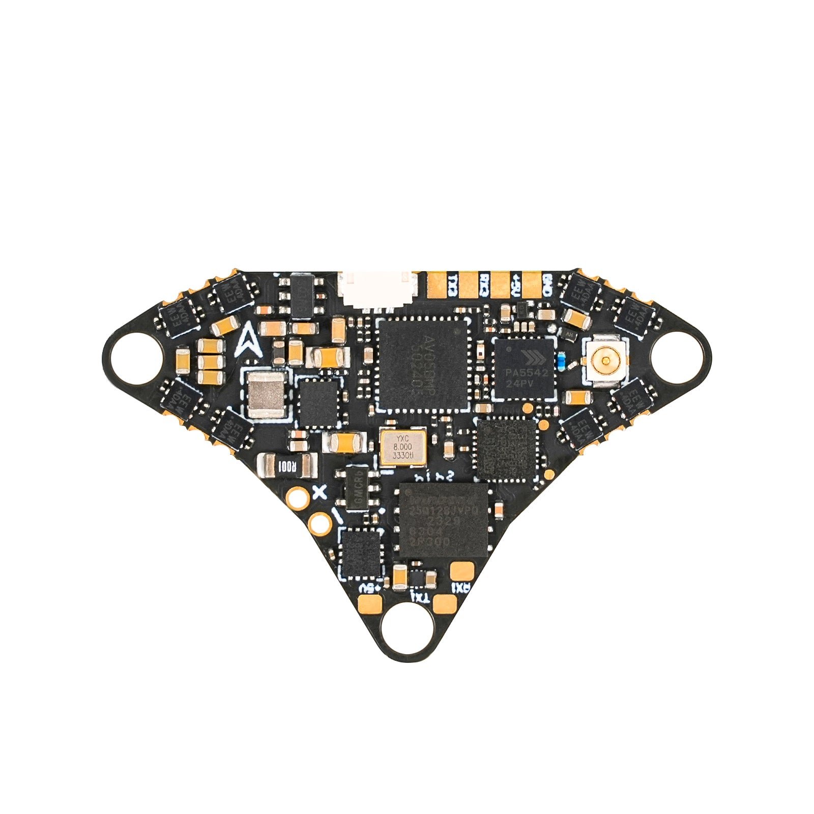
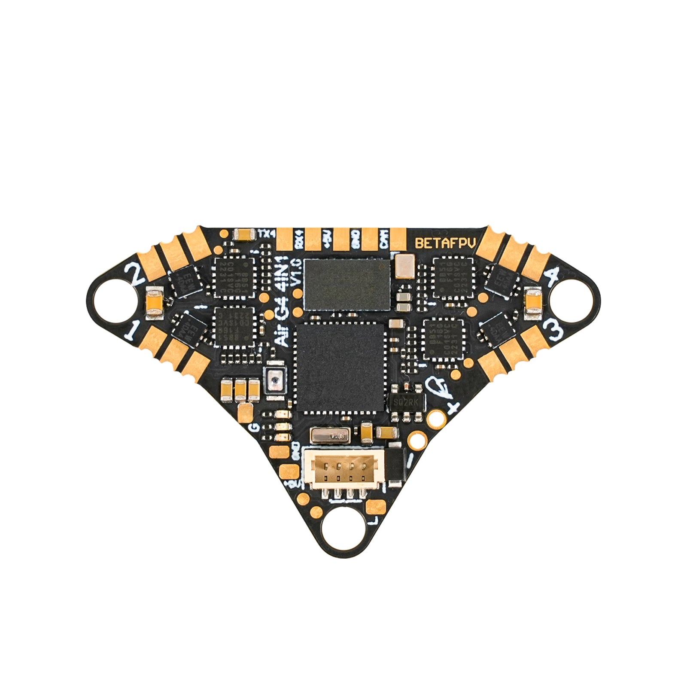

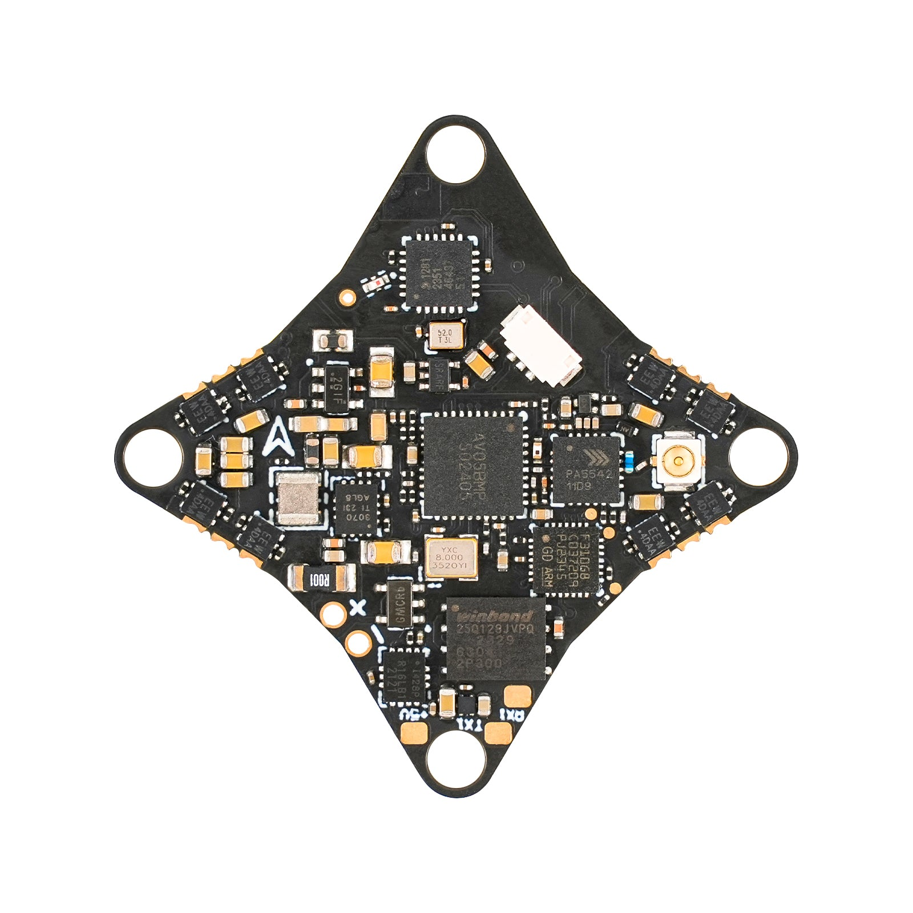
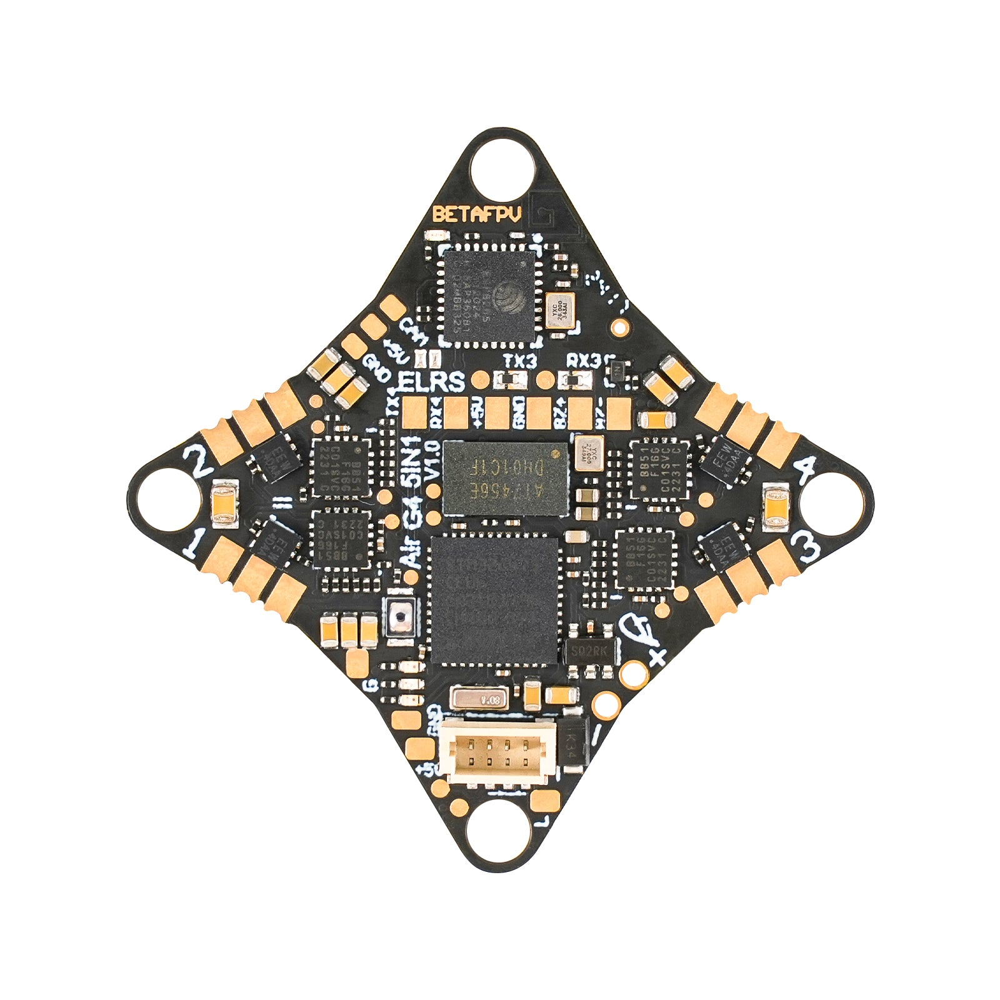
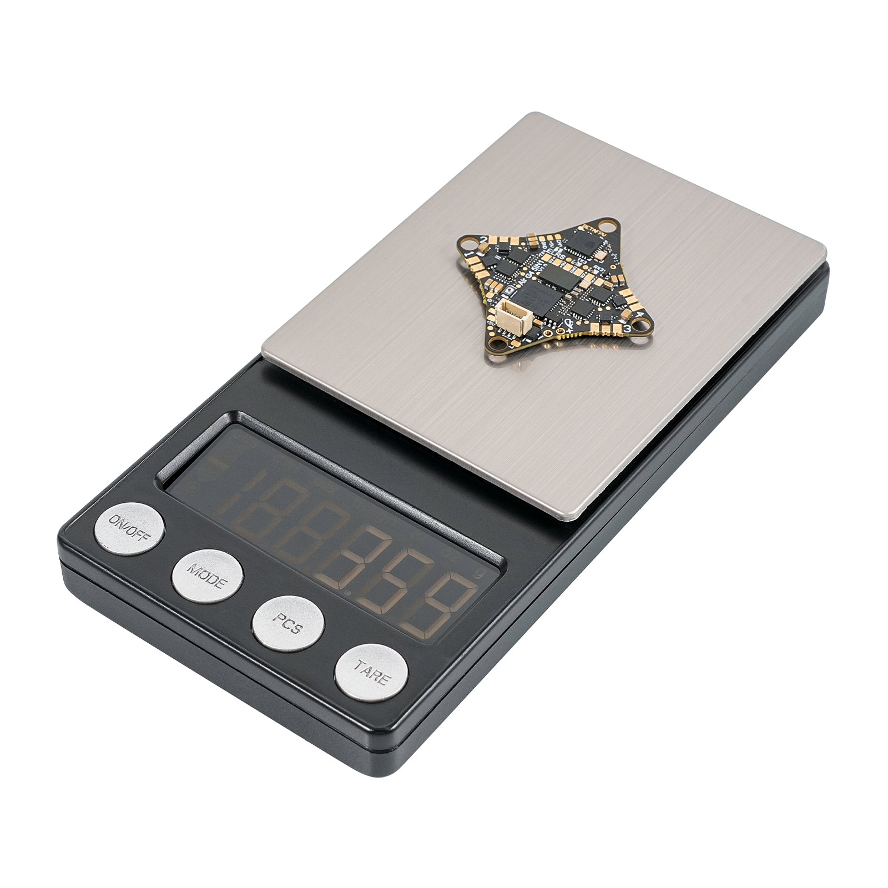

## Description

Air Brushless Flight Controller, the first 1S FC that utilizes the STM32G473CEU6, experienced a remarkable 55% increase in computing speed and lightning-fast response times, surpassing the F411. Equipped with the industry-leading ICM42688P gyro and onboard 5.8G 25mw~400mw VTX, it offers both 4IN1 with 2.9g and 5IN1 with 3.6g Versions, which takes your drone's posture and movement accurately to the next level. Immerse yourself effortlessly in the drone world of Finger-Tip control. Unmatched value and undeniable superiority with it, leave most of the competition in the dust. It will be the advanced choice for future ultralight 1S whoop drones!

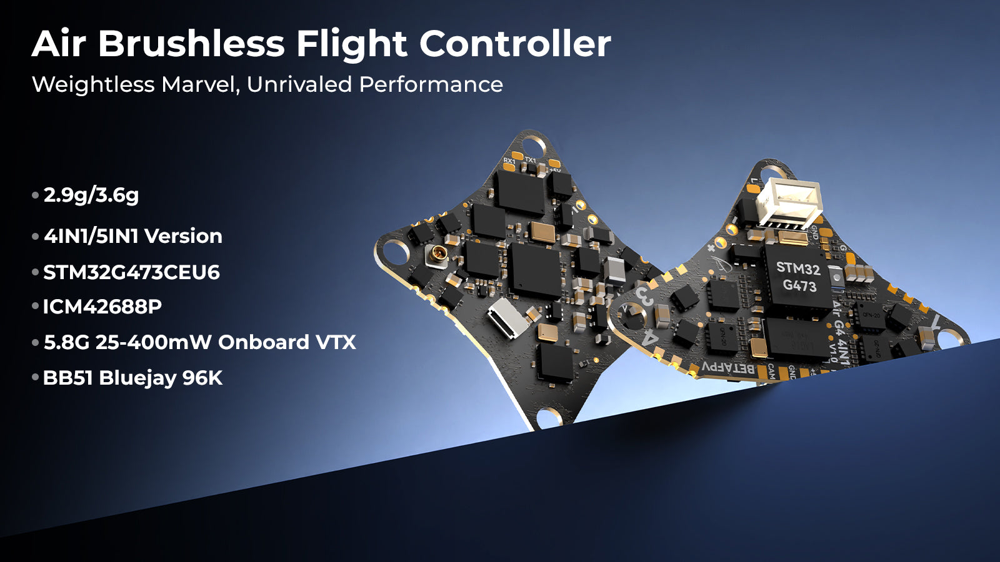

*Note: BETAFPV is immensely grateful to this testing team including ''[Don Johnson](https://www.youtube.com/@DonJohnsonFPV/videos), [Tokyo_Dom](https://www.youtube.com/@Tokyo_Dom), BLACKHORSE, wKich, Travis, [Ciotti FPV](https://www.youtube.com/@CiottiFPV/videos), [Tdog](https://www.youtube.com/@tdogfpv/videos), [Anthony Knight](https://www.youtube.com/user/Anthonyknight1988), [Isaac](https://www.facebook.com/isaac.pettit.7), [Albert](https://www.youtube.com/@AlbertKimTV), [sub250g](https://www.instagram.com/sub250gfpv/), [Tyranttfpv](https://www.instagram.com/tyranttfpv/), Wk Breeze'' for valuable ideas in the design of this Air Brushless Flight Controller.*

### Attention

- Crafted for advanced pilots, the ultra-thin (0.8mm) and lightweight Air FC is engineered for maximum agility and race-winning performance. It is the definitive choice for pushing the boundaries of FPV flight. For newcomers to FPV or those flying for entertainment, the [Matrix FC](https://betafpv.com/products/matrix-1s-brushless-flight-controller-hd) is the ideal alternative. It offers enhanced durability, requires no welding, and provides a more beginner-friendly experience.
- VTX Power: Higher VTX power consumes more energy and generates more heat, reducing flight time. For better flight time in indoor scenarios, use 25~100mW power.
- The calibrated power measured after temperature stabilization (stabilization condition: more than 60 seconds after powering on the flight controller) is: when set to 25mW, the output power is between 14dBm±0.8dBm (21mW to 30mW), which meets the normal standard. The following is the 5IN1 Air FC test data with the VTX set to 25mW, the power data is tested at different times on the R1, R3, R5, and R7 frequency points.

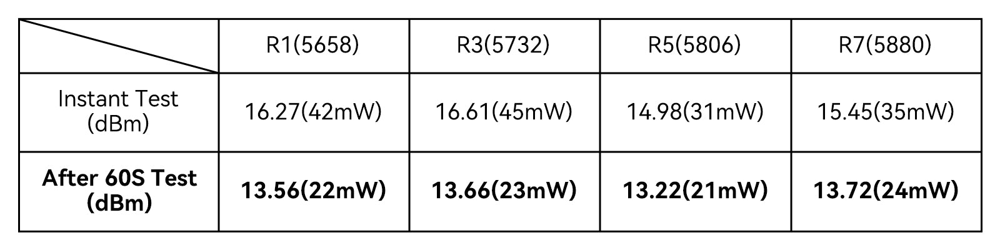

- The 4IN1 Air FC V1.1 version has already solved the VTX Output Power anomaly problem.
- Motor Wiring: Only soldering is supported for motor wiring on the flight control. Be careful to ensure the temperature of the soldering iron is maintained below 370℃ and limit the soldering duration to 1~2 seconds.

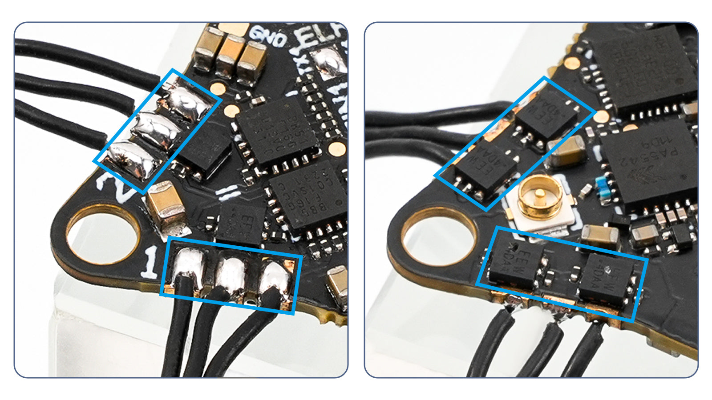

### Bullet Points

- Air Brushless Flight Controller, the first 1S FC that utilizes the G473 processor, experienced a remarkable 55% increase in computing speed and lightning-fast response times for precise racing and complex freestyle maneuvers, surpassing the F411.
- Higher integration yet lightweighter design, featuring a custom miniature OSD chip. Weighing only 2.9g (4IN1 Version) or 3.6g (5IN1 Version), it offers extra UART port options for effortless function expansions, adapting flawlessly to any flight scenario.
- Default integrated onboard 25-400mW VTX. Streamlines installation saves space, reduces weight, and boosts convenience for VTX and FC adjustments. The 5IN1 Version even integrates the Serial ELRS 2.4G RX.
- Elevate your drone's precision with the industry-leading ICM42688P gyro, integrated accelerometer, cutting-edge sensor calibration, and filtering algorithms, and a sample rate of up to 8K, which takes the drone's posture and movement accurate and precise drone to the next level.
- Unlock extensive flight data recording and analysis with an impressive up to 16MB capacity black box. Maximize performance and diagnose faults effectively, leveraging the full potential of your drone.

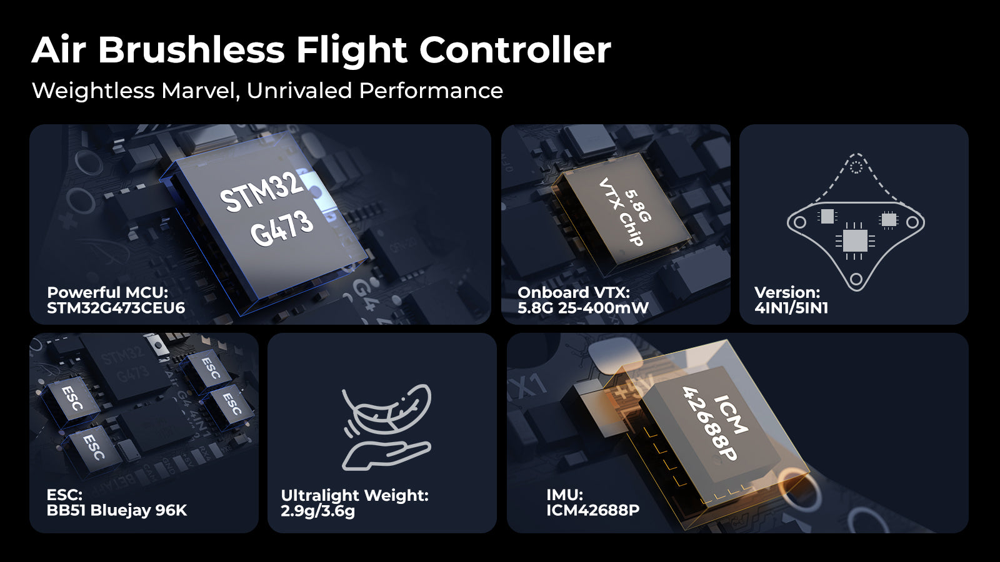

### Specifications

#### FC

- Weight: 2.9g (4IN1 Version) / 3.6g (5IN1 Version)
- Mounting Hole Size: 26mm x 26mm
- CPU*: STM32G473CEU6 (168MHz)
- Six-Axis: ICM42688P (SPI connection)
- Blackbox Memory: 16MB
- Sensor: Voltage & current
- 5V BEC*: 5V 3A
- USB Port: SH1.0 4-Pin
- Built-in ESC with 5A continuous
- RX: Serial ELRS 2.4G (V3.4.3) (Only 5IN1 Version)
- FC Firmware Version: Betaflight_4.5.0_BETAFPVG473
- 4IN1 Version: FC+ESC+OSD+VTX
- 5IN1 Version: FC+ESC+OSD+VTX+RX

#### ESC

- Input Voltage: 1S
- ESC Firmware: A_X_5_96KHz_V0.19.hex for BB51 Bluejay hardware
- Signal Support: D-shot300, D-shot600

#### VTX

- Output Power: 25/100/200/400/PIT
- Frequency: 5.8GHz 48 channels, with Raceband: 5658~5917MHz
- Channel SEL: SmartAudio2.0
- Modulation Type: FM
- Frequency Control: PLL
- All Harmonic: Max -50dBm
- Frequency Stability: ±100KHz (Typ.)
- Frequency Precision: ±200KHz (Typ.)
- Channel Carrier Error: ±1.5dB
- Antenna Port: 50 Ω
- Operating Temperature: -10℃~+80℃

### Diagram

Air Brushless Flight Controller (4IN1 Version):

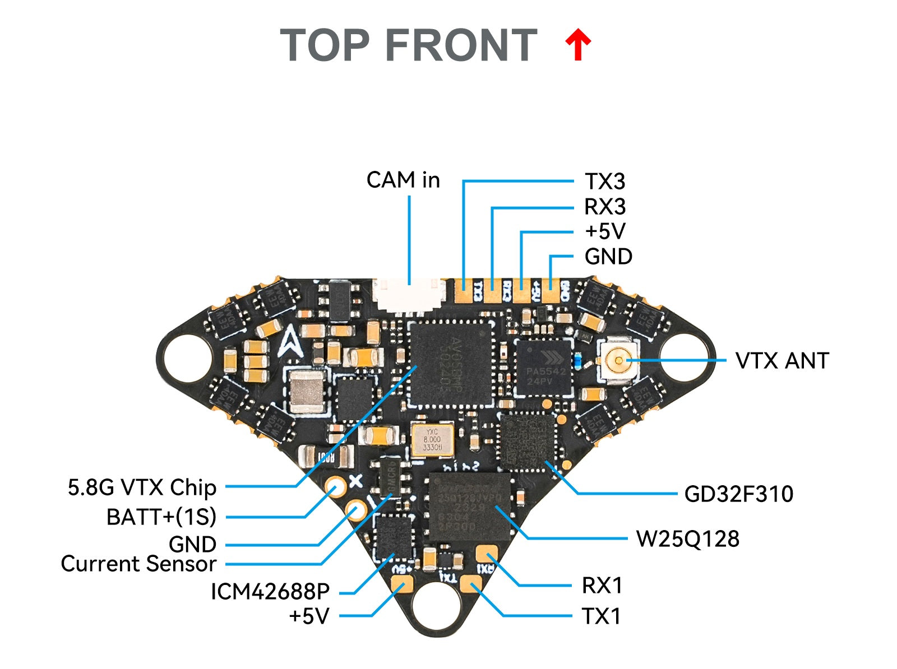

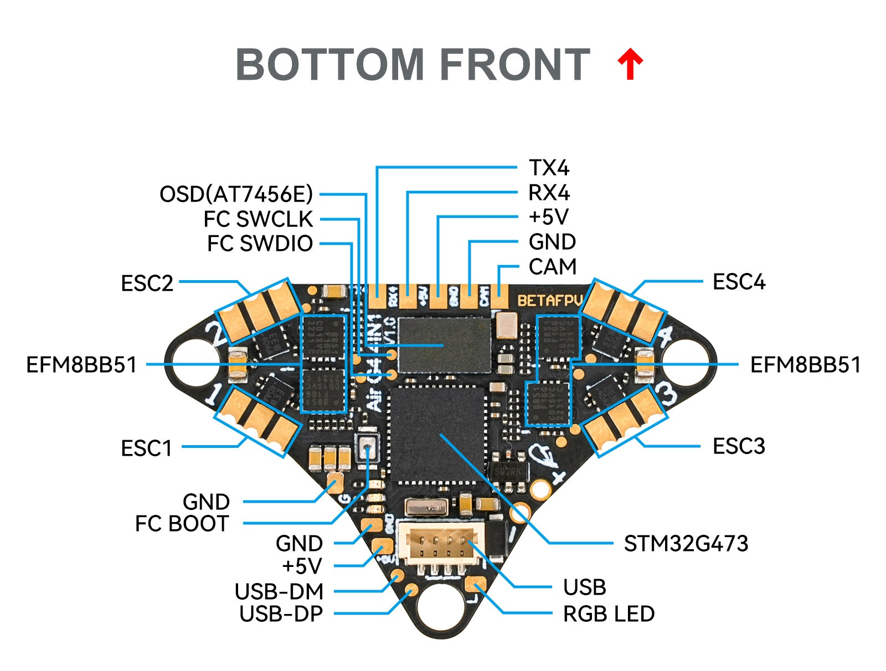

Air Brushless Flight Controller (5IN1 Version):

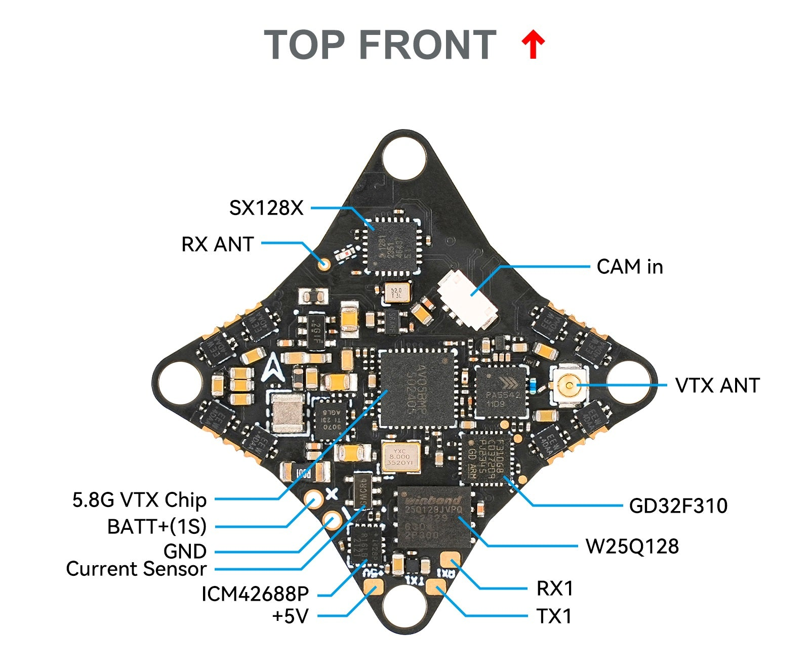

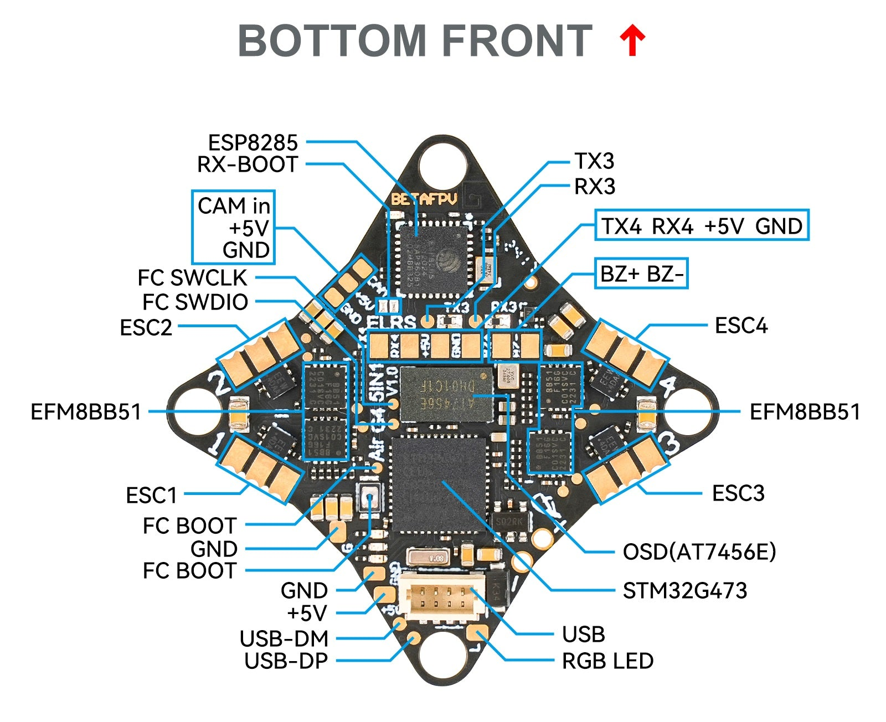

### Comparison Between G473 and F411

Say goodbye to limitations and embrace the cutting-edge technology of the G473 flight controller for an unparalleled flight experience. Air Brushless Flight Controller features up to 168MHz superior CPU Clock Speed and 4 richer serial ports, enabling lightning-fast response times and advanced computing power, making it ideal for demanding flight, which takes your flying experience to the next level and demonstrates outstanding performance, surpassing all 1S FC options available on the market at present.

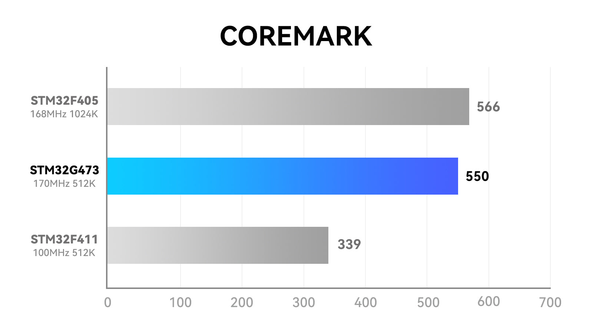

### 4IN1 & 5IN1

Choose this higher integration Air Brushless Flight Controller, for an ultra-light 1S whoop installation, tailored to meet the needs of discerning pilots. It is default integrated onboard 25-400mW VTX, the 5IN1 Version that integrates FC+ESC+OSD+VTX+RX goes a step further by integrating the Serial ELRS 2.4G RX, streamlining installation to save space and reduce weight, and enhancing convenience for VTX and FC adjustments. The 4IN1 Version removes the RX port for added versatility, providing pilots with more external RX options.

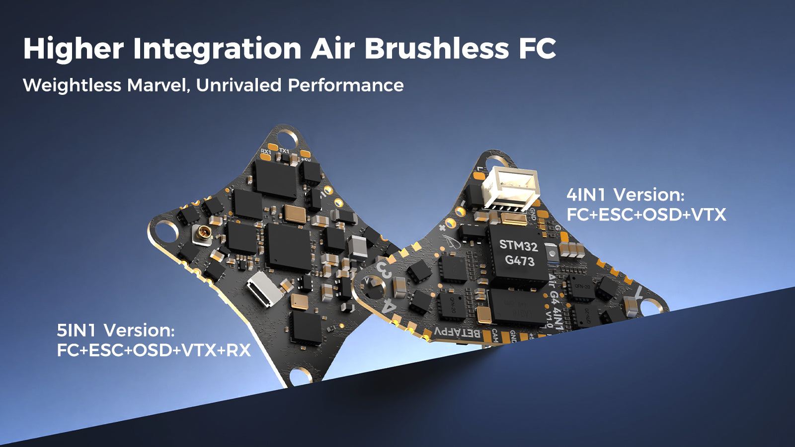

### Serial ELRS 2.4G RX

Serial ELRS 2.4G RX uses the Crossfire serial protocol (CRSF protocol) to communicate between the receiver and the flight controller board. So the Serial ELRS 2.4G RX is available to support upgrading to ELRS V3.0 with no need to flash Betaflight flight controller firmware. Enter binding status by power on/off three times.

- Plugin and unplug the flight controller three times;
- Make sure the RX LED is doing a quick double blink, which indicates the receiver is in bind mode;
- Make sure the RF TX module or radio transmitter enters binding status, which sends out a binding pulse;
- If the receiver has a solid light, it's bound.

The Serial ELRS 2.4G RX can be updated via Wi-Fi or Betaflight serial passthrough. Here is the way to update the Serial ELRS 2.4G RX firmware through passthrough.

- Plug in your FC to your computer, but do NOT connect to betaflight configurator;
- Choose target "BETAFPV 2.4GHz AIO RX";
- Flash using the BetaflightPassthrough option in ExpressLRS Configurator.

*[How to flash firmware via Wi-Fi here.](https://support.betafpv.com/hc/en-us/articles/4404231679129-How-to-Flash-Firmware-of-ELRS-RX-TX)*

### Betaflight Firmware and CLI

Betaflight official developers recommend using version 42688 of the gyroscope, and many issues with ICM42688 have been fixed in version 4.5.0. Please learn more from version 4.5.0.

- FC firmware: Betaflight_4.5.0_BETAFPVG473, [Download the firmware and CLI dump file](https://support.betafpv.com/hc/en-us/articles/33840464515353-Firmware-for-Air-FC-G4-V1)
- Reference link: [https://github.com/betaflight/betaflight/releases/tag/4.5.0](https://github.com/betaflight/betaflight/releases/tag/4.5.0)

### Bluejay ESC Firmware

With BB51 ESC solution, Air Brushless Flight Controller is based on A_X_5_96KHz_V0.19.hex for BB51 Bluejay hardware, it supports D-shot300, D-shot600, and even RPM filtering in Betaflight, offers 24KHz, 48KHz, and 96KHz fixed PWM frequency for options, and custom start-up melodies.

**DO NOT flash the firmware with a shorter interval,**otherwise, there will be a certain chance of stalling and burning the flight controller.

- ESC-Configurator: [https://preview.esc-configurator.com/](https://preview.esc-configurator.com/)
- [Download BLHeliSuite16714903](https://github.com/4712/BLHeliSuite/releases/tag/16714903)
- [Download the Bluejay ESC firmware. Please choose A_X_5_96KHz_V0.19.hex](https://github.com/bird-sanctuary/bluejay/releases)

### Connecting External RX/VTX

Please note that UART2 has connected to the VTX by default. This FC reserves 3 complete full-featured serial ports that can be used for external CRSF/SBUS receivers, GPS, HD VTX, or other serial devices. You can refer to the below pictures.

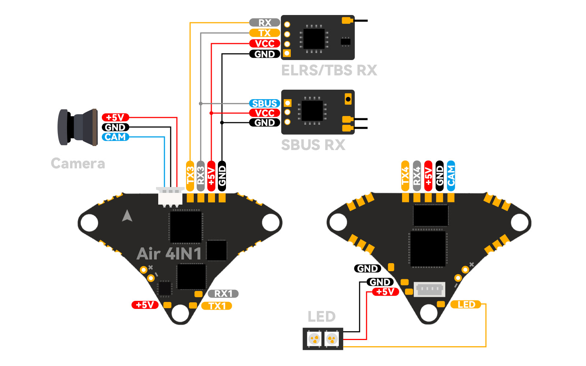

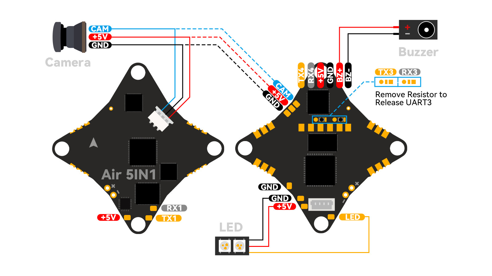

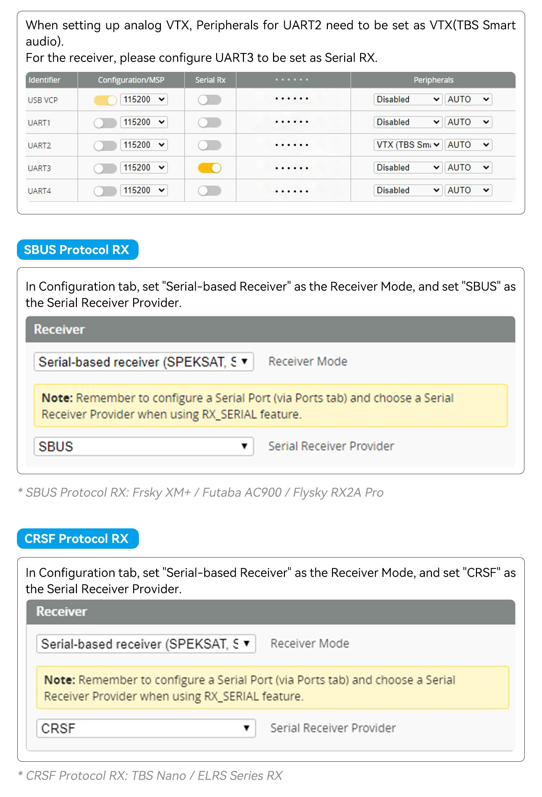

### Attention

- VTX Power: Higher VTX power consumes more energy and generates more heat, reducing flight time. For better flight time in indoor scenarios, use 25~100mW power.
- Motor Wiring: Only soldering is supported for motor wiring on the flight control. Avoid terminal plugging.
- VTX Antenna: Connect and install the image transmission antenna before powering on the flight control. Alternatively, set transmission power to 0 to avoid burnout.

### Recommended Parts

- Drones: [Air65](https://betafpv.com/products/air65-brushless-whoop-quadcopter), [Air75](https://betafpv.com/products/air75-brushless-whoop-quadcopter)
- Frames: [Air65](https://betafpv.com/products/air65-brushless-whoop-frame), [Air75](https://betafpv.com/products/air75-brushless-whoop-frame), [Meteor65](https://betafpv.com/collections/frame/products/meteor65-micro-brushless-whoop-frame), [Meteor65 Pro](https://betafpv.com/collections/frame/products/meteor65-pro-frame-kit), [Meteor75 Pro](https://betafpv.com/collections/frame/products/meteor75-pro-brushless-whoop-frame)
- Motors: [0702/0702SE](https://betafpv.com/collections/motors/products/0702-brushless-motors), [0802/0802SE](https://betafpv.com/collections/motors/products/0802se-22000kv-brushless-motors), [1102](https://betafpv.com/collections/motors/products/1102-13500kv-brushless-motors)
- Receiver: [ELRS Lite Receiver](https://betafpv.com/collections/rx/products/elrs-lite-receiver), [ELRS Nano Receiver](https://betafpv.com/collections/rx/products/elrs-nano-receiver)

### Package

- 1 * Air Brushless Flight Controller
- 1 * 2.4g Antenna (Only 5IN1 Version)
- 1 * Type-C to SH1.0 Adapter
- 1 * SH1.0 4Pin Adapter Cable
- 1 * 5.8g VTX Antenna
- 1 * BT2.0 U Whoop Cable Pigtail | 40mm
- 4 * M1.4*4 Self-tapping Screws
- 4 * Shock Absorbing Ball

*Note: The below packaging pic is the 4IN1 Version.*

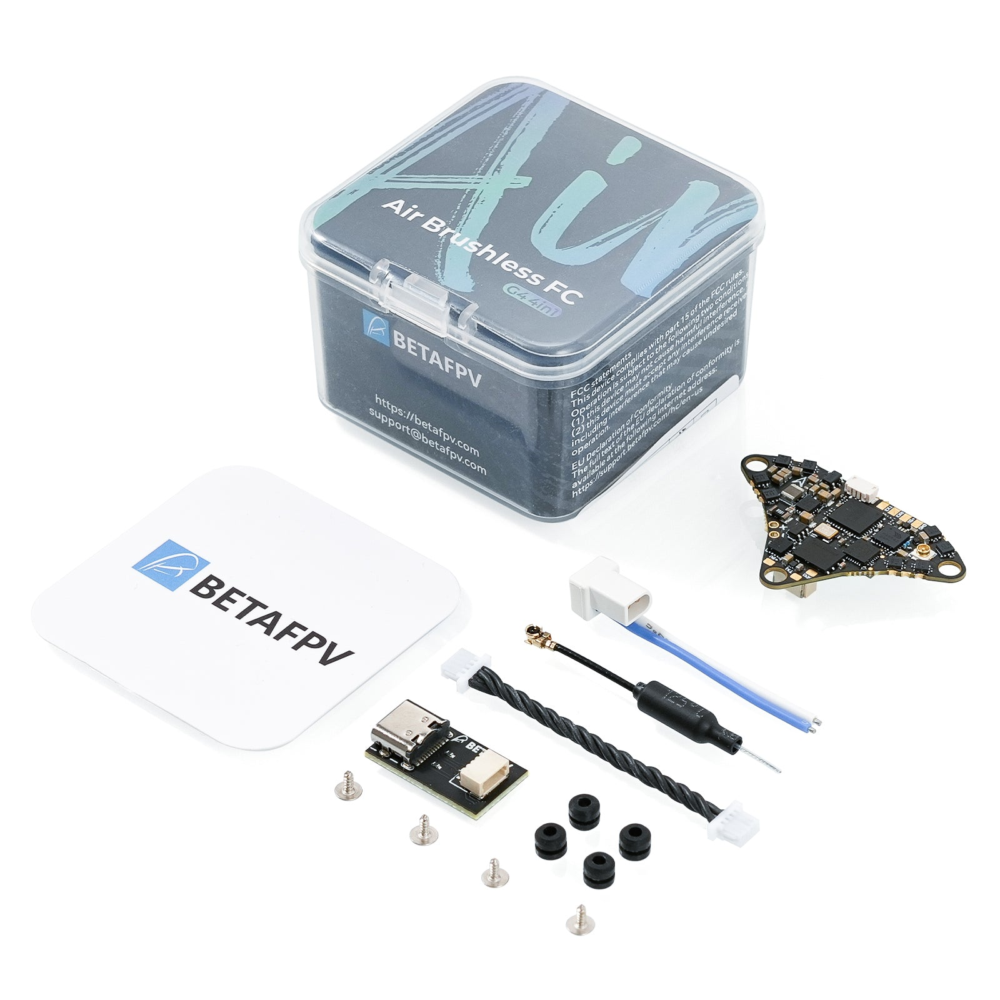

*Note: The below packaging pic is the 5IN1 Version.*

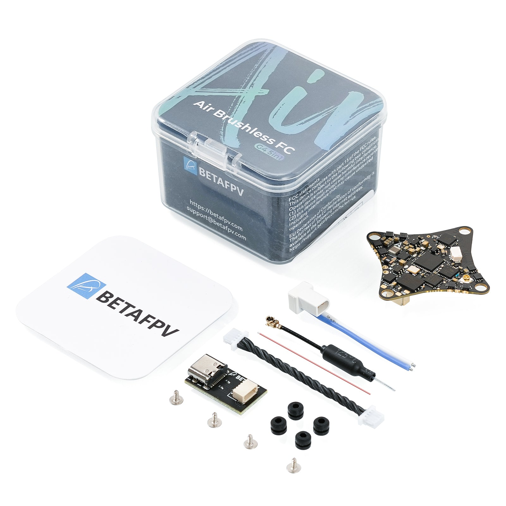
