# Air75 Brushless Whoop Quadcopter

| | |
|---|---|
| Source | <https://betafpv.com/products/air75-brushless-whoop-quadcopter> |
| Captured | 2026-08-14 |
| Shopify handle | `air75-brushless-whoop-quadcopter` |
| Vendor | BETAFPV |
| Product type | Brushless Quad |
| Published | 2024-07-11 |
| Relevance to this repo | AIR75 75mm drone — the aircraft in AIR75_G473/. Confirmed by 0802SE 23000KV motors matching OEM package A75_0802SE_23000kv_... |

> Archived marketing page. Vendor specifications, **not** a configuration
> artifact — nothing here is restorable to a flight controller. Where this
> page and a CLI dump or `config.h` disagree, the dump or target wins.

## Variants

| Variant | SKU | Available |
|---|---|---|
| ELRS 2.4G (5IN1) | 01010038_4 | no |

## Gallery

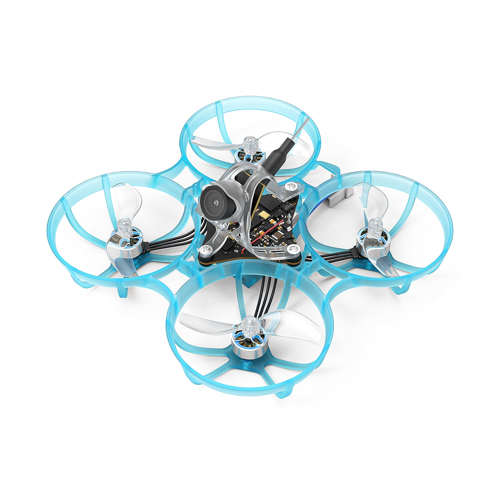
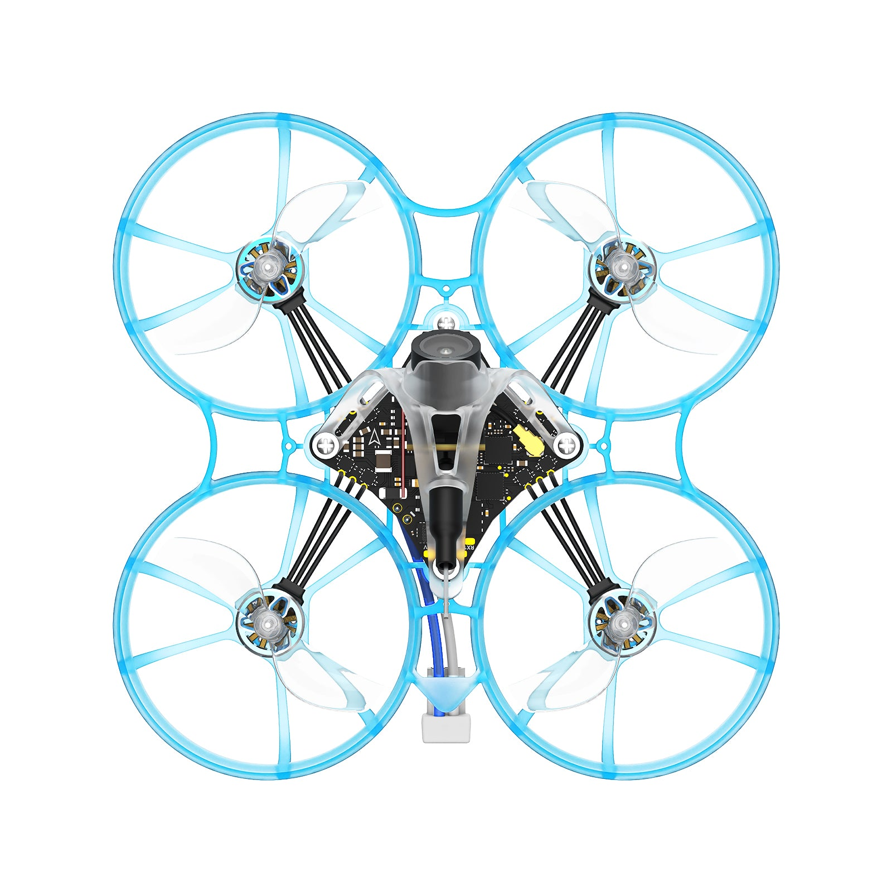
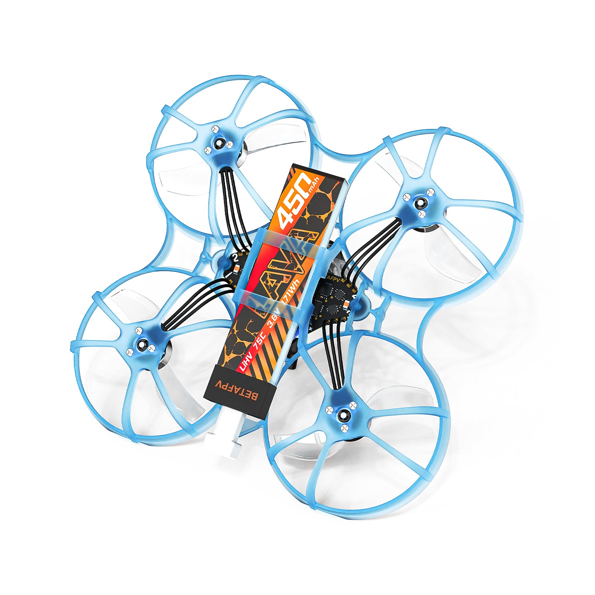
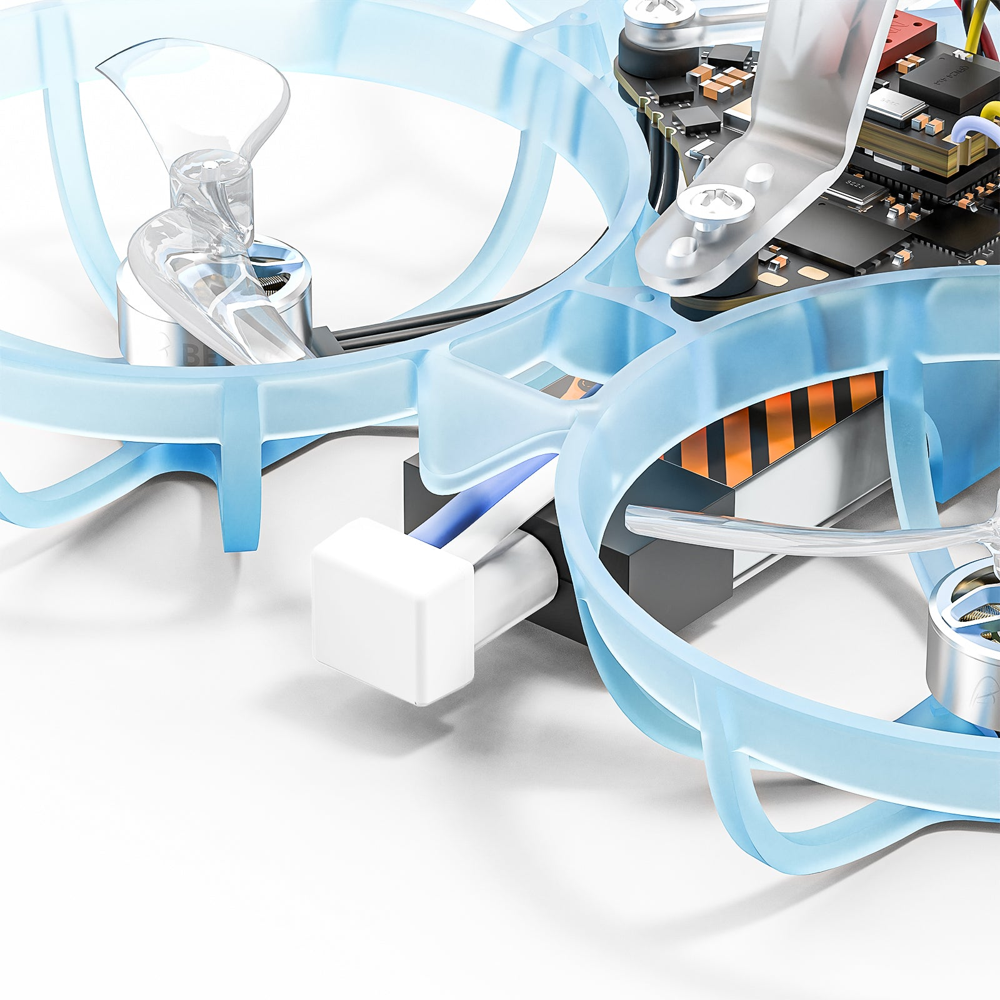
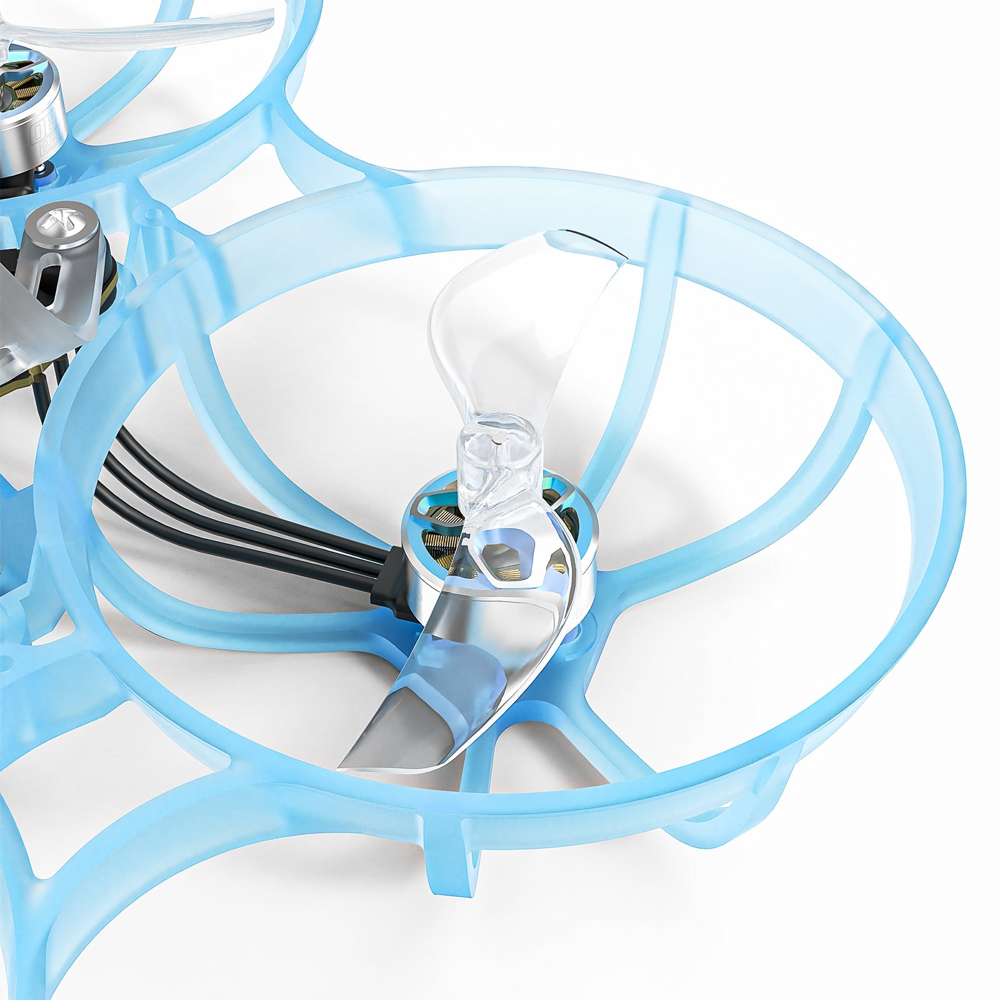
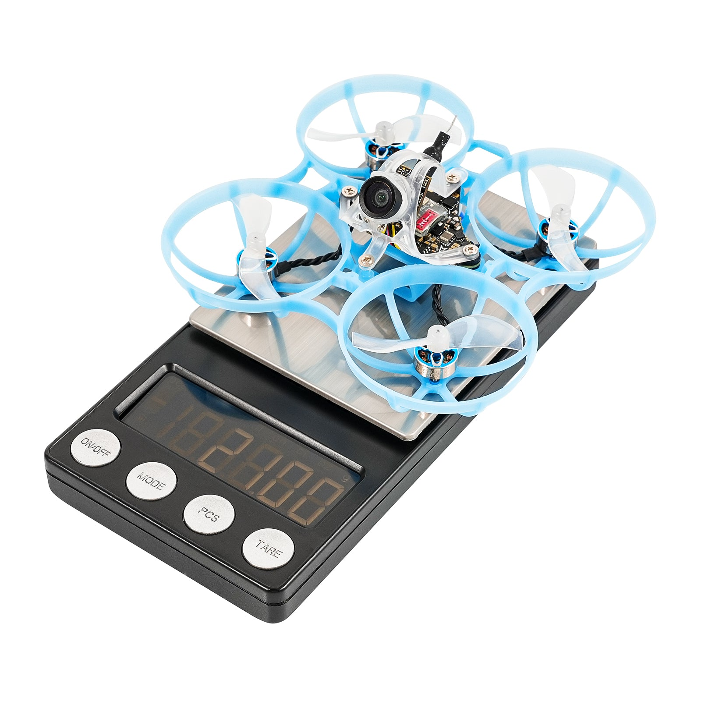

## Description

**Don't Miss Out: The exclusive Air Wisp Limited Edition is finally here! Discover the stunning [Air65 & Air75 Wisp](https://betafpv.com/products/air65-air75-wisp-brushless-whoop-quadcopter-limited-edition) and secure yours before they're gone!**

In this millisecond decision victory era, with galloping indulgence and challenging speed, seize your championship with Air75! Prepare for an explosive upgrade, now upgraded and more impressive than the Meteor Series. Weighing a mere lighter 21g yet boasts next-level performance. Equipped with [Air Canopy](https://betafpv.com/products/air-canopy), [Air75 Frame](https://betafpv.com/products/air75-brushless-whoop-frame), [Air Brushless Flight Controller (5IN1)](https://betafpv.com/products/air-brushless-flight-controller), and the new optional [LAVA 1S 450mAh 75C Battery](https://betafpv.com/collections/batt-1s/products/lava-1s-450mah-75c-battery-4pcs) enhances the ultra-lightweight feature. It reigns as the Ultralight King and Reaction Giant!

*Note: Starting December 12, the Air75 will be equipped with the Air Brushless Flight Controller 5IN1 version.*

*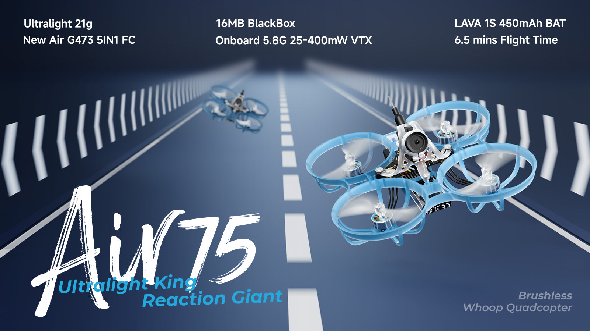*

*Note: BETAFPV is immensely grateful to this testing team including ''[Don Johnson](https://www.youtube.com/@DonJohnsonFPV/videos), [Tokyo_Dom](https://www.youtube.com/@Tokyo_Dom), BLACKHORSE, wKich, Travis, [Ciotti FPV](https://www.youtube.com/@CiottiFPV/videos), [Tdog](https://www.youtube.com/@tdogfpv/videos), [Anthony Knight](https://www.youtube.com/user/Anthonyknight1988), [Isaac](https://www.facebook.com/isaac.pettit.7), [Albert](https://www.youtube.com/@AlbertKimTV), [sub250g](https://www.instagram.com/sub250gfpv/), Wk Breeze'' for valuable ideas in the design of this Air75.*

### Bullet Points

- Experience a New Level of Lightweight flying with our 1S 75mm Indoor Whoop. Weighing in at just 21g, it offers an exhilarating and agile flying experience.
- [Air Brushless Flight Controller (5IN1)](https://betafpv.com/products/air-brushless-flight-controller) is the first 1S FC that uses the G473 processor which has superior computing power and is equipped with ICM42688P gyroscope. This all-in-one solution seamlessly integrates FC, ESC, OSD, Serial ELRS 2.4G RX and Onboard 5.8G 25mw~400mw VTX, while weighing just 3.6g.
- For a smooth and elegant free flight experience, the Air75 features the [Gemfan 40mm 2-Blade Props](https://betafpv.com/products/gemfan-40mm-2-blade-propellers-1-0mm-shaft-4pcs) and [0802SE | 23000KV Motor](https://betafpv.com/collections/motors/products/0802se-22000kv-brushless-motors), allowing for timely responses and precise follow-up actions for incredible speed bursts and agile steering.
- Discover the Air75, accompanied by the Z-Folding [LAVA 1S 450mAh 75C Battery](https://betafpv.com/collections/batt-1s/products/lava-1s-450mah-75c-battery-4pcs), enabling the ultimate lightweight flight experience. Take to the skies with unparalleled agility and weightlessness.
- Express your unique style with various part options. From 75mm frames to canopies and propellers, offering pilots a diverse selection of captivating colors. Combine with BETAFPV waterslide decals to effortlessly infuse your whoop drones with a personalized.

### Specifications

- Item: Air75 Brushless Whoop Quadcopter
- Weight: 21g
- Wheelbase: 75mm
- Frame: [Air75 Frame](https://betafpv.com/products/air75-brushless-whoop-frame)
- Canopy: [Air Canopy](https://betafpv.com/products/air-canopy)
- FC & ESC: [Air Brushless Flight Controller (5IN1 Version)](https://betafpv.com/products/air-brushless-flight-controller)
- VTX: Onboard 5.8G 25mw - 400mw VTX
- Camera: C03 Camera
- Motor: [0802SE | 23000KV](https://betafpv.com/collections/motors/products/0802se-22000kv-brushless-motors)
- Props: [Gemfan 40mm 2-Blade](https://betafpv.com/products/gemfan-40mm-2-blade-propellers-1-0mm-shaft-4pcs)
- Battery Connector: [BT2.0 U Cable Pigtail](https://betafpv.com/products/bt2-0-1s-whoop-cable-pigtail)
- Recommend Battery: [LAVA 1S 450mAh 75C](https://betafpv.com/collections/batt-1s/products/lava-1s-450mah-75c-battery-4pcs)
- Flight Time (4.35v-3.3v): 6.5min
- RX Version: Onboard Serial ELRS 2.4G

### Comparison Air75 & Meteor75

*Note: The Air75 is crafted for advanced pilots aiming to push the boundaries of FPV agility and racing flight performance. For newcomers to FPV or those flying for entertainment, the [Meteor75 Pro](https://betafpv.com/products/meteor75-pro-brushless-whoop-quadcopter) is a better choice. It offers enhanced durability, requires no welding, and provides a more beginner-friendly experience.*

**Air75**

**Meteor75**

Weight
21.0g
24.9g

Wheelbase
75mm
75mm

Frame
[Air75 Frame](https://betafpv.com/products/air75-brushless-whoop-frame)
[Meteor75 Micro Frame](https://betafpv.com/collections/frame/products/meteor75-micro-brushless-whoop-frame)

Canopy
[Air Canopy](https://betafpv.com/products/air-canopy)
[Canopy for Micro Camera 2022](https://betafpv.com/products/canopy-for-micro-camera-2022)

FC & ESC
[Air Brushless Flight Controller (5IN1 Version)](https://betafpv.com/products/air-brushless-flight-controller)

[F4 1S 5A FC (Serial ELRS 2.4G)](https://betafpv.com/collections/brushless-flight-controller/products/f4-1s-5a-aio-brushless-flight-controller-elrs-2-4g)
[F4 1S 5A FC (SPI Frsky)](https://betafpv.com/collections/brushless-flight-controller/products/f4-1s-5a-aio-brushless-flight-controller-elrs-2-4g)

VTX
Onboard 5.8G 25mw - 400mw VTX
M03 VTX

Camera
C03 Camera
C03 Camera

Motor
[0802SE | 23000KV](https://betafpv.com/collections/motors/products/0802se-22000kv-brushless-motors)
[0802SE | 19500KV](https://betafpv.com/collections/brushless-motors/products/0802se-22000kv-brushless-motors)

Props
[Gemfan 40mm 2-Blade](https://betafpv.com/products/gemfan-40mm-2-blade-propellers-1-0mm-shaft-4pcs)
[Gemfan 40mm 2-Blade](https://betafpv.com/products/gemfan-40mm-2-blade-propellers-1-0mm-shaft-4pcs)

Battery Connector
[BT2.0 U Cable Pigtail](https://betafpv.com/products/bt2-0-1s-whoop-cable-pigtail)
BT2.0

Recommend Battery
[LAVA 1S 450mAh 75C](https://betafpv.com/collections/batt-1s/products/lava-1s-450mah-75c-battery-4pcs)

[BT2.0 450mAh 30C](https://betafpv.com/products/bt2-0-450mah-1s-30c-battery-4pcs?_pos=1&_sid=da2924868&_ss=r)
[LAVA 1S 450mAh 75C](https://betafpv.com/collections/batt-1s/products/lava-1s-450mah-75c-battery-4pcs)

Flight Time
4.35v-3.3v
6.5min
4.5min (Freestyle) / 6min

RX Version
Onboard Serial ELRS 2.4G
ELRS/Frsky/TBS

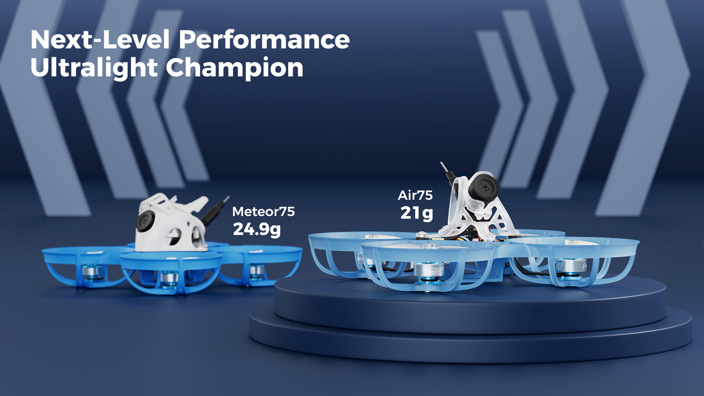

### Flight Controller & ESC

The Air75 is now equipped with the [Air Brushless Flight Controller (5IN1)](https://betafpv.com/products/air-brushless-flight-controller), featuring the advanced G473 processor, which provides superior computing power and lightning-fast response times—a significant upgrade over the F411 used in the Meteor75. Weighing just 3.6g, it integrates FC, ESC, OSD, VTX, and RX into a compact design, simplifying setup and maintenance while striking the perfect balance between performance and lightness. Powered by the industry-leading ICM42688P gyroscope and a custom micro-sized OSD chip, the Air75 delivers smoother, more responsive control. With multiple UART ports for flexible function expansion, the Air75 is designed for seamless integration into both racing and freestyle FPV, offering unmatched precision and fingertip control.

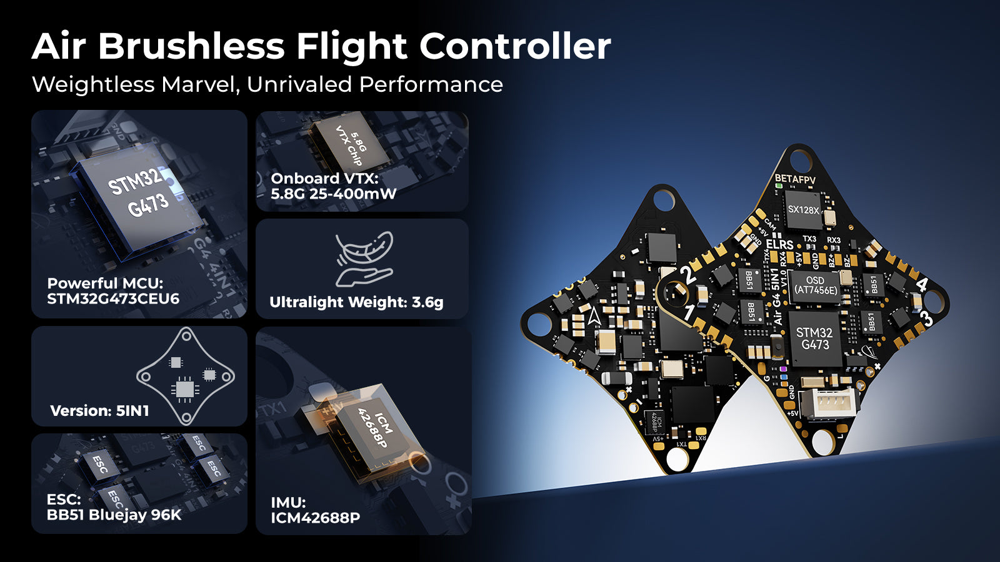

### Upgraded Air Canopy

Experience high-quality, clear, and sharper images with the lightweight [C03 FPV Micro Camera](https://betafpv.com/products/c03-fpv-micro-camera), weighing just 1.45g. We've redesigned the [Air Canopy](https://betafpv.com/products/air-canopy) structure to be more flexible, impact-resistant, and durable. The improved bending effect enhances flexibility, reduces the chances of breakage, and greatly enhances explosion resistance for easier installation. Effortlessly accommodates an assortment of Micro and Nano Analog cameras. Supporting angle adjustment from 25° to 50°. With it, Air75 can chase the limit of racing victory worry less.

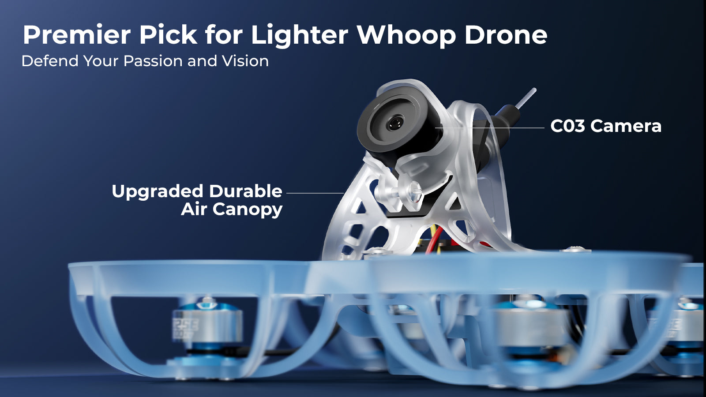

### Propulsion System

For a smooth and elegant free flight experience, the Air75 features the [Gemfan 40mm 2-Blade Props](https://betafpv.com/products/gemfan-40mm-2-blade-propellers-1-0mm-shaft-4pcs), a larger pitch tip of the props, quick response, and crisp action, and[0802SE | 23000KV Motor](https://betafpv.com/collections/motors/products/0802se-22000kv-brushless-motors), allowing for timely responses and precise follow-up actions for incredible speed bursts and agile steering. Equipped with the ultralight [LAVA 1S 450mAh 75C Battery](https://betafpv.com/collections/batt-1s/products/lava-1s-450mah-75c-battery-4pcs) that features the groundbreaking Z-Folding Process for the Air75 more concentrated center gravity, crisper response, greater acceleration, and enhanced maneuverability.

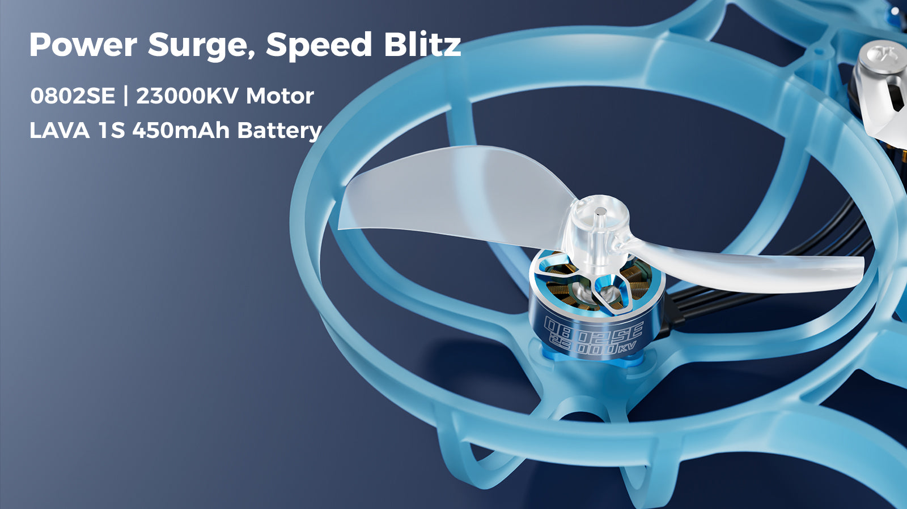

### Air75 Frame

To enhance the flying experience, DIY enthusiasts have diligently worked on reducing the weight of the 75mm whoop drones, especially frames for an ultra-light structure. We upgraded the [Meteor75 Micro Frame](https://betafpv.com/products/meteor75-micro-brushless-whoop-frame) to the [Air75 Frame](https://betafpv.com/products/air75-brushless-whoop-frame), which achieves a remarkable weight lighter from 5.68g to 4.45g. It maintains exceptional strength and durability while introducing a new motor fixed slot, and optimizing a low-profile design. Having 8 color choices, it indisputably emerges as the top topgallant choice for pilots seeking an unparalleled ultra-light Sub20g 75mm 1S Whoop drone and personality.

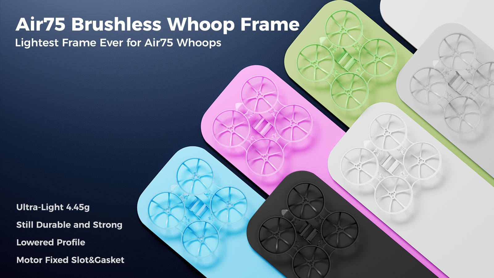

### Recommended Parts

- Radio Transmitter: [LiteRadio 3 Pro](https://betafpv.com/products/literadio-3-pro-radio-transmitter), [LiteRadio 3](https://betafpv.com/collections/rx-tx/products/literadio-3-radio-transmitter), [LiteRadio 2 SE](https://betafpv.com/collections/rx-tx/products/literadio-2-se-radio-transmitter)
- Goggles: [VR03 FPV Goggles](https://betafpv.com/collections/goggle-antennas/products/vr03-fpv-goggles), [VR02 FPV Goggles](https://betafpv.com/collections/goggle-antennas/products/vr02-fpv-goggles)
- FC: [Air Brushless Flight Controller (5IN1)](https://betafpv.com/products/air-brushless-flight-controller)
- Battery: [LAVA II 1S 480mAh/580mAh/680mAh Battery](https://betafpv.com/products/lava-ii-1s-battery), [LAVA 1S 450mAh 75C Battery](https://betafpv.com/collections/batt-1s/products/lava-1s-450mah-75c-battery-4pcs)
- Props: [Gemfan 40mm 2-Blade Props](https://betafpv.com/products/gemfan-40mm-2-blade-propellers-1-0mm-shaft-4pcs)
- Colorful Frame: [Air75 Brushless Whoop Frame](https://betafpv.com/products/air75-brushless-whoop-frame), [Air75 II Brushless Whoop Frame](https://betafpv.com/products/air75-ii-brushless-whoop-frame)
- Colorful Canopy: [Air II Canopy](https://betafpv.com/products/air-ii-canopy), [Air Canopy](https://betafpv.com/products/air-canopy)
- Screws: [Drone Screw Pack](https://betafpv.com/products/betafpv-drone-screw-pack), [Meteor Series Motor Fixing Screws Pack (40PCS)](https://betafpv.com/products/meteor-series-motor-fixing-screws-pack-40pcs)
- Sticker: [BETAFPV Waterslide Decals](https://betafpv.com/collections/sticker-keychain/products/betafpv-model-decals)

### File

- [Download the CLI and Firmware for the Air75 Brushless Whoop Quadcopter](https://support.betafpv.com/hc/en-us/articles/32986946281113-CLI-and-Firmware-for-Air75)

### Package

- 1 * Air75 Brushless Whoop Quadcopter
- 1 * Air Canopy
- 4 * Gemfan 40mm 2-Blade Propellers
- 1 * Pack of Screws
- 1 * 4Pin Adapter Cable
- 1 * USB Type-C Adapter Board

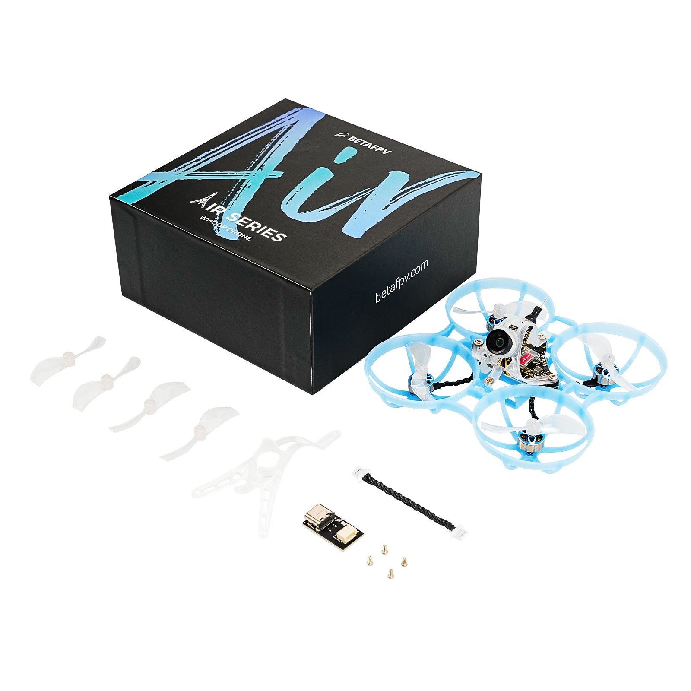
