# F4 2-3S 20A AIO FC V1

| | |
|---|---|
| Source | <https://betafpv.com/products/f4-2-3s-20a-aio-fc-v1> |
| Captured | 2026-08-14 |
| Shopify handle | `f4-2-3s-20a-aio-fc-v1` |
| Vendor | BETAFPV |
| Product type | Brushless FC |
| Published | 2023-08-24 |
| Relevance to this repo | STM32F405RGT6 20A AIO — the FC archived in BETAFPVF405/ (board_name BETAFPVF405) |

> Archived marketing page. Vendor specifications, **not** a configuration
> artifact — nothing here is restorable to a flight controller. Where this
> page and a CLI dump or `config.h` disagree, the dump or target wins.

## Variants

| Variant | SKU | Available |
|---|---|---|
| ICM42688 | 01040015_1 | no |
| ICM42605 | 01040015_2 | no |

## Gallery

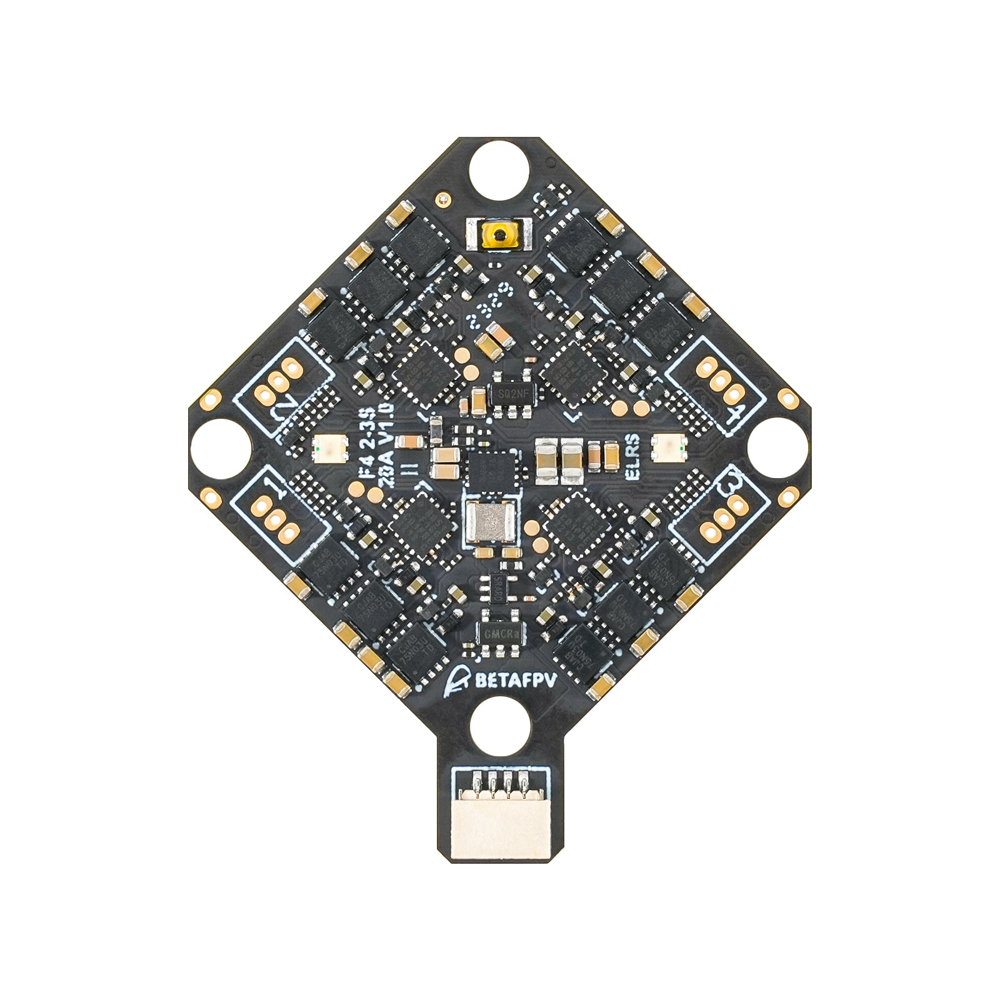
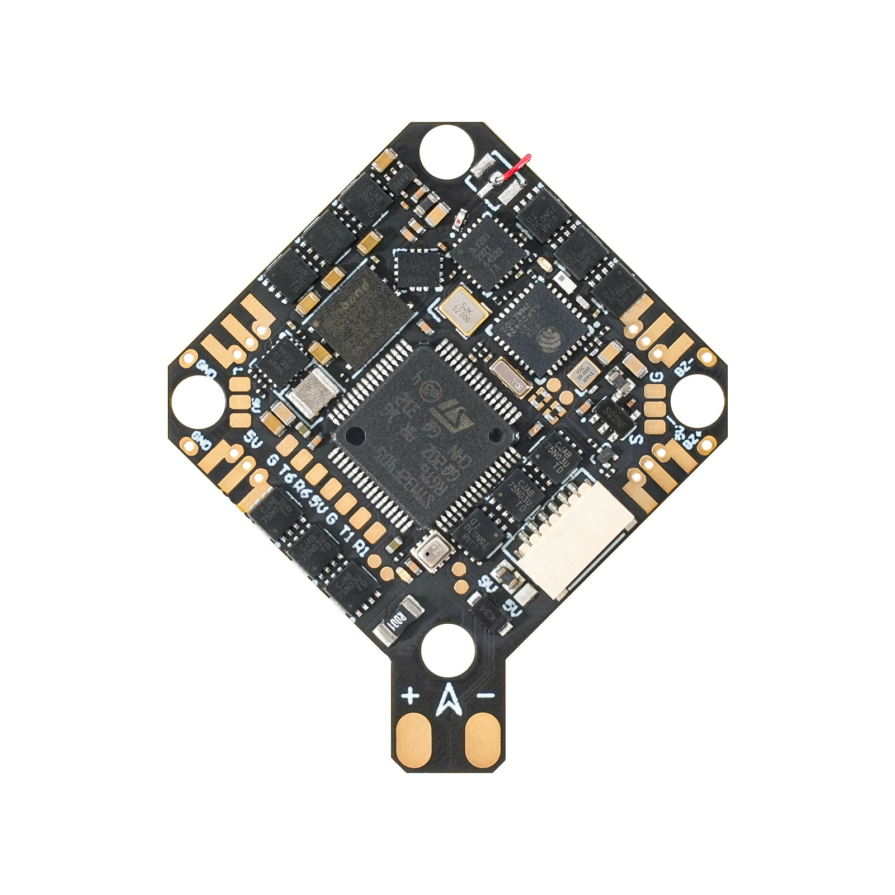
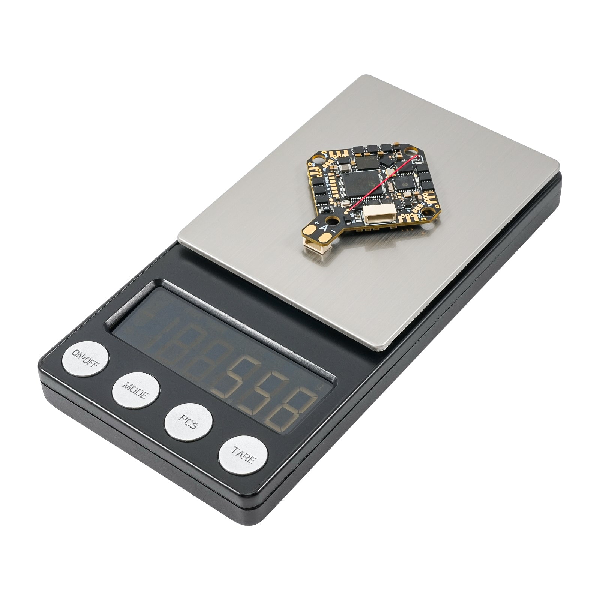

## Description

F4 2-3S 20A AIO FC V1 is specifically designed for HD VTX, utilizing 2-3S batteries for enhancing the flight experience. It features a dual BEC solution that delivers stable power outputs of 9V@2A for DJI O3 and 5V@3A for external devices. With a 20A ESC, it enables agile flight and increases dynamic. And connector for DJI O3 HD VTX and USB port for easy installation and maintenance. Ideal for HD VTX whoop enthusiasts, offering a heightened level of professionalism and convenience with this FC option.

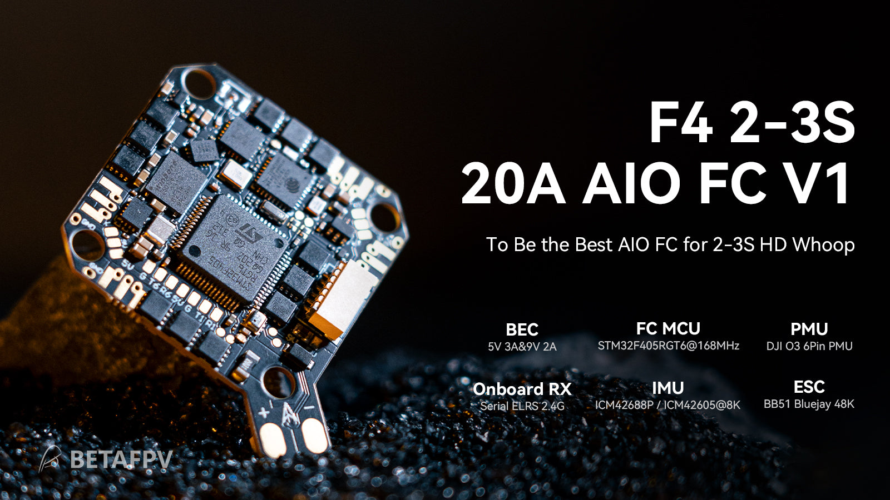

### Bullet Point

- Designed for HD VTX, it features a dual 9V@2A for DJI O3 and 5V@3A for external device BEC solution to prevent screen blackout on the DJI O3 due to low voltage during throttle increase.
- It includes a new DJI O3 6-pin PMU for easy installation without soldering, reducing assembly complexity. Newbie friendly.
- The power range of 2-3S provides increased thrust and improved control with a 20A ESC featuring a single NMOS for continuous current capability.
- The upgraded onboard receiver allows selective power cutoff for saving power and offers additional UART TX3 and RX3 ports for connecting the external device.
- Redesigned solder pad layout ensures larger, more secure pads for easy and reliable soldering, while the relocated USB port at the rear facilitates computer tuning.
- It features an STM32F405RGT6 chip, Integrate Serial ELRS 2.4G receiver, 16M black box, barometer, current meter, reserve 3 complete serial ports and a standard SBUS, support GPS, HD VTX, external receiver, and other equipment.

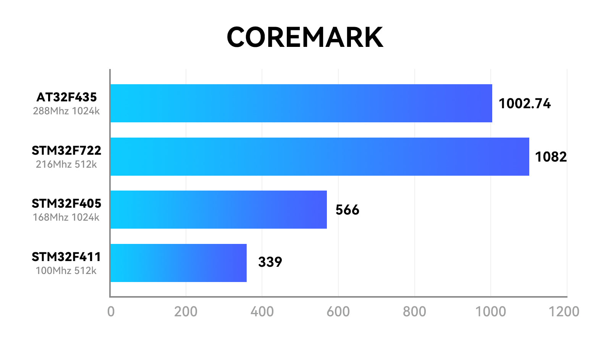

### Specification

- Weight: 5.58g (without motor connectors and power cable),5.92g (with motor connectors)
- Mounting Hole Size: 26mm x 26mm
- CPU*: STM32F405RGT6 (168MHz)
- Six-Axis: ICM42688P/ICM42605 (SPI connection)
- RX: Serial ELRS 2.4G Receiver
- RX firmware version: BETAFPV AIO 2400 RX ELRS V3.3.0
- Antenna: Enameled wire
- Blackbox Memory: 16MB
- Sensor: Barometer (BMP280/DSP310), Voltage & Current
- 5V BEC*: 5V 3A@8V supply
- 9V BEC*: 9V 2A@8V supply
- USB Port: SH1.0 4-Pin
- Built-in ESC with 20A continuous and peak 25A current
- ESC input voltage: 2-3S
- FC firmfware version: Betaflight_4.4.1_BETAFPVF405
- ESC firmware: C_X_70_48_V0.19.2.hex for BB51 Bluejay hardware
- Signal support: D-shot300, D-shot600

**The output current of BEC will decrease as the temperature increases*

### Diagram

Below is the diagram for F4 2-3S 20A AIO FC V1.

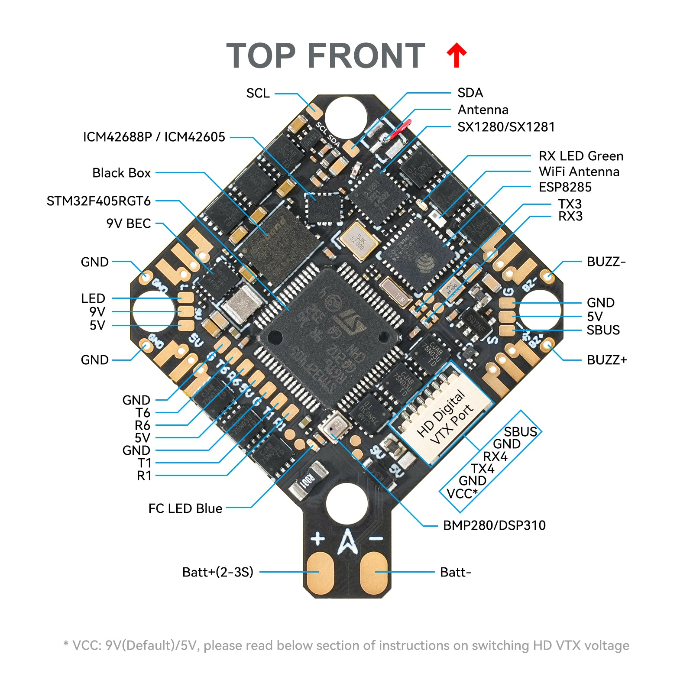

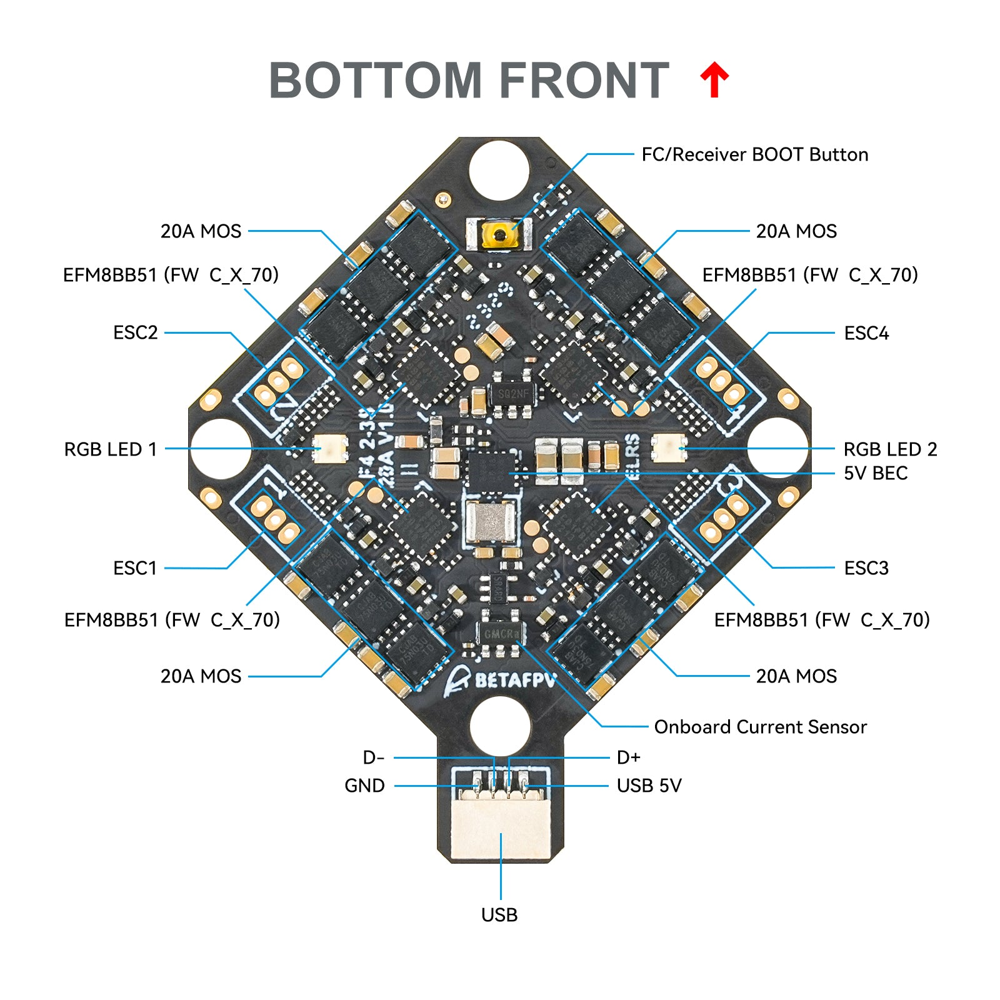

### Comparison

We upgraded the FC from [F4 1S 12A AIO FC V3](https://betafpv.com/products/f4-1s-12a-aio-brushless-flight-controller-v3-0) to [F4 2-3S 20A AIO FC V1](https://betafpv.com/products/f4-2-3s-20a-aio-fc-v1). The upgraded FC features an ESC with a pulse overcurrent capacity of 25A, ensuring stable operation of the flight controller even in the event of motor stalling. The addition of a 9V 2A BEC power supply ensures the stable operation of the DJI O3 HD VTX when the battery voltage is low. It also includes a DJI O3 6-pin PMU allowing for connection to HD VTX without soldering. It integrates features such as a 16MB black box, with support for GPS, external receivers, and other devices. The redesigned solder pad layout and USB connector make installation and maintenance easier and more convenient.

[F4 1S 12A AIO FC V3](https://betafpv.com/products/f4-1s-12a-aio-brushless-flight-controller-v3-0)
[F4 2-3S 20A AIO FC V1](https://betafpv.com/products/f4-2-3s-20a-aio-fc-v1)

Weight
4.23g
5.58g

BEC

5V@3A for External RX

5V@3A for External RX

9V@2A for DJI O3

Connector for DJI O3
Not support
Support

ESC Current
12A
20A

ESC Input Voltage

1-2S
2-3S

Number of Serial Ports
2*UART, 1*SBUS
4*UART, 1*SBUS

*Note: I*f you use the F4 2-3S 20A AIO FC V1, the serial port of the SBUS receiver is UART5 while F4 1S 12A AIO Brushless FC V3 is UART6.

F4 2-3S 20A AIO FC V1 also has extended the USB port to the end for easier parameter adjustment and wiring. And a new DJI O3 6-pin PMU has been added for convenient installation and maintenance.

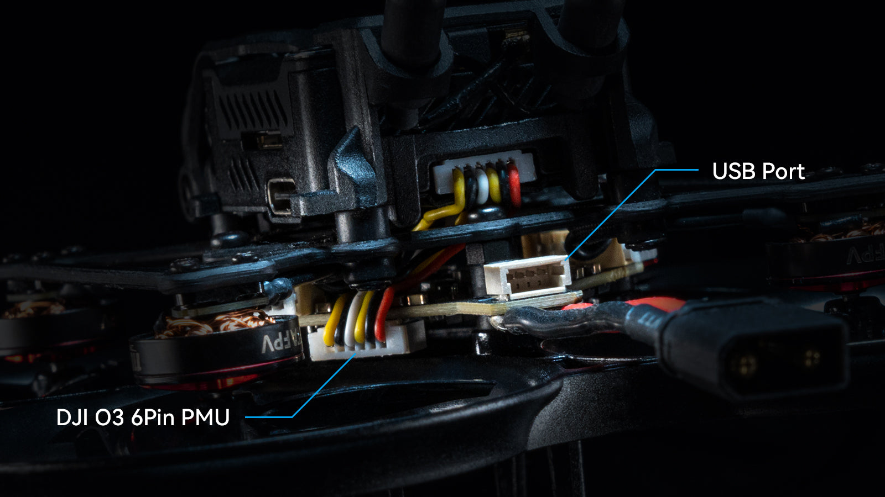

### FAQ

Power cutoff: Removing the chip bead disconnects the power supply, and to reuse the onboard ELRS receiver, soldering the solder pads together restores power.

UART3 release: Removing two resistors on the solder pads releases UART3. The left side is TX3, and the right side is RX3. To reconnect, solder the solder pads together when reusing the onboard ELRS receiver.

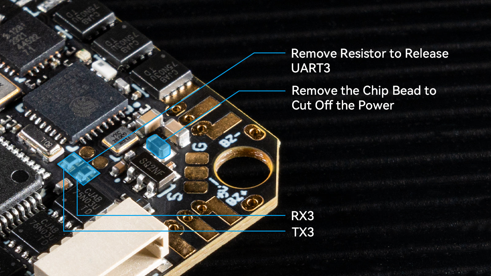

Voltage Switch: The HD VTX connector defaults to 9V. The chip bead is soldered between the 9V pad and the middle pad. To use WalkSnail Avatar HD mini 1s and Lite, please ensure the power supply voltage is 5V. Remove the chip bead first from the 9V pad and solder it between the middle pad and the 5V pad. Alternatively, you can use solder instead the chip bead to switch between the 5V and 9V pads.

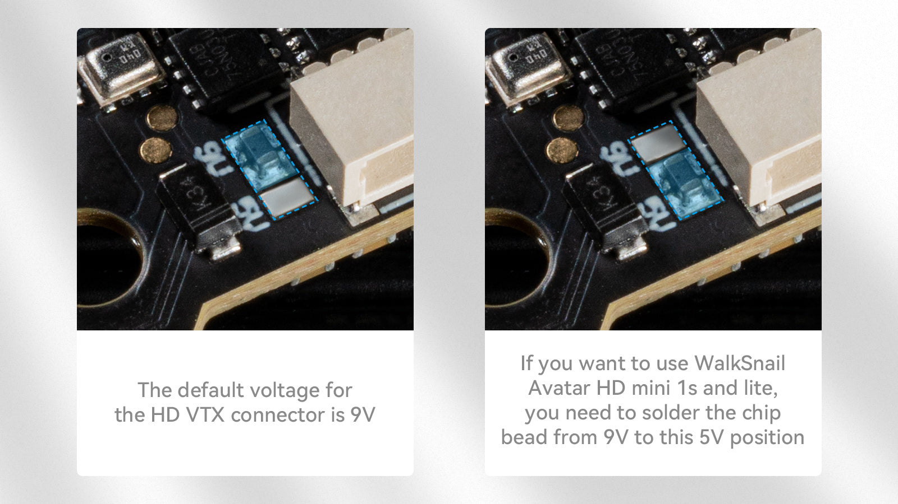

Motor choice: Avoid selecting motors with excessively high KV ratings, as motors above 20,000KV are prone to burn.

### Betaflight Firmware and CLI

FC firmware: Betaflight_4.4.1_BETAFVF405

[Download the firmware and CLI dump file](https://support.betafpv.com/hc/en-us/articles/21884915967513-CLI-for-F4-2-3S-20A-Flight-Controller-ELRS-V1-0-)

Reference link:

[https://github.com/betaflight/betaflight/releases/tag/4.4.1](https://github.com/betaflight/betaflight/releases/tag/4.4.1)

### ESC Firmware

With BB51 ESC solution, F4 2-3S 20A AIO FC V1 is based on BLHeliSuite16714903 with Bluejay ESC firmware, it supports bidirectional D-shot and RPM filtering in Betaflight, offers 24KHz, 48KHz, and 96KHz fixed PWM frequency for options, and custom start-up melodies. F4 2-3S 20A AIO FC V1 default factory setting is **48KHz** and it doesn’t recommend upgrading the 96KHz, or it might cause an error in the motor idle setting, not spinning when disarmed.

**DO NOT flash the firmware with a shorter interval,**otherwise, there will be a certain chance of stalling and burning the flight controller.

- ESC-Configurator: [https://preview.esc-configurator.com/](https://preview.esc-configurator.com/)
- [Download BLHeliSuite16714903](https://github.com/4712/BLHeliSuite/releases/tag/16714903)
- [Download the Bluejay ESC firmware. Please choose C_X_70.HEX](https://github.com/bird-sanctuary/bluejay/releases)

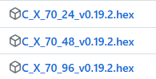

### Serial ELRS 2.4G RX

Serial ELRS 2.4G RX uses the Crossfire serial protocol (CRSF protocol) to communicate between the receiver and the flight controller board. So the Serial ELRS 2.4G RX is available to support upgrading to ELRS V3 with no need to flash Betaflight flight controller firmware.

- Enter binding status by power on/off three times.
- Plugin and unplug the flight controller three times;
- Make sure the RX LED is doing a quick double blink, which indicates the receiver is in bind mode;
- Make sure the RF TX module or radio transmitter enters binding status, which sends out a binding pulse;
- If the receiver has a solid light, it's bound.

The Serial ELRS 2.4G RX can be updated via Wi-Fi or Betaflight serial passthrough. Here is the way to update the Serial ELRS 2.4G RX firmware through passthrough.

- Plug in your FC to your computer, but do NOT connect to betaflight configurator.
- Choose target "BETAFPV 2.4GHz AIO RX".
- Flash using the BetaflightPassthrough option in ExpressLRS Configurator.

*[How to flash firmware via Wi-Fi here.](https://support.betafpv.com/hc/en-us/articles/4404231679129-How-to-Flash-Firmware-of-ELRS-RX-TX)*

### Connecting External Devices

Please note that the board reserves two serial ports and a standard SBUS port, which is available for the external CRSF protocol receiver or GPS module, and SBUS protocol receiver. You can refer to the below picture.

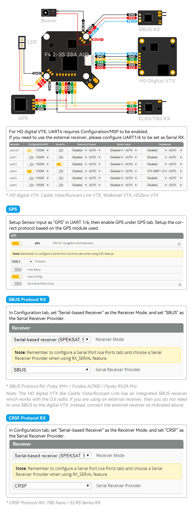

### Recommend Parts

- Drones: [Pavo20 Pro II](https://betafpv.com/products/pavo20-pro-ii-brushless-whoop-quadcopter), [Pavo20 Pro](https://betafpv.com/products/pavo20-pro-brushless-whoop-quadcopter), [Pavo Pico](https://betafpv.com/products/pavo-pico-brushless-whoop-quadcopter), [HX115 SE Toothpick Drone](https://betafpv.com/products/hx115-se-fpv-quadcopter)

### Package

- 1 * F4 2-3S 20A AIO FC V1
- 4 * M2*10 Machine Screw
- 4 * M2*10 Nylon Screw
- 4 * M2 Nuts
- 4 * Shock Absorbing Ball
- 4 * JST1.25mm Angle Socket
- 4 * JST1.25mm Straight Socket
- 1 * SH1.0 4Pin Adapter Cable
- 1 * Type-C to SH1.0 Adapter
- 1 * XT30 Power Cord
- 1 * Filter Capacitor
- 1 * 30mm Double-head VTX connector wire
- 1 * 60mm Single-head VTX connector wire

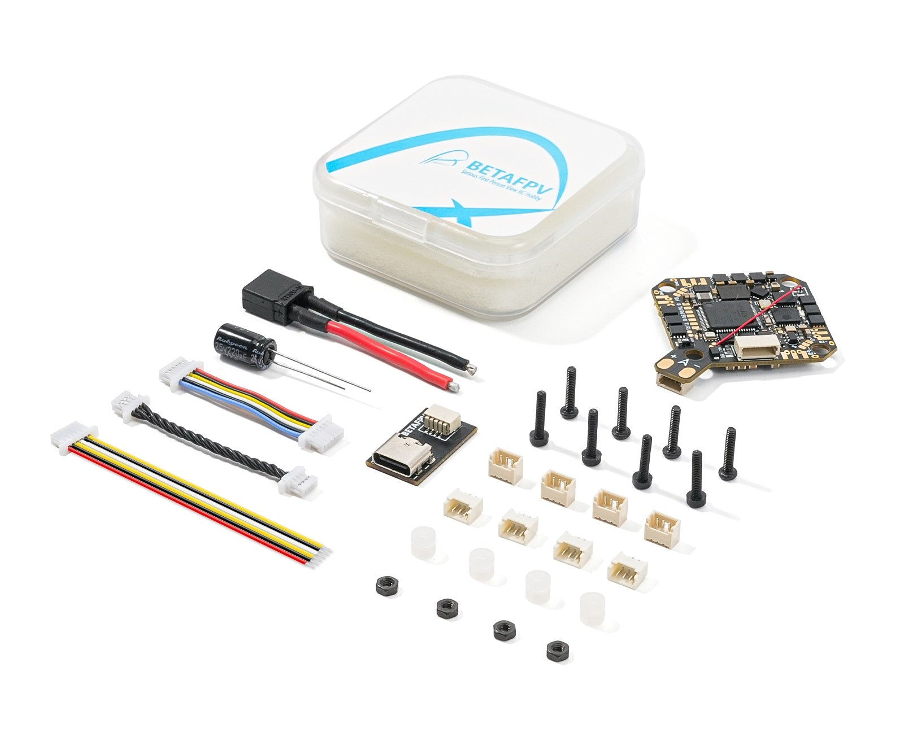
