# Matrix 1S Brushless Flight Controller (5IN1 II)

| | |
|---|---|
| Source | <https://betafpv.com/products/matrix-1s-5in1-ii-brushless-flight-controller> |
| Captured | 2026-08-14 |
| Shopify handle | `matrix-1s-5in1-ii-brushless-flight-controller` |
| Vendor | BETAFPV |
| Product type | Brushless FC |
| Published | 2026-01-29 |
| Relevance to this repo | STM32G473CEU6 5IN1 II — candidate for the BETAFPVG473_V2/V3 revisions (lists the ICM42688P/ICM42622/BMI270 alt-IMU set). UNCONFIRMED against board_name |

> Archived marketing page. Vendor specifications, **not** a configuration
> artifact — nothing here is restorable to a flight controller. Where this
> page and a CLI dump or `config.h` disagree, the dump or target wins.

## Variants

| Variant | SKU | Available |
|---|---|---|
| Solder-free | 01040020_1 | no |
| Solder-required | 01040020_2 | no |

## Gallery

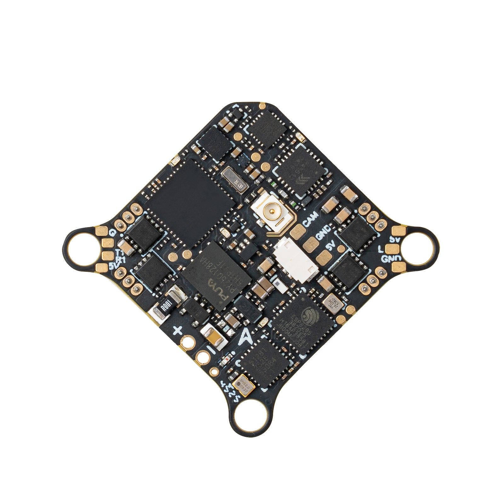
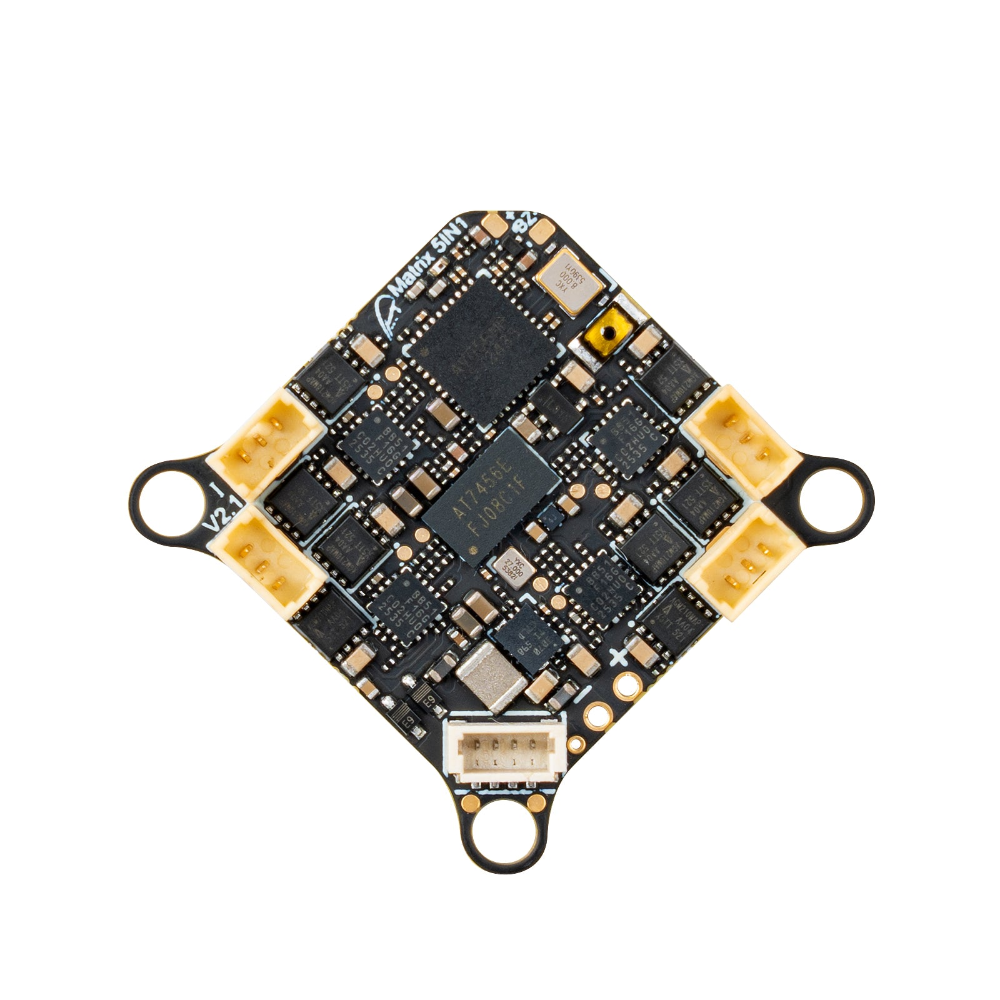
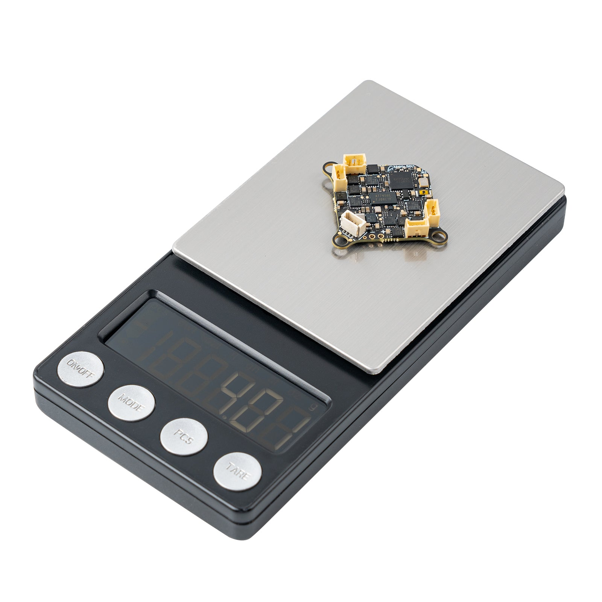
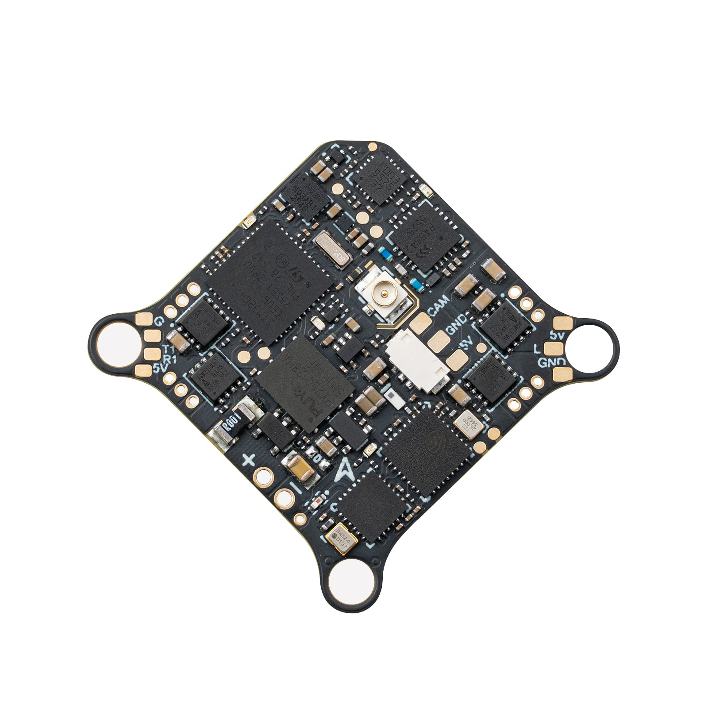
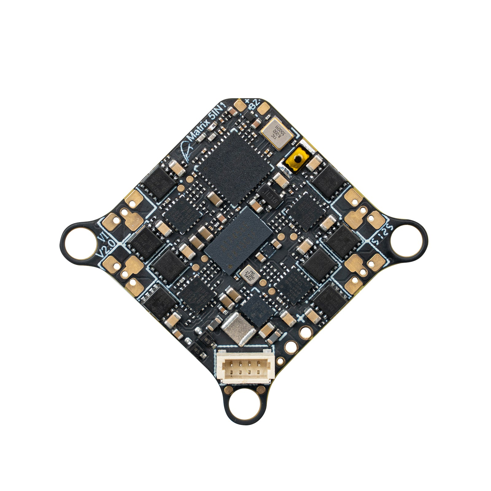
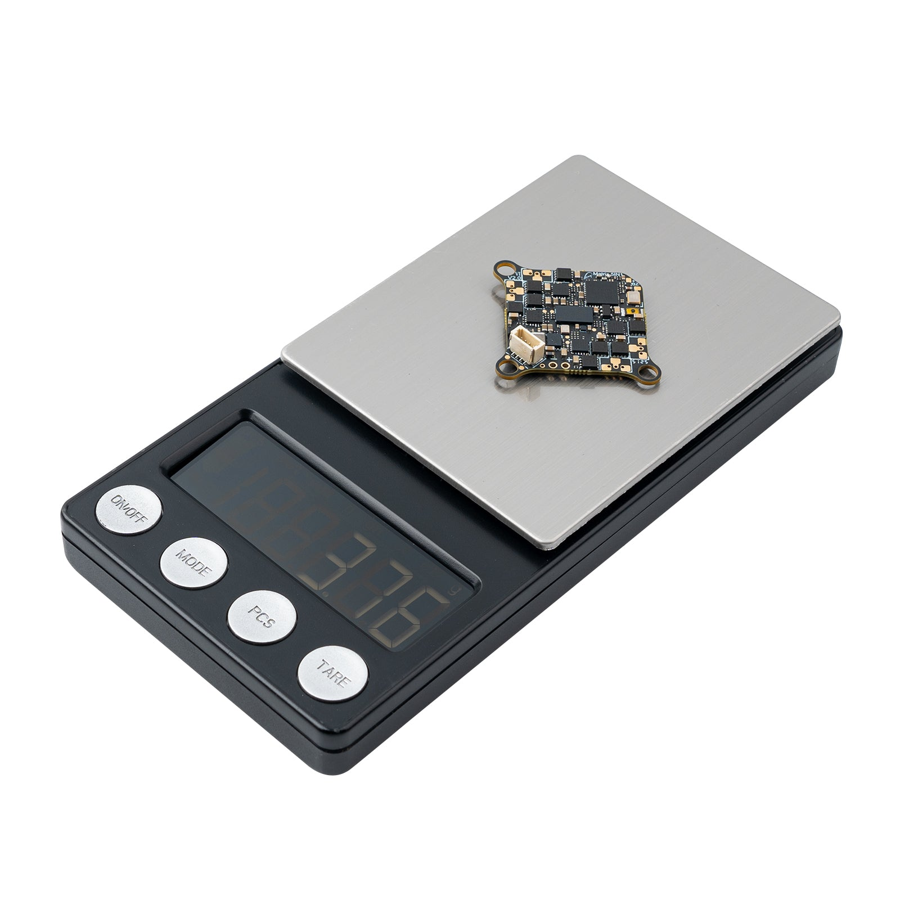

## Description

The Matrix 1S 5IN1 II Brushless Flight Controller is the next-generation flight controller engineered for pilots who refuse to compromise. Building on the proven all-in-one design, it delivers a substantial leap in both performance and durability. Experience the raw power of a 12A continuous ESC, the crash-proof confidence of 3-point mounting, and the build flexibility of Plug & Play or DIY versions. This is the durable, high-output core for your most demanding 1S whoop builds.

*Note: Due to the shortage of IMU chip ICM42688, BETAFPV team has found new IMU chips including ICM42622, BMI270, and LSM6DSK320X, and built [compatible firmwares](https://support.betafpv.com/hc/en-us/articles/54655791332761-Firmware-for-Matrix-1S-Brushless-Flight-Controller-5IN1-II). Extensive testing confirms they all meet our strict quality standards.*

*Betaflight has not yet released official firmwares compatible with some of the IMU chips, so please do not flash the official Betaflight firmware and pay attention to future support updates.*

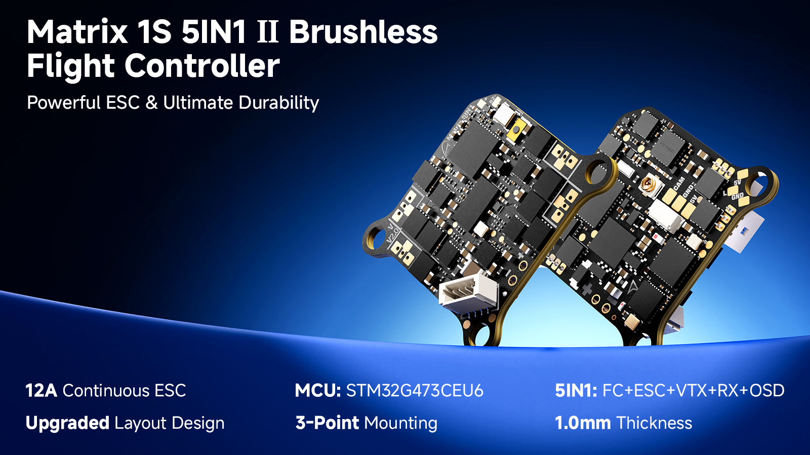

### Attention

- Flight controllers are covered for manufacturer defects. Issues arising from user errors, physical crash damage, damage during installation or dismantling, modifications, power surges, electrical fires, or water exposure are not covered.
- VTX Power: Higher VTX power consumes more energy and generates more heat, reducing flight time. For better flight time in indoor scenarios, use 25~100mW power.
- VTX Antenna: Connect and install the image transmission antenna before powering on the flight control. Alternatively, set transmission power to 0 to avoid burnout.

### Bullet Points

- All-in-One Integration: Combines the FC, ESC, OSD, Serial ELRS 2.4GHz RX, and a 5.8GHz 400mW VTX into a single, compact unit.
- Upgraded 12A Continuous ESC: Delivers 12A continuous current (18A peak) for powerful propulsion.
- Enhanced Durability: Features a robust 3-point mounting system and a 1.0mm thick PCB to absorb crash impacts and protect core components.
- Flexible Build Options: Available in both Solder-free and Solder-required versions to suit any skill level or weight preference. Features larger solder pads for easier, more reliable custom wiring.
- Advanced Core Components: Built around a powerful G473 processor for precise racing and complex freestyle maneuvers.
- Optimized Layout: A refined component arrangement improves durability and overall reliability.

### Specifications

#### FC

- MCU: STM32G473CEU6
- Gyro: ICM42688P / ICM42622 / BMI270 / LSM6DSK320X
- Blackbox memory: 16MB
- Sensor: Voltage & Current
- BEC: 5V, Max 3A
- UART: UART 1, UART 2 (For VTX), UART 3 (For RX), UART 4
- BetaFlight OSD: AT7456E
- ESC: 12A continuous
- RX: Serial ELRS 2.4GHz (V3.4.3)
- VTX: 5.8GHz 48 channels, Max 400mW
- FC firmware: Betaflight_4.5.3_BETAFPVG473_V2
- USB port: SH1.0-4Pin
- Motor connector: JST1.25
- Battery connector: BT2.0
- Mounting hole size: 26mm x 26mm
- Weight: 4.1±0.1g (solder-free), 3.76g (soldered-required)

#### ESC

- Power input: 1S Only
- Current: 12A continuous, 18A peak
- ESC firmware: A_X_5_96KHz_V0.19.hex for BB51 Bluejay firmware
- Digital signal protocol: DShot300, DShot600

#### VTX

- Output power: 25/100/200/400/PIT
- Frequency: 5.8GHz 48 channels, with Raceband: 5658~5917MHz
- Channel SEL: SmartAudio2.0
- Modulation type: FM
- Frequency control: PLL
- All harmonic: Max -50dBm
- Frequency stability: ±100KHz (Typ.)
- Frequency precision: ±200KHz (Typ.)
- Channel carrier error: ±1.5dB
- Antenna port: 50 Ω
- Operating temperature: -10℃~80℃

### Diagram

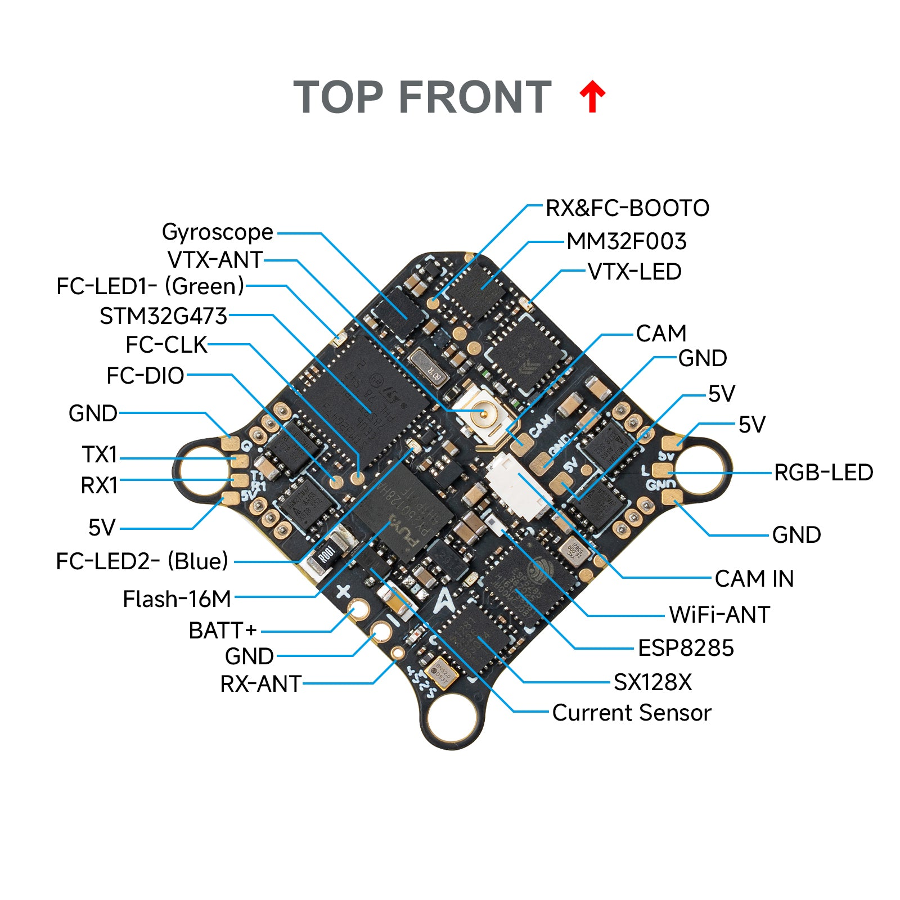

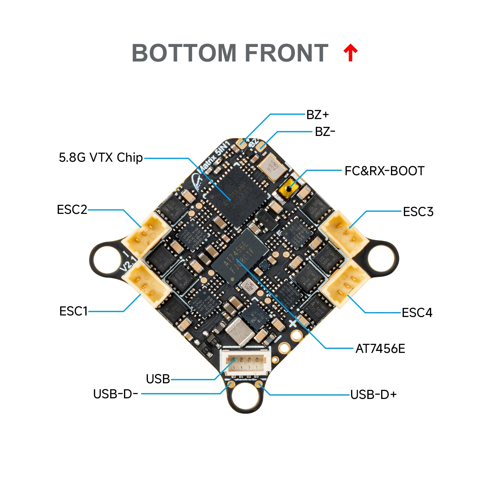

### Upgraded 12A Continuous ESC

The Matrix 5IN1 II features a significantly more powerful ESC, upgraded from 5A to a robust 12A continuous current (18A peak) to meet the high surge demands of 1S whoops. This increase was achieved by integrating 12 MOS tubes directly onto the board through rigorous testing. Paired with gold-plated motor connectors, it ensures superior conductivity and power delivery, providing stronger, more responsive propulsion.

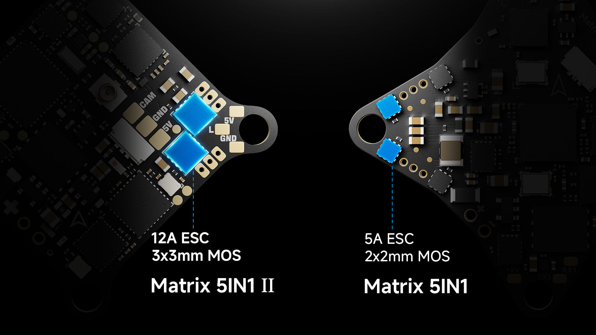

### Enhanced Durability & Crash Protection

Developed in response to community feedback on crash reliability, the board now features a 3-point mounting system. This design creates essential cushioning space during impacts, reducing stress on core components and lowering the damage rate by up to 80%. Combined with a 1.0mm thickened PCB and an optimized component layout, the Matrix 5IN1 II is built to survive hard crashes.

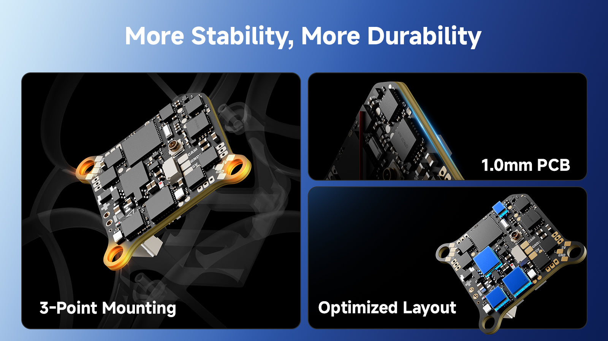

### Two Build Options: Solder-free Or Solder-required

To suit different builders, the Matrix 5IN1 II is available in two versions: solder-free and solder-required. The solder-free version has motor connectors and power cable pre-soldered for quick and easy installation, while the solder-required version includes the gold-plated JST1.25 connectors and BT2.0 U cable in the package for custom wiring. Larger solder pads allows direct soldering to save weight.

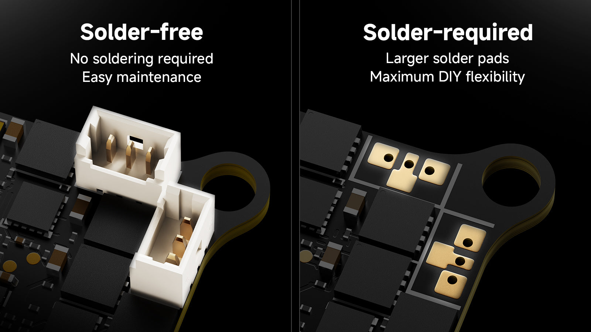

### Matrix 5IN1 II vs. Matrix 5IN1 vs. Air 5IN1

All three flight controllers share the same core MCU, OSD, RX, and VTX. The Matrix 5IN1 II is the next-generation balance, blending the durable 1mm-thick board and larger solder pads of the Matrix series with a remarkably lightweight design—adding only 0.16g compared to the Air 5IN1. It stands out with its 12A continuous (18A peak) ESC, gold-plated connectors, and three-point mounting, delivering superior power and the most robust crash protection for high-performance builds.

**Matrix 5IN1 II**

[Matrix 5IN1](https://betafpv.com/products/matrix-1s-brushless-flight-controller)

[Air 5IN1](https://betafpv.com/products/air-brushless-flight-controller?variant=41142912745606)

MCU

STM32G473CEU6

OSD

BetaFlight OSD: AT7456E

Blackbox Memory

16M

RX

Onboard serial ELRS 2.4GHz

VTX

Onboard 5.8GHz 48 channels, 400mW

Circuit Board Thickness

1.0mm

0.8mm

ESC

1S, 12A

1S, 5A

1S, 5A

Motor Connector

Gold plated JST1.25

JST1.25

-

Weight (VTX antenna excluded)

4.13g (solder-free)

3.76g (solder-required)

3.92g

3.60g

### Serial ELRS 2.4G RX

Serial ELRS 2.4G RX uses the Crossfire serial protocol (CRSF protocol) to communicate between the receiver and the flight controller board. So the Serial ELRS 2.4G RX is available to support upgrading to ELRS V3.0 with no need to flash Betaflight flight controller firmware. Enter binding status by power on/off three times.

- Plugin and unplug the flight controller three times;
- Make sure the RX LED is doing a quick double blink, which indicates the receiver is in bind mode;
- Make sure the RF TX module or radio transmitter enters binding status, which sends out a binding pulse;
- If the receiver has a solid light, it's bound.

The Serial ELRS 2.4G RX can be updated via Wi-Fi or Betaflight serial passthrough. Here is the way to update the Serial ELRS 2.4G RX firmware through passthrough.

- Plug in your FC to your computer, connect to ExpressLRS Configurator instead of Betaflight Configurator;
- Choose target "BETAFPV 2.4GHz AIO RX";
- Flash using the BetaflightPassthrough option in ExpressLRS Configurator.

*[How to flash firmware via Wi-Fi here.](https://support.betafpv.com/hc/en-us/articles/4404231679129-How-to-Flash-Firmware-of-ELRS-RX-TX)*

### Betaflight Firmware and CLI

Betaflight official developers recommend using version 42688 of the gyroscope, and many issues with ICM42688 have been fixed in version 4.5.3. Please learn more from version 4.5.3.

- FC firmware: [Betaflight_4.5.3_BETAFPVG473_V2, download the firmware and CLI dump file](https://support.betafpv.com/hc/en-us/articles/54655791332761-Firmware-for-Matrix-1S-Brushless-Flight-Controller-5IN1-II)
- Reference link: [https://github.com/betaflight/betaflight/releases/tag/4.5.3](https://github.com/betaflight/betaflight/releases/tag/4.5.3)

### Bluejay ESC Firmware

With BB51 ESC solution, Matrix 1S Brushless Flight Controller is based on A_X_5_96KHz_V0.19.hex for BB51 Bluejay hardware, it supports D-shot300, D-shot600, and even RPM filtering in Betaflight, offers 24KHz, 48KHz, and 96KHz fixed PWM frequency for options, and custom start-up melodies.

**DO NOT flash the firmware with a shorter interval,**otherwise, there will be a certain chance of stalling and burning the flight controller.

- ESC-Configurator: [https://preview.esc-configurator.com/](https://preview.esc-configurator.com/)
- [Download BLHeliSuite16714903](https://github.com/4712/BLHeliSuite/releases/tag/16714903)
- [Download the Bluejay ESC firmware. Please choose A_X_5_96KHz_V0.19.hex](https://github.com/bird-sanctuary/bluejay/releases)

### How to Use Serial Ports, Intergrated RX and VTX

Please note that by default, UART2 is connected to the VTX and UART3 is connected to the RX. To release UART3, please remove the resistor. Additionally, this FC reserves 2 complete full-featured serial ports that can be used for external CRSF/SBUS receivers, GPS, HD VTX, or other serial devices. You can refer to the below pictures.

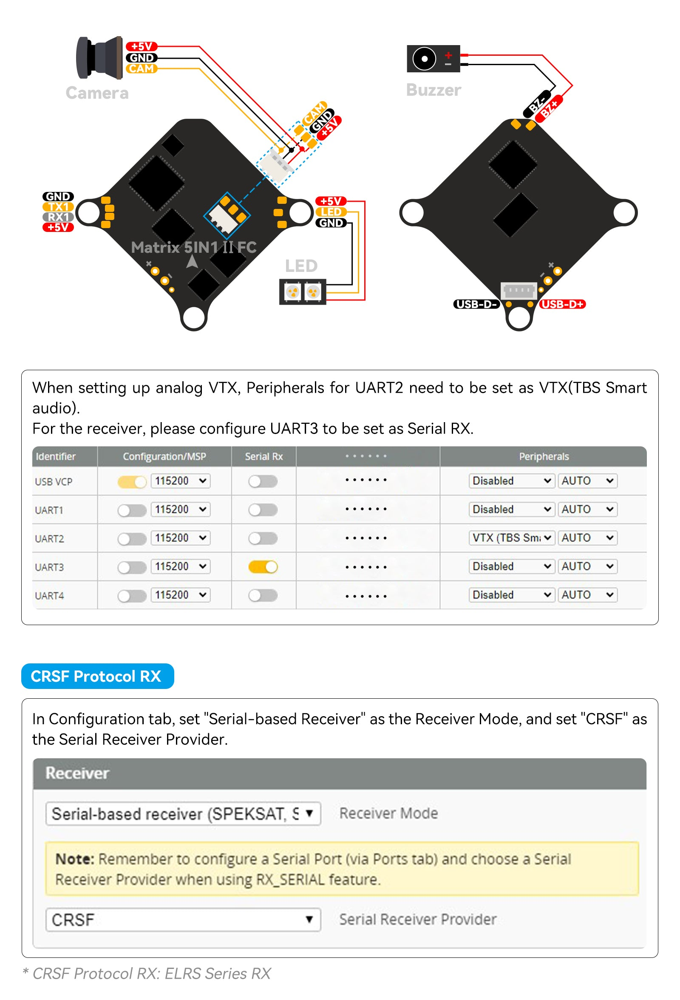

### Recommended Parts

- Drones: [Air65 II](https://betafpv.com/products/air65-ii-brushless-whoop-quadcopter), [Air75 II](https://betafpv.com/products/air75-ii-brushless-whoop-quadcopter), [Meteor65 Pro](https://betafpv.com/products/air65-brushless-whoop-quadcopter), [Meteor75 Pro](https://betafpv.com/products/air75-brushless-whoop-quadcopter)
- Frames: [Air65 Champion Frame](https://betafpv.com/products/air65-champion-brushless-whoop-frame), [Air65 II Frame](https://betafpv.com/products/air65-ii-brushless-whoop-frame), [Air75 II Frame](https://betafpv.com/products/air75-ii-brushless-whoop-frame), [Meteor65 Pro Frame](https://betafpv.com/collections/frame/products/meteor65-pro-frame-kit), [Meteor75 Pro Frame](https://betafpv.com/collections/frame/products/meteor75-pro-brushless-whoop-frame)
- Motors: [0702/0702SE Motors](https://betafpv.com/collections/motors/products/0702-brushless-motors), [0802/0802SE Motors](https://betafpv.com/collections/motors/products/0802se-22000kv-brushless-motors), [1102 Motors](https://betafpv.com/collections/motors/products/1102-13500kv-brushless-motors)
- Camera: [C03 Micro Camera](https://betafpv.com/products/c03-fpv-micro-camera)

### Package

Matrix 1S 5IN1 II Brushless Flight Controller (Solder-free Version)

- 1 * Matrix 1S 5IN1 II Brushless Flight Controller (Solder-free Version)
- 1 * Type-C to SH1.0 Adapter
- 1 * SH1.0-4Pin Adapter Cable
- 1 * 5.8G Antenna
- 4 * M1.2*4 Self-tapping Screws
- 4 * M1.4*5 Self-tapping Screws
- 4 * Shock Absorbing Balls

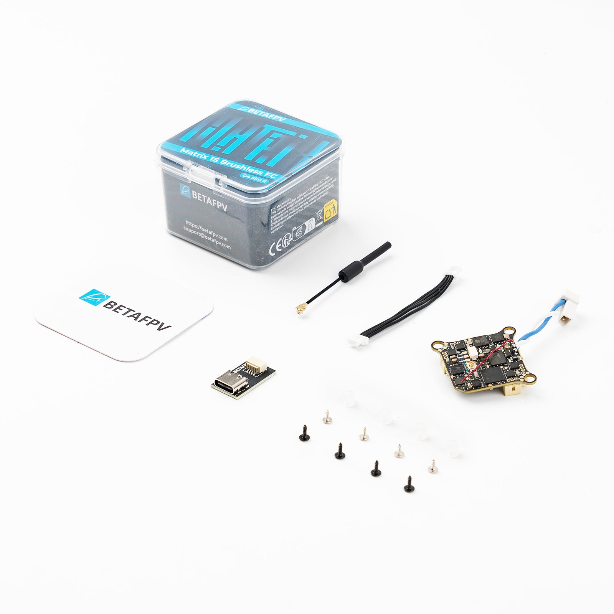

Matrix 1S 5IN1 II Brushless Flight Controller (Solder-required Version)

- 1 * Matrix 1S 5IN1 II Brushless Flight Controller (Solder-required Version)
- 4 * JST 1.25mm Gold Plated Connectors
- 1 * BT2.0 U Cable
- 1 * Type-C to SH1.0 Adapter
- 1 * SH1.0-4Pin Adapter Cable
- 1 * 5.8G Antenna
- 4 * M1.2*4 Self-tapping Screws
- 4 * M1.4*5 Self-tapping Screws
- 4 * Shock Absorbing Balls

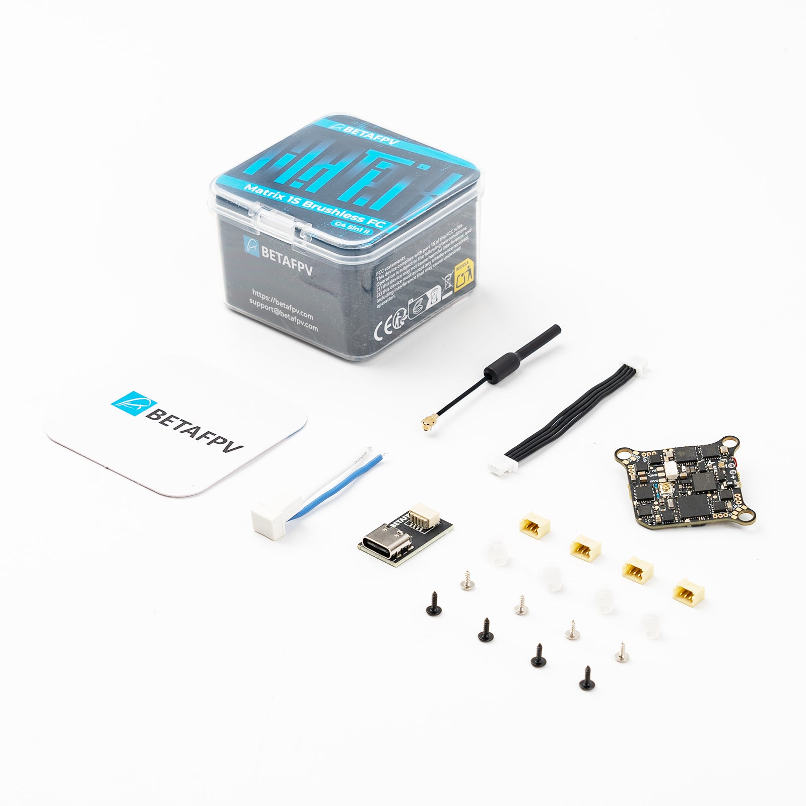
