# [BETA TEST] Matrix 1S Brushless Flight Controller (AIO P1 HD VTX)

| | |
|---|---|
| Source | <https://betafpv.com/products/matrix-1s-brushless-flight-controller-aio-p1-hd-vtx> |
| Captured | 2026-08-14 |
| Shopify handle | `matrix-1s-brushless-flight-controller-aio-p1-hd-vtx` |
| Vendor | BETAFPV |
| Product type | Brushless FC |
| Published | 2026-08-13 |
| Relevance to this repo | STM32G473 AIO P1 HD VTX (BETA TEST listing) — G473 family context. UNCONFIRMED |

> Archived marketing page. Vendor specifications, **not** a configuration
> artifact — nothing here is restorable to a flight controller. Where this
> page and a CLI dump or `config.h` disagree, the dump or target wins.

## Variants

| Variant | SKU | Available |
|---|---|---|
| 4IN1 | 01040024_1 | no |

## Gallery

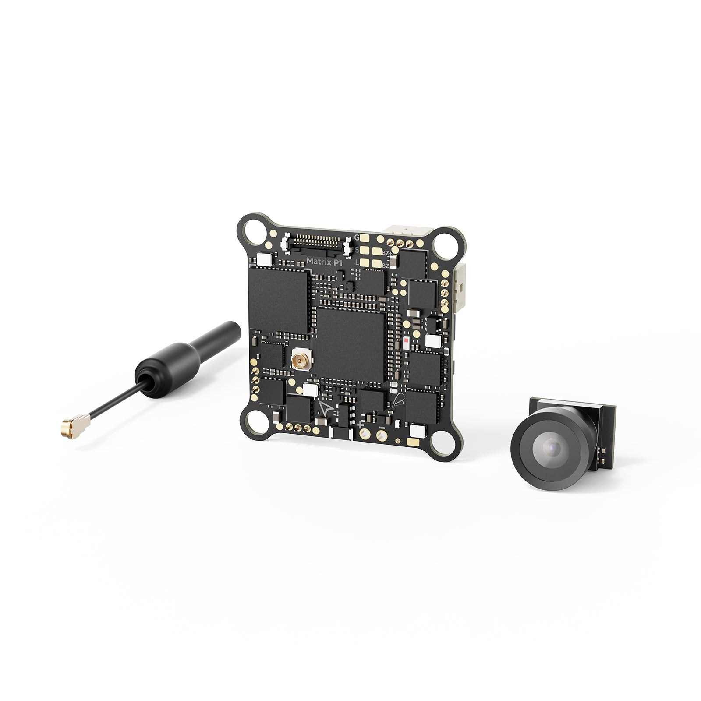
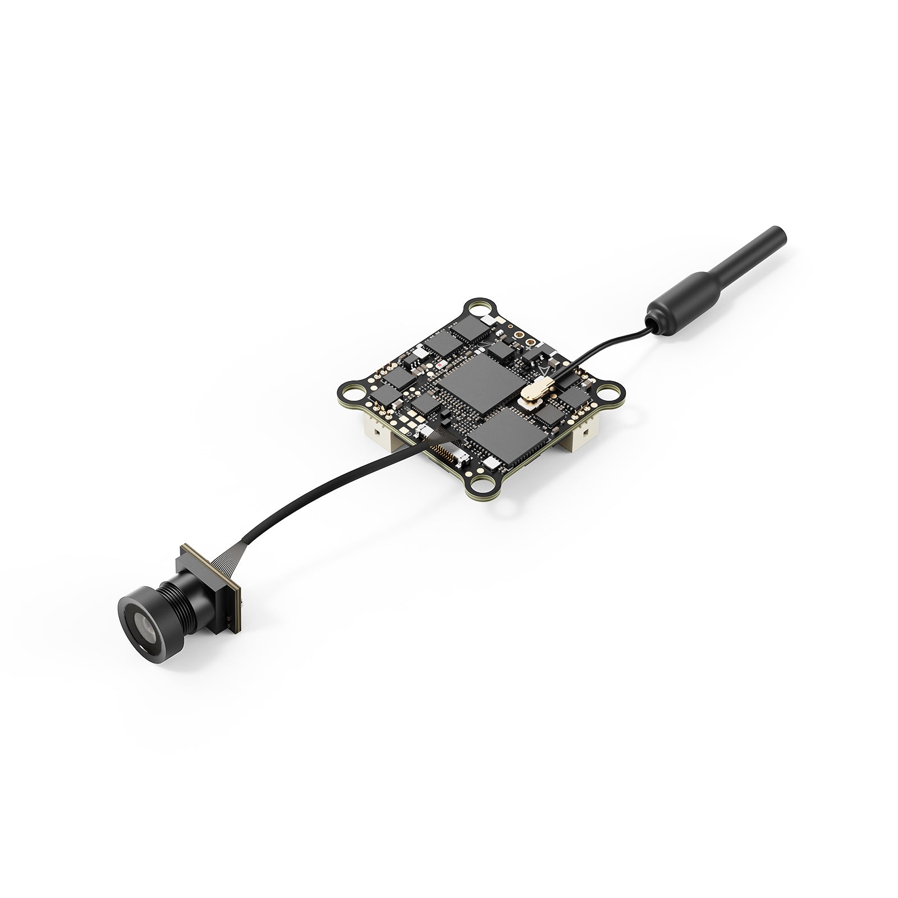
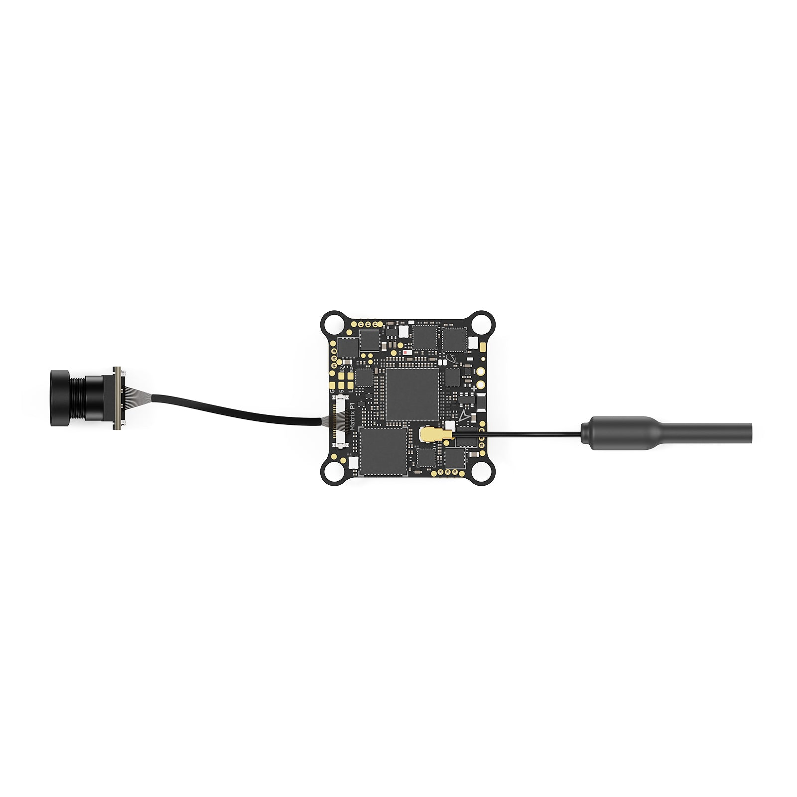
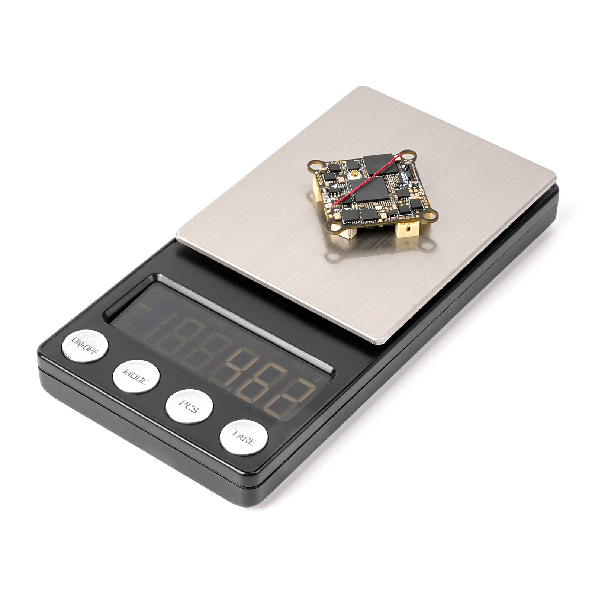
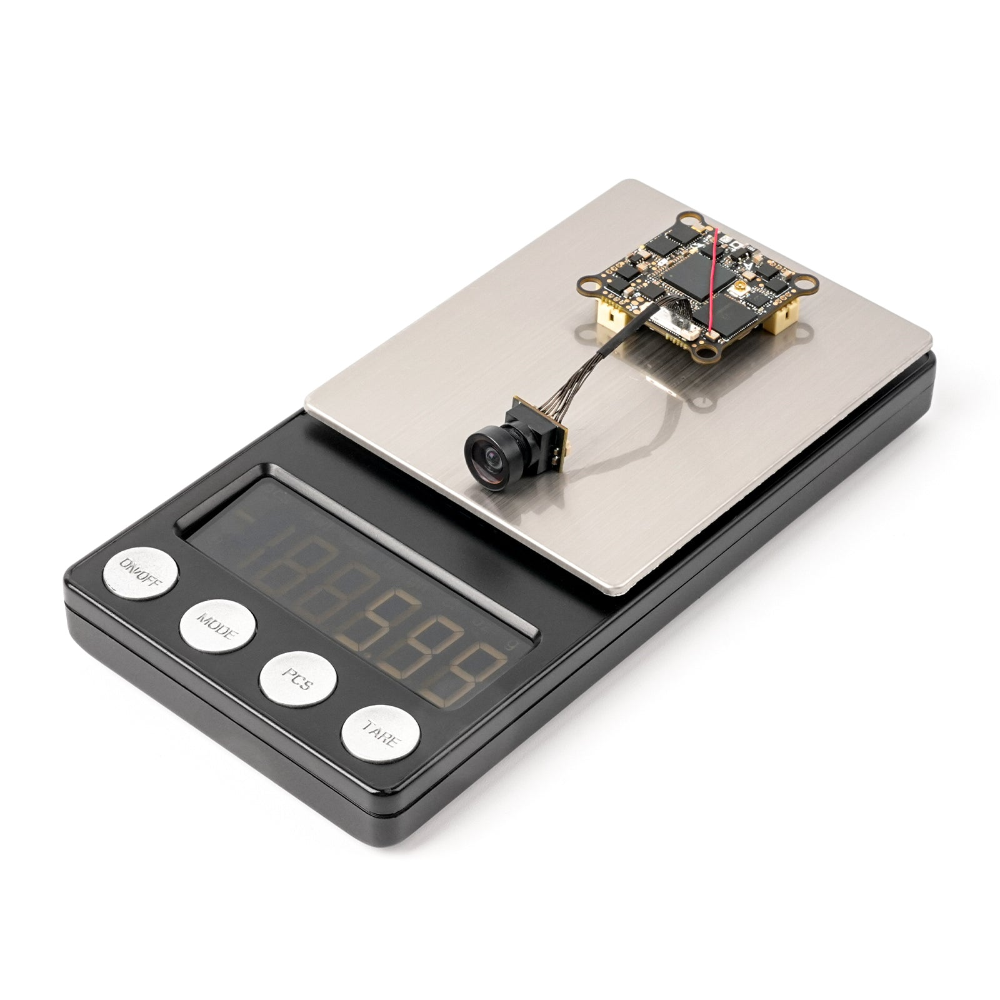

## Description

*This is the Beta Test page for the Matrix 1S Brushless Flight Controller (AIO P1 HD VTX). Just 100 units available at a discount. The final version will be released after the testing phase. Also in beta – the P1 HD VRX (Nano). [Check it out](https://betafpv.com/products/p1-hd-vrx-nano) for more information.*

Experience the lightest digital 1S flight controller – the Matrix 1S AIO P1 HD FC. Weighing just 4.60g, this fully integrated board combines the STM32G473 flight controller, continuous 12A ESC, Serial ELRS 2.4G receiver, and P1 Air Unit VTX into a single, compact unit – making it easier than ever to build and maintain your digital whoop. Enjoy a cost‑effective, lightweight, and plug‑and‑play digital FPV experience with the Matrix 1S AIO P1 HD FC.

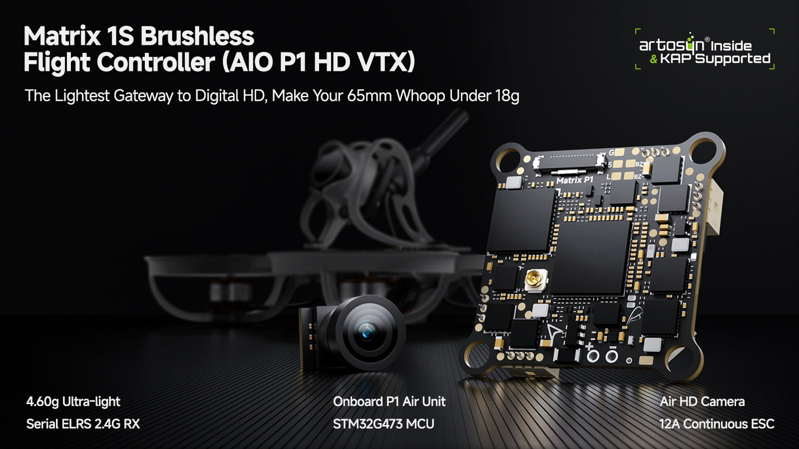

### Attention

- Flight controllers are covered for manufacturer defects. Issues arising from user errors, physical crash damage, damage during installation or dismantling, modifications, power surges, electrical fires, or water exposure are not covered.
- VTX Antenna: Connect and install the image transmission antenna before powering on the flight control. Alternatively, set transmission power to 0 to avoid burnout.

### Bullet Points

- Built-in P1 Air Unit HD VTX: Combines Matrix 1S FC with P1 Air Unit, adding a new digital HD member to the ArtLynk System for seamless integration.
- Lightest Digital FC: Weighs just 4.60g (5.99g with the Air HD Camera), keeping your 1S whoop lightweight and agile.
- All‑in‑One Integrated Design: Combines STM32G473 FC, 12A ESC, Serial ELRS 2.4G receiver, and P1 Air Unit VTX on a single board.
- Cost‑Effective Digital Upgrade – An affordable entry into digital HD FPV without compromising on performance or features.

### Specifications

#### FC

- MCU: STM32G473CEU6
- Gyro: 3.2kHz
- Blackbox memory: 16MB
- Sensor: Voltage & Current
- BEC: 5V, Max 3A
- UART: UART 2, UART 3 (For RX), UART 4 (For HD VTX)
- BetaFlight OSD: /
- ESC: 1S, 12A continuous
- RX: Serial ELRS 2.4GHz (V3.5.3)
- VTX: Onboard P1 Air Unit
- USB port: SH1.0-4Pin
- Motor connector: JST1.25 (gold-plated)
- Battery connector: BT2.0
- Mounting hole size: 25.5* 25.5mm
- Board thickness: 1.0mm
- Dimensions: 30.5*30.5mm
- Weight (antenna & camera excluded): 4.60g

#### ESC

- Power input: 1S
- Current: 12A continuous, 18A peak
- ESC firmware: A_X_5_96KHz_V0.19.hex for BB51 Bluejay firmware
- Digital signal protocol: DShot300, DShot600

#### RX

- RX: Serial ExpressLRS 2.4GHz
- Antenna: Copper wire 31mm length
- Firmware target: BETAFPV 2.4G AIO V2 RX
- Telemetry output power: <12dBm
- Flash firmware via WIFI: Support

#### VTX

- VTX: P1 Air Unit
- Frequency: 5.1-5.9GHz
- Power: 200mW
- Video transmission latency: c. 60ms
- Live view quality: 1080p@60fps

### Camera

- CMOS: 1/2.9''
- Resolution: 200 DPI
- FOV: 153°
- Aspect ratio: 16:9
- S/N Ratio: 41.5dB
- Port: DF36-15
- Coaxial cable length: 50mm
- Dimensions: 11.9*11.8*14.2mm
- Weight (cable included): 1.34g

### Diagram

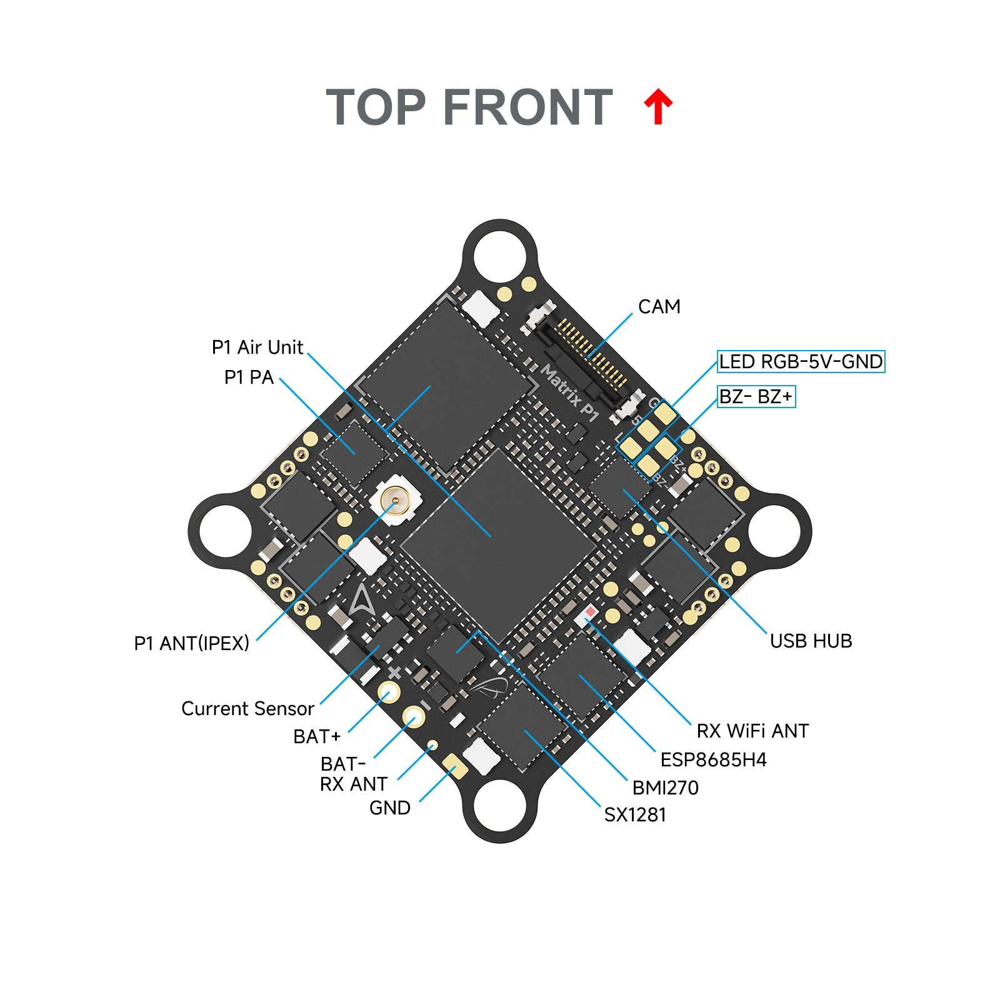

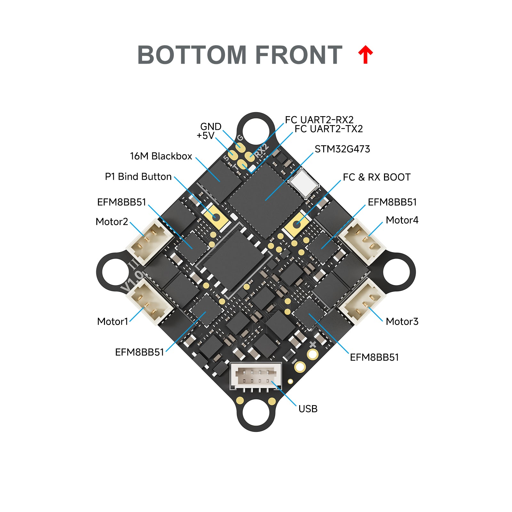

### Lightest Digital AIO

The Matrix AIO P1 HD FC integrates the P1 Air Unit HD VTX directly into the board, weighing just 4.60g – making it the lightest digital all‑in‑one flight controller available. When installed in the [Air65 II Champion](https://betafpv.com/products/air65-ii-brushless-whoop-quadcopter), the whoop weighs only 17.4g, just 0.8g heavier than the analog version. Experience crisp, clear HD video without the weight penalty – digital FPV has never been this light.

**Matrix AIO P1 HD FC**

[Matrix 5IN1 II FC](https://betafpv.com/products/matrix-1s-5in1-ii-brushless-flight-controller)

MCU

STM32G473CEU6

ESC

12A continuous, 18A peak

RX

Onboard P1 Air Unit

Onboard serial ELRS 2.4GHz

Camera

Air HD camera

C03 V2

Weight (FC)

4.60g

3.76g

Weight (Camera)

1.34g

1.45g

Weight (Installed in Air65 II Champion)

17.4g

16.6g

### Highly Integration

The Matrix AIO P1 HD FC combines the STM32G473 flight controller, Bluejay ESC, Serial ELRS 2.4G receiver, and P1 Air Unit VTX into a single, compact board – minimizing wiring and simplifying builds. The STM32G473 MCU runs at 168MHz, delivering excellent computing capacity for responsive flight performance. The powerful ESC features a robust 12A continuous current (18A peak) to meet the high surge demands of 1S digital whoops. Paired with the P1 Air Unit HD VTX, enjoy a 1080p@60fps live feed with approximately 60ms latency – crisp, immersive digital video at an affordable cost.

### Know More About ArtLynk Protocol

The ArtLynk protocol is a low-latency, long-range communication protocol for drones, offering superior stability and range over traditional analog VTX. ArtLynk protocol enables real-time HD video at about 60ms latency from glass to glass, which is crucial for smooth flight control and high-quality FPV (First Person View). Here are the key features you may want to know.

- **Artosyn Inside & KAP Supported:**ArtLynk protocol uses the Artosyn's latest AR803X chipset, with core technology support provided by KAP (KAP company provides core technology support or product solution to all FPV companies and ensures compatibility for various FPV products using Artosyn chipsets).
- **Collaborative and Open Community:**ArtLynk protocol is a collaborative FPV ecosystem not belonging to ONLY one company. Many FPV enterprises and teams would design and produce their own products based on the ArtLynk protocol, ensuring broad compatibility and fostering community.

The ArtLynk protocol supports the following devices, letting you customize your own build or simply bind and fly:

- BETAFPV [P1 Air Unit](https://betafpv.com/products/p1-air-unit-hd-vtx), [VR04 HD Goggles](https://betafpv.com/products/vr04-hd-fpv-goggles), [Aquila20 P1](https://betafpv.com/products/aquila20-brushless-whoop-quadcopter), [Meteor75 Pro P1](https://betafpv.com/products/meteor75-pro-p1-brushless-whoop-quadcopter), [Monitor](https://betafpv.com/products/monitor), [P1 HD VRX (Standard)](https://betafpv.com/products/p1-hd-vrx-standard), [P1 HD VRX (Nano) [Beta Test]](https://betafpv.com/products/p1-hd-vrx-nano), [Matrix 1S AIO P1 HD FC [Beta Test]](https://betafpv.com/products/matrix-1s-brushless-flight-controller-aio-p1-hd-vtx)
- [HGLRC Draco](https://www.hglrc.com/products/hglrc-draco-a1-a2-hd-vtx)
- TJRC VTX, XJRC XJ3D Goggles, XJRC 02L Goggles
- More coming soon!

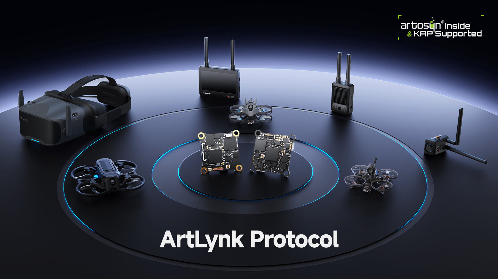

### Serial ELRS 2.4G RX

Serial ELRS 2.4G RX uses the Crossfire serial protocol (CRSF protocol) to communicate between the receiver and the flight controller board. So the Serial ELRS 2.4G RX is available to support upgrading to ELRS V3.0 with no need to flash Betaflight flight controller firmware. Enter binding status by power on/off three times.

- Plugin and unplug the flight controller three times;
- Make sure the RX LED is doing a quick double blink, which indicates the receiver is in bind mode;
- Make sure the RF TX module or radio transmitter enters binding status, which sends out a binding pulse;
- If the receiver has a solid light, it's bound.

The Serial ELRS 2.4G RX can be updated via Wi-Fi or Betaflight serial passthrough. Here is the way to update the Serial ELRS 2.4G RX firmware through passthrough.

- Plug in your FC to your computer, connect to ExpressLRS Configurator instead of Betaflight Configurator;
- Choose target "BETAFPV 2.4GHz AIO RX";
- Flash using the BetaflightPassthrough option in ExpressLRS Configurator.

*[How to flash firmware via Wi-Fi here.](https://support.betafpv.com/hc/en-us/articles/4404231679129-How-to-Flash-Firmware-of-ELRS-RX-TX)*

### Bluejay ESC Firmware

With BB51 ESC solution, Matrix 1S Brushless Flight Controller is based on A_X_5_96KHz_V0.19.hex for BB51 Bluejay hardware, it supports D-shot300, D-shot600, and even RPM filtering in Betaflight, offers 24KHz, 48KHz, and 96KHz fixed PWM frequency for options, and custom start-up melodies.

**DO NOT flash the firmware with a shorter interval,**otherwise, there will be a certain chance of stalling and burning the flight controller.

- ESC-Configurator: [https://preview.esc-configurator.com/](https://preview.esc-configurator.com/)
- [Download BLHeliSuite16714903](https://github.com/4712/BLHeliSuite/releases/tag/16714903)
- [Download the Bluejay ESC firmware. Please choose A_X_5_96KHz_V0.19.hex](https://github.com/bird-sanctuary/bluejay/releases)

#### ESC Configuration

This flight controller has Bluejay 96kHz firmware by default. If you experience motor startup issues, adjust the Minimum Startup Power (Boost) and Maximum Startup Power (Protection) parameters using the [ESC Configurator](https://esc-configurator.com/). Refer to the table below for recommended values.

Motor Models
Minimum Startup Power (Boost)
Maximum Startup Power (Protection)

Freestyle 0802 22000KV

Freestyle 1102 21000KV

1025
1100

Racing 0802 25000KV

Champion 0802 28000KV

Freestyle 0702 25000KV

Racing 0702 30000KV

Champion 0702 36000KV

1015
1060

### How to Use Serial Ports, Intergrated RX and VTX

Please note that by default, UART3 is connected to the RX and UART4 is connected to the HD VTX. Additionally, this FC reserves 1 complete full-featured serial ports that can be used for external CRSF/SBUS receivers, GPS, or other serial devices. You can refer to the below pictures.

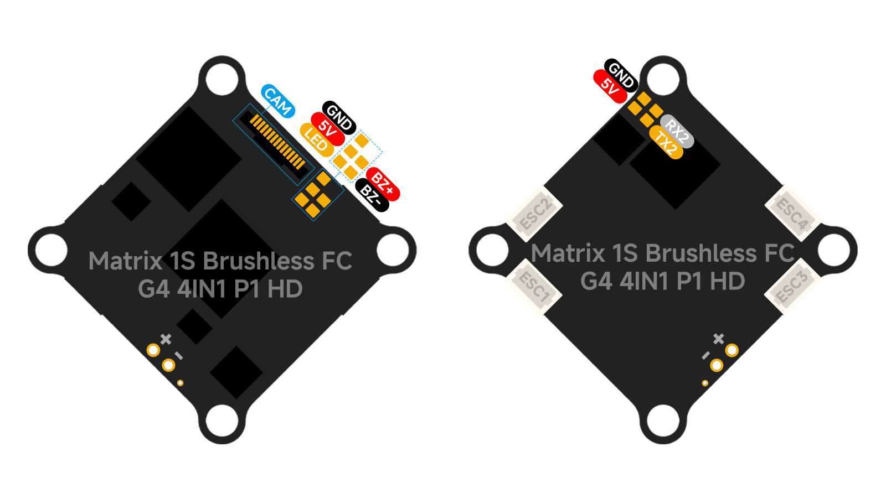

### Recommended Parts

- VRX: P1 HD VRX (Nano)
- Goggles: [VR04 HD](https://betafpv.com/products/vr04-hd-fpv-goggles)
- Whoops: [Air65 II](https://betafpv.com/products/air65-ii-brushless-whoop-quadcopter), [Air75 II](https://betafpv.com/products/air75-ii-brushless-whoop-quadcopter), [Meteor75 Pro](https://betafpv.com/products/meteor75-pro-brushless-whoop-quadcopter)
- Frame: [Air65 II Frame](https://betafpv.com/products/air65-ii-brushless-whoop-frame), [Air65 Champion Frame](https://betafpv.com/products/air65-champion-brushless-whoop-frame), [Air75 II Frame](https://betafpv.com/products/air75-ii-brushless-whoop-frame), [Meteor75 Pro II Frame](https://betafpv.com/products/meteor75-pro-ii-brushless-whoop-frame), [Meteor65 Pro II Frame](https://betafpv.com/products/meteor65-pro-ii-brushless-whoop-frame)
- Motors: [0702 Motors](https://betafpv.com/products/0702-brushless-motors-2026), [0802 Motors](https://betafpv.com/products/0802-brushless-motors-2026), [1102 Motors](https://betafpv.com/products/1102-brushless-motors-2026)
- Canopy: [Air II Canopy](https://betafpv.com/products/air-ii-canopy)

### Package

Matrix 1S Brushless Flight Controller (AIO P1 HD VTX)

- 1 * Matrix 1S Brushless Flight Controller (AIO P1 HD VTX)
- 1 * Type-C Adapter
- 1 * SH1.0-4Pin Adapter Cable
- 1 * 5.8G Antenna
- 4 * M1.2*4 Self-tapping Screws
- 4 * M1.4*5 Self-tapping Screws
- 4 * H1.2mm Shock Absorbing Balls

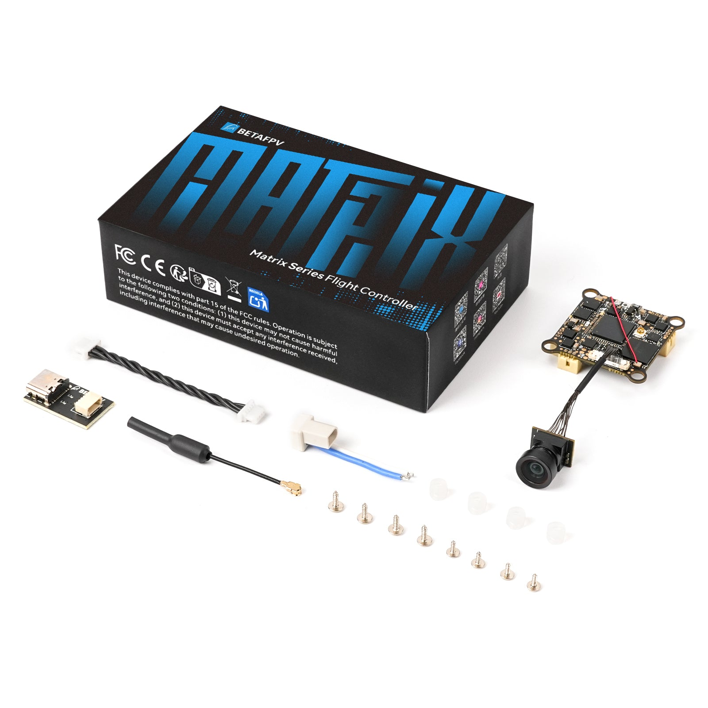
