# Matrix 1S Brushless Flight Controller (3IN1/4IN1)

| | |
|---|---|
| Source | <https://betafpv.com/products/matrix-1s-brushless-flight-controller-hd> |
| Captured | 2026-08-14 |
| Shopify handle | `matrix-1s-brushless-flight-controller-hd` |
| Vendor | BETAFPV |
| Product type | Brushless FC |
| Published | 2025-01-09 |
| Relevance to this repo | STM32G473CEU6 3IN1/4IN1 — G473 family context; likely the Meteor75 Pro P1 FC lineage. UNCONFIRMED |

> Archived marketing page. Vendor specifications, **not** a configuration
> artifact — nothing here is restorable to a flight controller. Where this
> page and a CLI dump or `config.h` disagree, the dump or target wins.

## Variants

| Variant | SKU | Available |
|---|---|---|
| 4IN1 | 01040018_3 | no |
| 3IN1 (BMI270) | 01040018_4 | no |
| 3IN1 (ICM42688P) | 01040018_2 | no |

## Gallery

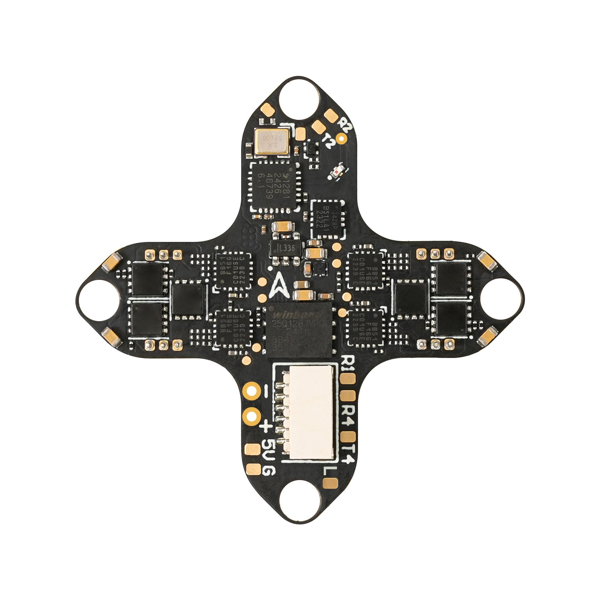
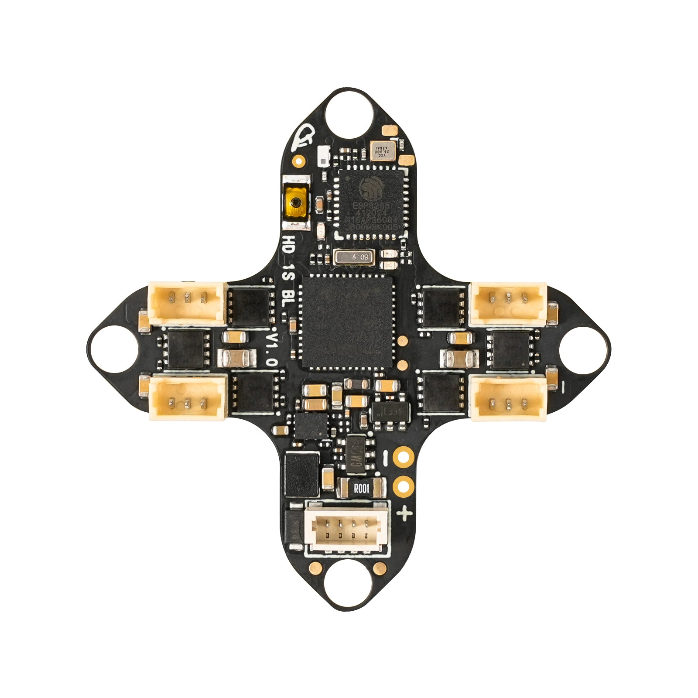
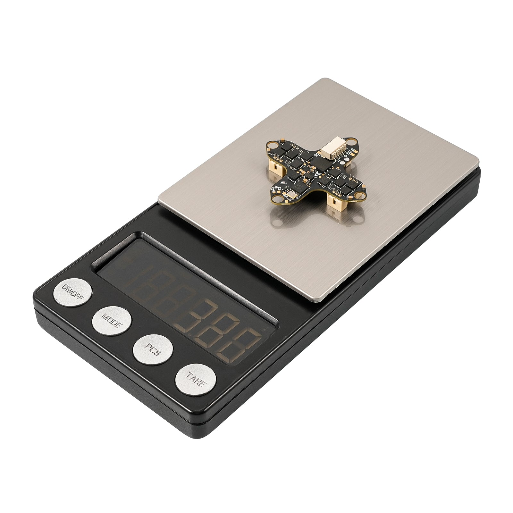
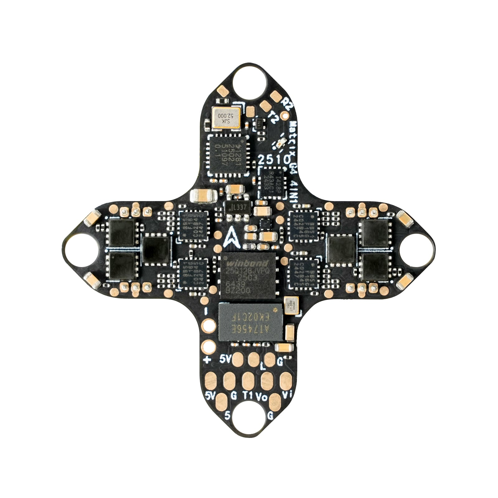
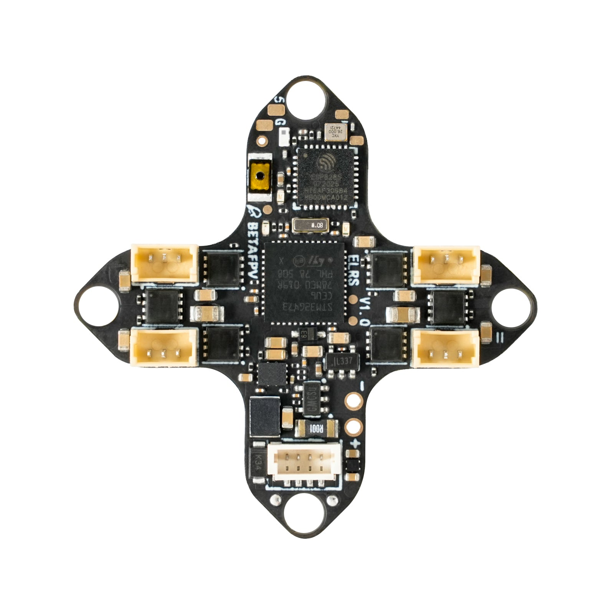
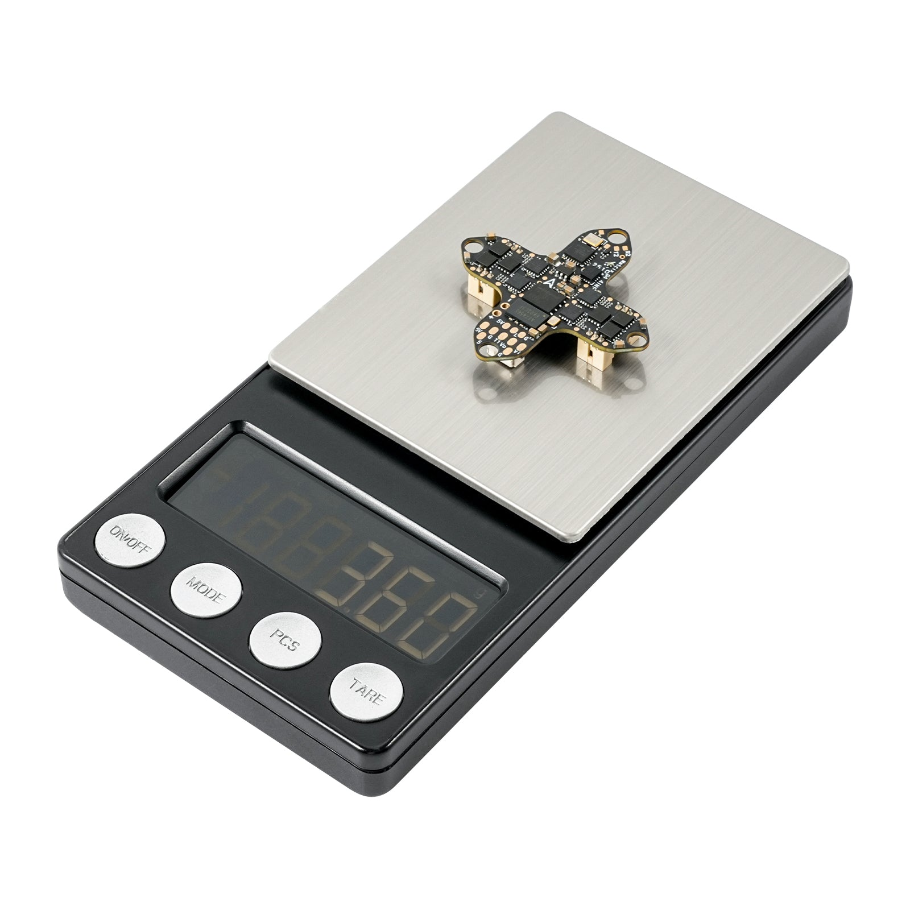

## Description

The Matrix 1S Brushless Flight Controller redefines 1S whoop performance with two purpose-driven architectures: the 3IN1 for DJI O4 digital dominance (integrating FC, ESC, and ELRS 2.4G RX while omitting analog OSD), and the 4IN1 for analog mastery (adding built-in OSD + solder pads for external VTXs). Both feature the iconic cross-design architecture, newly developed BEC, 18A peak ESCs, and the STM32G473 MCU for 55% faster processing—delivering effortless setup, pro-tier control, and uncompromised flight dynamics that rewrite 1S standards.

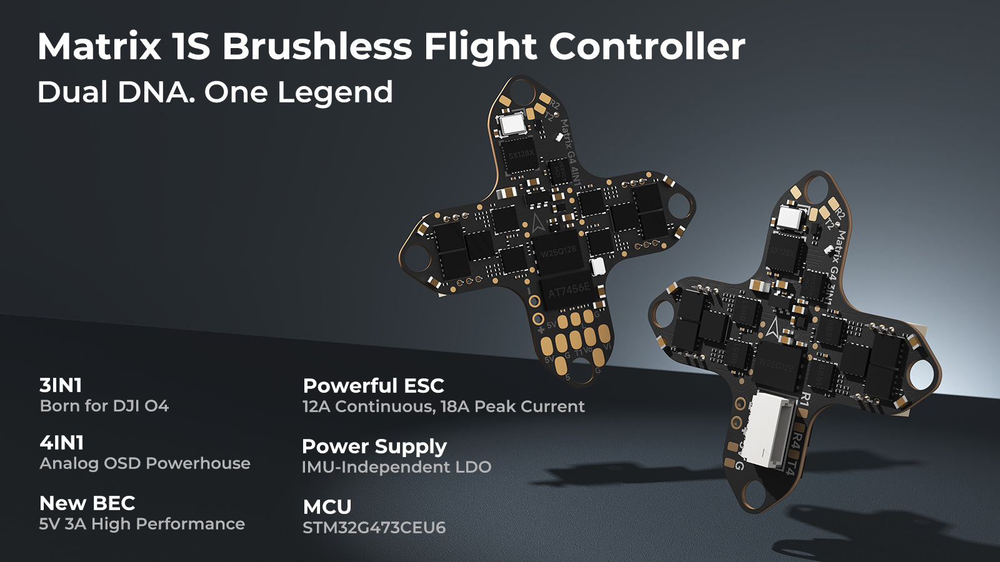

### Attention

- Crafted for newcomers and recreational pilots, the Matrix FC features a robust 1mm board for enhanced durability, a solder-free design for easy installation, and a beginner-friendly experience. For advanced pilots, the ultra-thin and lightweight [Air FC](https://betafpv.com/products/air-brushless-flight-controller) is the definitive choice, engineered with race-winning agility to push the boundaries of FPV flight performance.
- Flight controllers are covered for manufacturer defects. Issues arising from user errors, physical crash damage, damage during installation or dismantling, modifications, power surges, electrical fires, or water exposure are not covered.

### Bullet Points

- Dual DNA: 3IN1 (FC, ESC, and ELRS 2.4G RX) for DJI O4 digital dominance (omits analog OSD), 4IN1 for analog mastery with OSD.
- STM32G473 MCU: 55% faster processing than F411 for responsive tuning.
- Stable Video Transmission: Features a newly developed BEC to ensure consistent power delivery for seamless HD performance.
- Enhanced Overcurrent Capacity: Supports 12A continuous current and 18A peak ESC, providing robust performance for demanding flights.
- Reliable Precision: Includes an independent 3.3V LDO design to deliver stable, interference-free power directly to the IMU for accurate control.
- Whoop-ready Installation: The 3IN1 is equipped with motor plugs and a SH1.0-6Pin HD digital port for a hassle-free installation and maintenance experience, while the 4IN1 has external VTX soldering pads for protocol flexibility.

### Specifications

#### FC

- MCU: STM32G473CEU6 (168MHz)
- Gyro: ICM42688P
- Blackbox Memory: 16MB
- Sensor: Voltage & current
- BEC: 5V/3A
- UART (3IN1 Version): UART 1 (RX Only/SBUS), UART 2 (Free), UART 3 (For RX), UART 4 (Free/HD MSP)
- UART (4IN1 Version): UART 1 (For VTX), UART 2 (Free), UART 3 (For RX), UART 4 (NONE)
- ESC: 12A continuous
- RX: Serial ELRS 2.4GHz (V3.4.3)
- FC Firmware: Betaflight_4.5.1_BETAFPVG473 (3IN1 version), Betaflight_4.5.2_BETAFPVG473_V2 (4IN1 version)
- USB Port: SH1.0-4Pin
- OSD: AT7456E (4IN1 version only)
- HD Digital VTX Port: SH1.0-6Pin (3IN1 version only)
- Motor Plug: JST1.25-3Pin
- Battery Connector: BT2.0
- Mounting Size: 25.5mm x 25.5mm
- Weight (3IN1 Version): 3.8±0.1g (battery connector excluded), 4.2±0.1g (battery connector included)
- Weight (4IN1 Version): 3.6±0.1g (battery connector excluded), 4.6±0.1g (battery connector included)

#### ESC

- Power Input: 1S only
- Current: 12A continuous, 18A peak
- ESC Firmware: A_X_5_96_v0.19.2.hex for BB51 Bluejay firmware
- Digital Signal Protocol: DSHOT300, DSHOT600

**Matrix 1S 3IN1**

**Matrix 1S 4IN1**

[F4 1S 5A AIO](https://betafpv.com/products/f4-1s-5a-aio-brushless-flight-controller-elrs-2-4g)

MCU

STM32G473CEU6

STM32F411CEU6

MCU frequency

168MHz

108MHz

Gyro, max. sampling rate

ICM42688P, 8KHz

BMI270, 3.2KHz

ESC

12A continuous

1S, 5A

Blackbox

memory

16M

8M

OSD

-

Betaflight OSD: AT7456E

RX

Onboard Serial ELRS 2.4GHz

Motor plug

JST1.25

Weight

3.8g

3.6g

3.64g

### 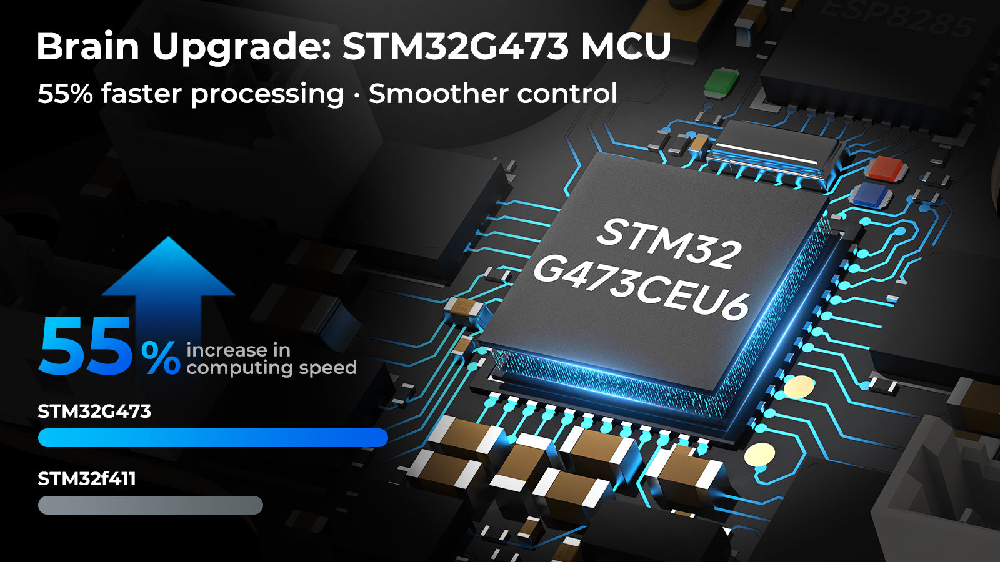

### Diagram

Matrix 1S Brushless Flight Controller (3IN1):

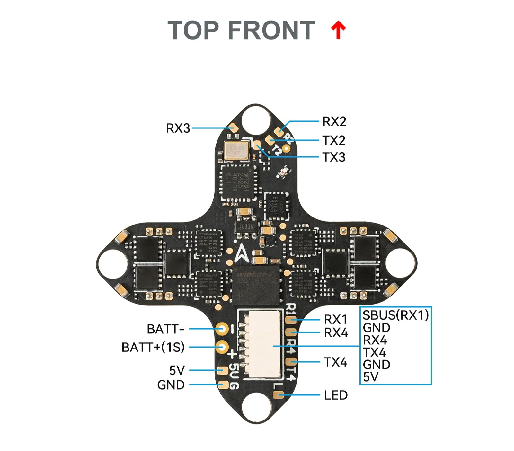

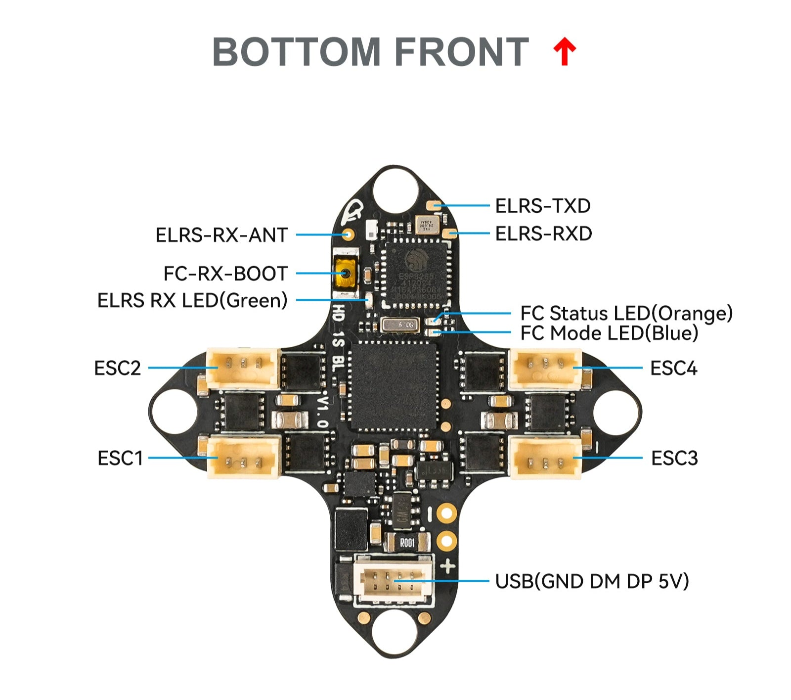

Matrix 1S Brushless Flight Controller (4IN1):

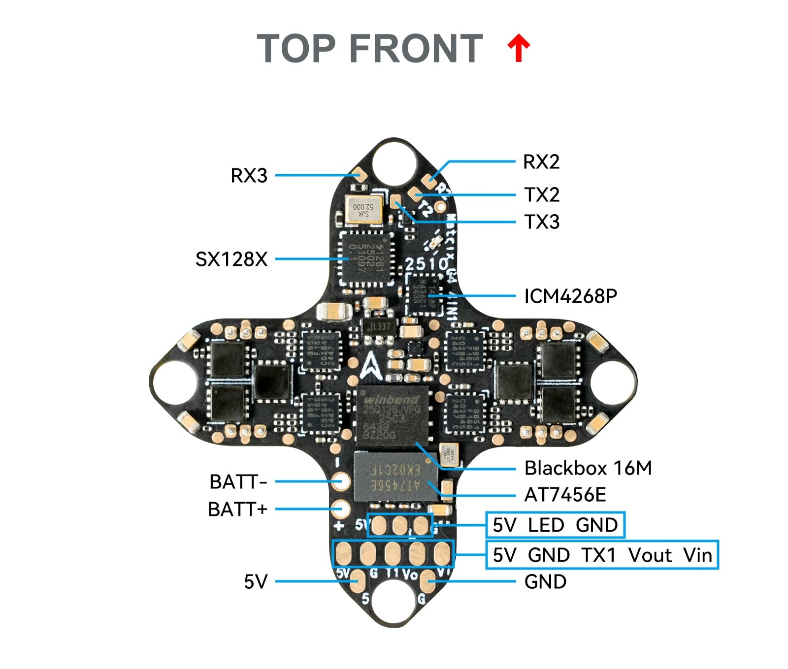

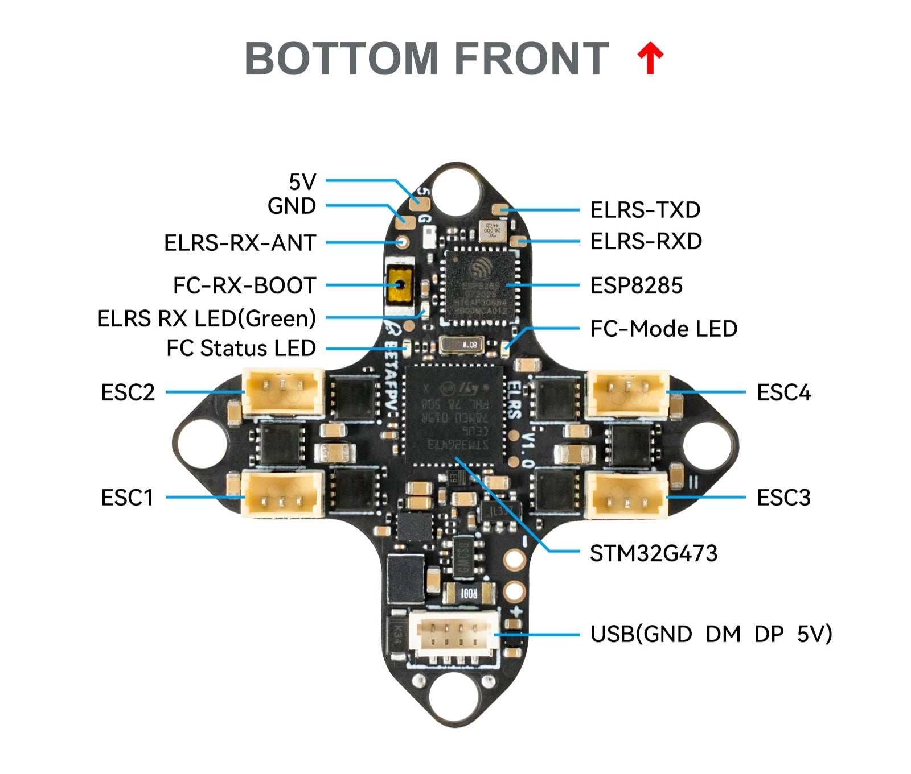

### Ultra-Resilient BEC

1S whoops often fly at voltages as low as 3.3V and digital image transmission requires higher current, placing significant demands on the BEC. To meet these challenges, an advanced BEC has been developed, capable of delivering over 3A of current at ultra-low voltages down to 2.85V. This ensures stable image transmission even in critical situations. While flying to such low voltages isn't recommended, this innovation provides pilots with a greater chance of safely recovering from unexpected situations.

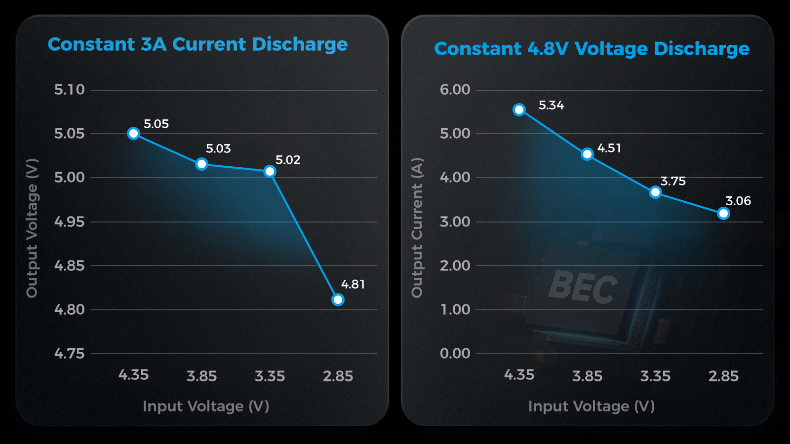

### Enhanced Continuous 12A ESC

Whether powering digital HD systems or high-performance analog builds, 1S whoops demand ESCs that won’t flinch. Our engineers exceeded expectations, delivering a robust ESC with 12A continuous output and 18A peak capacity on the iconic "cross" flight controller. This ensures optimal thrust-to-weight ratio, reliable performance, and worry-free high-definition flights.

### Individual Power Supply for IMU

Unlike traditional shared power supply designs, the Matrix 1S FC features an independent 3.3V LDO power supply exclusively for the IMU. This innovation eliminates interference, creating a cleaner and more stable environment that enhances flight precision, improves sensitivity, and reduces the risk of performance issues—ensuring unmatched stability during every flight.

### Whoop-ready Installation

Equipped with convenient motor plugs and a SH1.0-6Pin HD digital port, the 3IN1 version allows for a completely solder-free installation and maintenance process. Spend less time building and more time flying HD whoops.

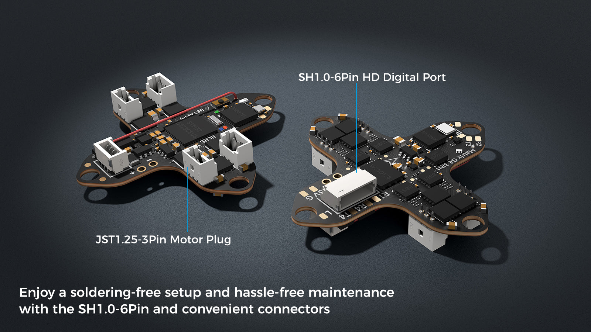

The 4IN1 version retains soldering pads for external analog VTX, giving you protocol freedom while reducing voltage ripple interference for cleaner video signals.

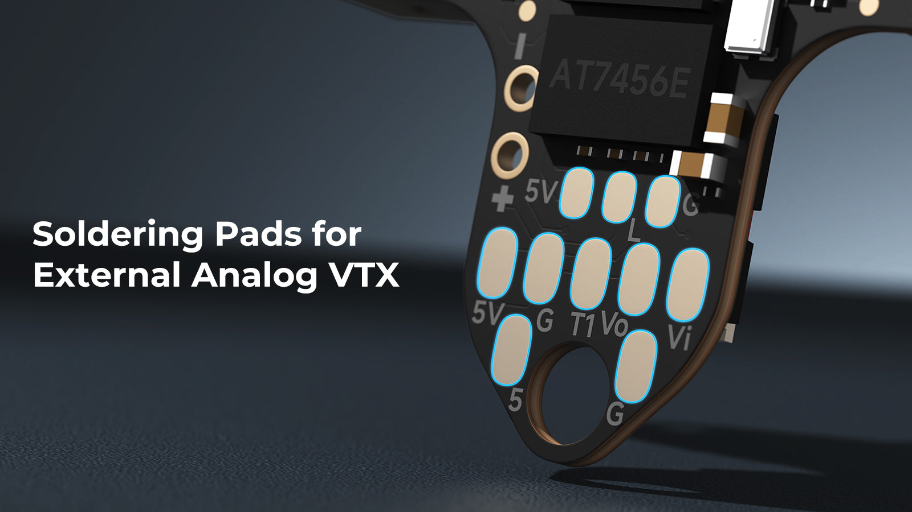

### Serial ELRS 2.4G RX

Serial ELRS 2.4G RX uses the Crossfire serial protocol (CRSF protocol) to communicate between the receiver and the flight controller board. So the Serial ELRS 2.4G RX is available to support upgrading to ELRS V3.0 with no need to flash Betaflight flight controller firmware. Enter binding status by power on/off three times.

- Plugin and unplug the flight controller three times;
- Make sure the RX LED is doing a quick double blink, which indicates the receiver is in bind mode;
- Make sure the RF TX module or radio transmitter enters binding status, which sends out a binding pulse;
- If the receiver has a solid light, it's bound.

The Serial ELRS 2.4G RX can be updated via Wi-Fi or Betaflight serial passthrough. Here is the way to update the Serial ELRS 2.4G RX firmware through passthrough.

- Plug in your FC to your computer, connect to ExpressLRS Configurator instead of Betaflight Configurator;
- Choose target "BETAFPV 2.4GHz AIO RX";
- Flash using the BetaflightPassthrough option in ExpressLRS Configurator.

*[How to flash firmware via Wi-Fi here.](https://support.betafpv.com/hc/en-us/articles/4404231679129-How-to-Flash-Firmware-of-ELRS-RX-TX)*

### Betaflight Firmware and CLI

Betaflight official developers recommend using version 42688 of the gyroscope, and many issues with ICM42688 have been fixed in version 4.5.0. Please learn more from version 4.5.1 and 4.5.2.

Matrix 1S Brushless Flight Controller (3IN1):

- FC firmware: Betaflight_4.5.1_BETAFPVG473, download the [firmware and CLI dump file](https://support.betafpv.com/hc/en-us/articles/41037090524697-Firmware-for-Matrix-1S-Brushless-Flight-Controller-3IN1-HD)
- Reference link: [https://github.com/betaflight/betaflight/releases/tag/4.5.1](https://github.com/betaflight/betaflight/releases/tag/4.5.1)

Matrix 1S Brushless Flight Controller (4IN1):

- FC firmware: Betaflight_4.5.2_BETAFPVG473_V2, download the [firmware and CLI dump file](https://support.betafpv.com/hc/en-us/articles/48215862783769-Firmware-for-Matrix-1S-Brushless-Flight-Controller-4IN1)
- Reference link: [https://github.com/betaflight/betaflight/releases/tag/4.5.2](https://github.com/betaflight/betaflight/releases/tag/4.5.2)

*IMPORTANT:*

- *Starting Jan 5, 2026, we will be shipping 3IN1 FC equipped with the BMI270 gyroscope. Before flashing firmware, please verify your gyroscope version to ensure compatibility.*
- *The Matrix 1S 3IN1 and 4IN1 require different firmware - always verify your version before flashing to avoid performance issues.*

### Bluejay ESC Firmware

With BB51 ESC solution, Matrix 1S 3IN1 HD Brushless Flight Controller is based on A_X_5_96_v0.19.2.hex for BB51 Bluejay firmware, it supports DSHOT300, DSHOT600, and even RPM filtering in Betaflight, offers 24KHz, 48KHz, and 96KHz fixed PWM frequency for options, and custom start-up melodies.

**DO NOT flash the firmware with a shorter interval,**otherwise, there will be a certain chance of stalling and burning the flight controller.

- ESC-Configurator: [https://preview.esc-configurator.com/](https://preview.esc-configurator.com/)
- Download [BLHeliSuite16714903](https://github.com/4712/BLHeliSuite/releases/tag/16714903)
- Download the [Bluejay ESC firmware,](https://github.com/bird-sanctuary/bluejay/releases) please choose A_X_5_96_v0.19.2.hex.

### How to Use Serial Ports, Intergrated RX and VTX

UART3 is connected to the built-in serial ELRS RX. To release UART3, please remove the resistor. Additionally, Matrix 1S FC reserves 2 complete full-featured serial ports that can be used for external serial receivers, GPS, HD VTX, or other serial devices. Refer to the pictures below.

Matrix 1S Brushless Flight Controller (3IN1):

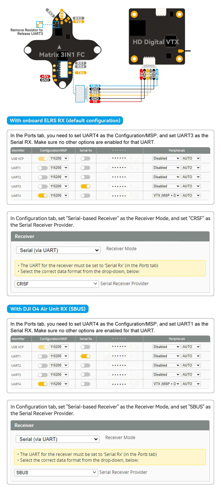

Matrix 1S Brushless Flight Controller (4IN1):

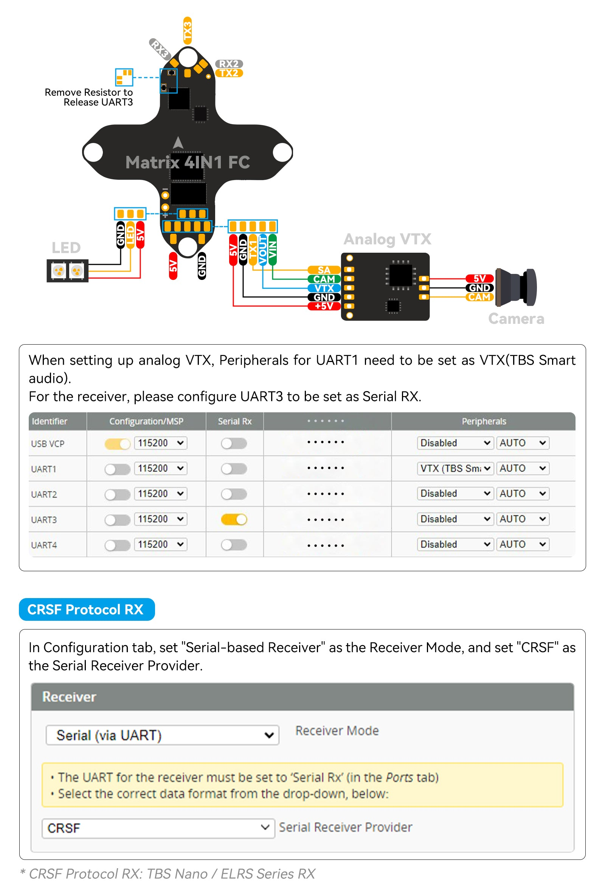

### Recommended Parts

Matrix 1S Brushless Flight Controller (3IN1)

- Drones: [Meteor75 Pro II O4](https://betafpv.com/products/meteor75-pro-ii-o4-brushless-whoop-quadcopter), [Meteor65 Pro II O4](https://betafpv.com/products/meteor65-pro-ii-o4-brushless-whoop-quadcopter), [Meteor65 Pro O4](https://betafpv.com/products/meteor65-pro-o4-brushless-whoop-quadcopter), [Meteor75 Pro O4](https://betafpv.com/products/meteor75-pro-o4-brushless-whoop-quadcopter)
- Frames: [Meteor75 Pro II Frame](https://betafpv.com/products/meteor75-pro-ii-brushless-whoop-frame), [Meteor65 Pro II Frame](https://betafpv.com/products/meteor65-pro-ii-brushless-whoop-frame), [Meteor75 Pro Frame](https://betafpv.com/products/meteor75-pro-brushless-whoop-frame), [Meteor65 Pro Frame](https://betafpv.com/products/meteor65-pro-frame-kit)
- Motors: [1102 Motors (2026)](https://betafpv.com/products/1102-brushless-motors-2026), [0802SE Motor](https://betafpv.com/products/0802se-22000kv-brushless-motors), [1102 Motor](https://betafpv.com/products/1102-13500kv-brushless-motors)
- Propellers: [GF 35mm 3-Blade](https://betafpv.com/products/gemfan-35mm-3-blade-propellers-1-0mm-shaft-4pcs), [GF 45mm 3-Blade](https://betafpv.com/products/gemfan-45mm-2-blade-3-blade-propellers-1-5mm-shaft-4pcs)

Matrix 1S Brushless Flight Controller (4IN1)

- Drones: [Meteor65 Pro](https://betafpv.com/products/meteor65-pro-brushless-whoop-quadcopter-1s), [Meteor75 Pro](https://betafpv.com/products/meteor75-pro-brushless-whoop-quadcopter), [Air65](https://betafpv.com/products/air65-brushless-whoop-quadcopter), [Air75](https://betafpv.com/products/air75-brushless-whoop-quadcopter)
- Frames: [Meteor65 Pro Frame](https://betafpv.com/products/meteor65-pro-frame-kit), [Meteor75 Pro Frame](https://betafpv.com/products/meteor75-pro-brushless-whoop-frame), [Air65 Frame](https://betafpv.com/products/air65-brushless-whoop-frame), [Air75 Frame](https://betafpv.com/products/air75-brushless-whoop-frame)
- Motors: [0702 II Motor](https://betafpv.com/products/0702-ii-brushless-motors), [0802SE Motor](https://betafpv.com/products/0802se-22000kv-brushless-motors), [1102 Motor](https://betafpv.com/products/1102-13500kv-brushless-motors)
- Propellers: [GF 1219S 3-Blade](https://betafpv.com/products/gemfan-1219s-3-blade-propellers-1-0mm-shaft), [HQ 31mm Ultralight 3-Blade](https://betafpv.com/products/hq-31mm-ultralight-3-blade-propellers-1-0mm-shaft), [GF 35mm 3-Blade](https://betafpv.com/products/gemfan-35mm-3-blade-propellers-1-0mm-shaft-4pcs), [GF 45mm 3-Blade](https://betafpv.com/products/gemfan-45mm-2-blade-3-blade-propellers-1-5mm-shaft-4pcs)

### Package

- 1 * Matrix 1S Brushless Flight Controller (3IN1)
- 1 * Type-C to SH1.0 Adapter
- 1 * SH1.0-4Pin Adapter Cable
- 1 * SH1.0-6Pin Adapter Cable
- 4 * M1.2*4 Self-tapping Screws
- 4 * M1.4*5 Self-tapping Screws
- 4 * Shock Absorbing Balls

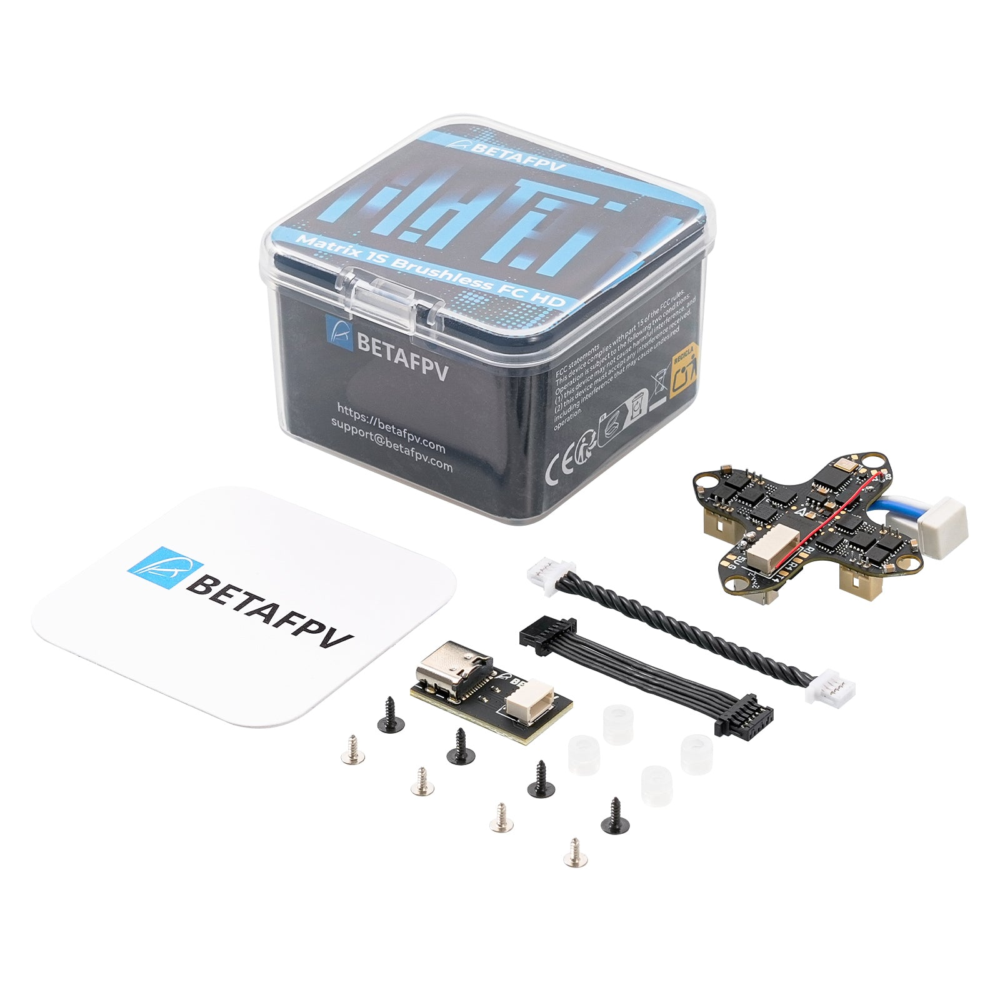

- 1 * Matrix 1S Brushless Flight Controller (4IN1)
- 1 * Type-C to SH1.0 Adapter
- 1 * SH1.0-4Pin Adapter Cable
- 4 * M1.2*4 Self-tapping Screws
- 4 * M1.4*5 Self-tapping Screws
- 4 * Shock Absorbing Balls

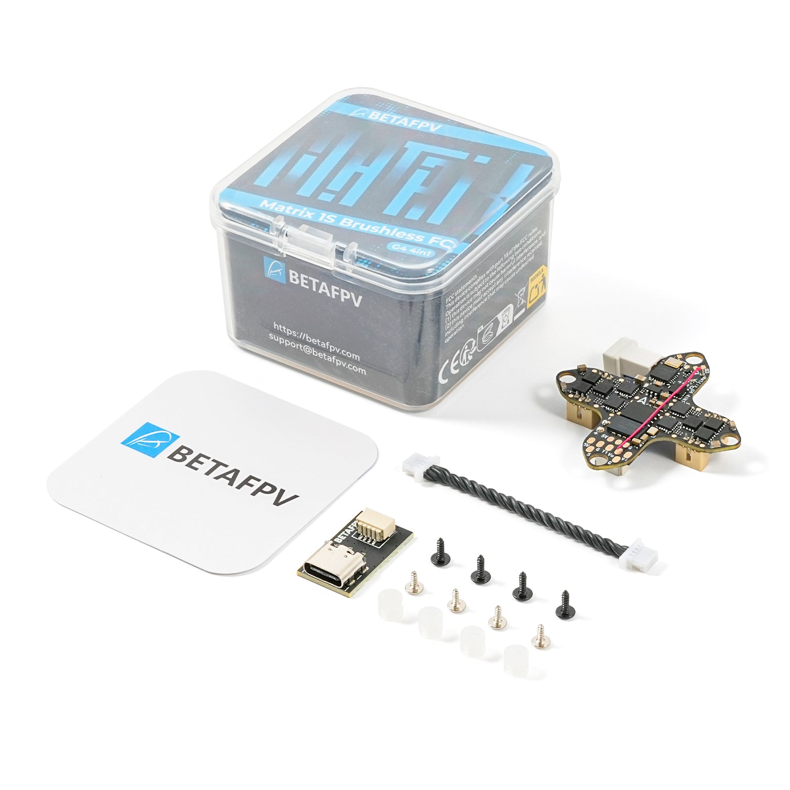
