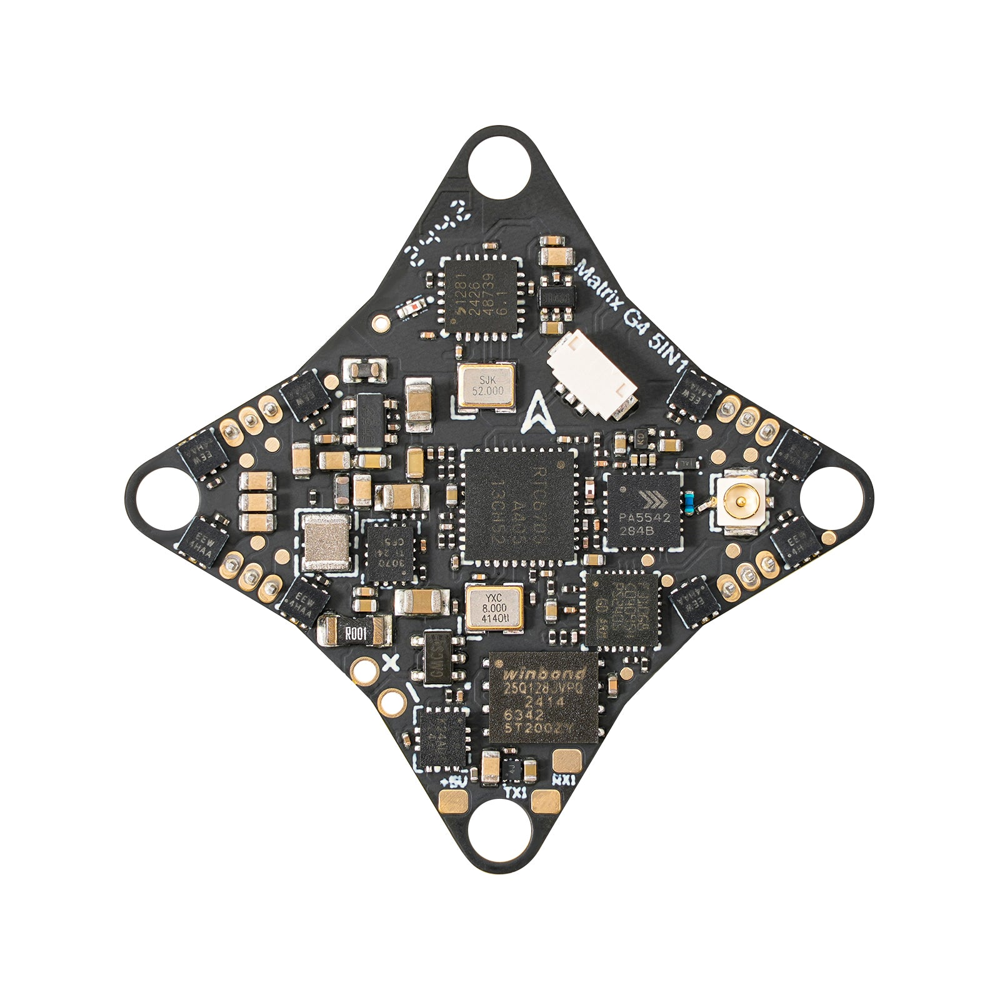
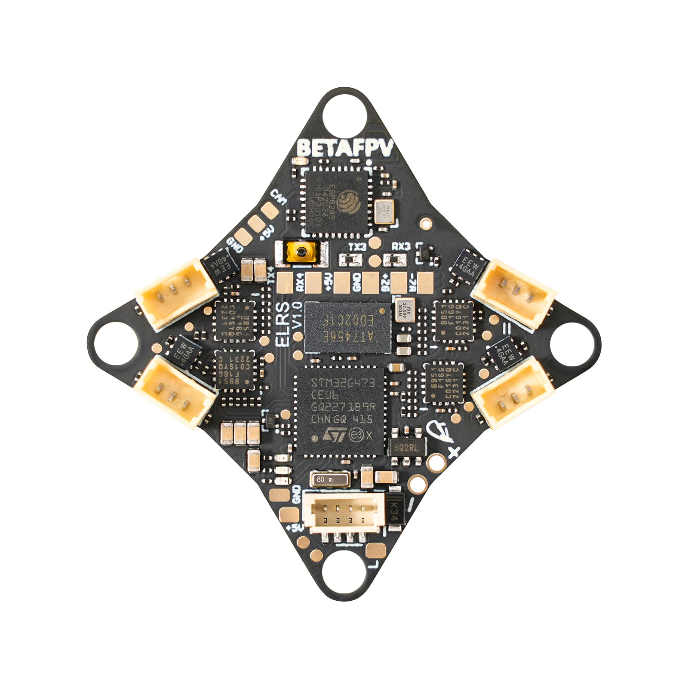
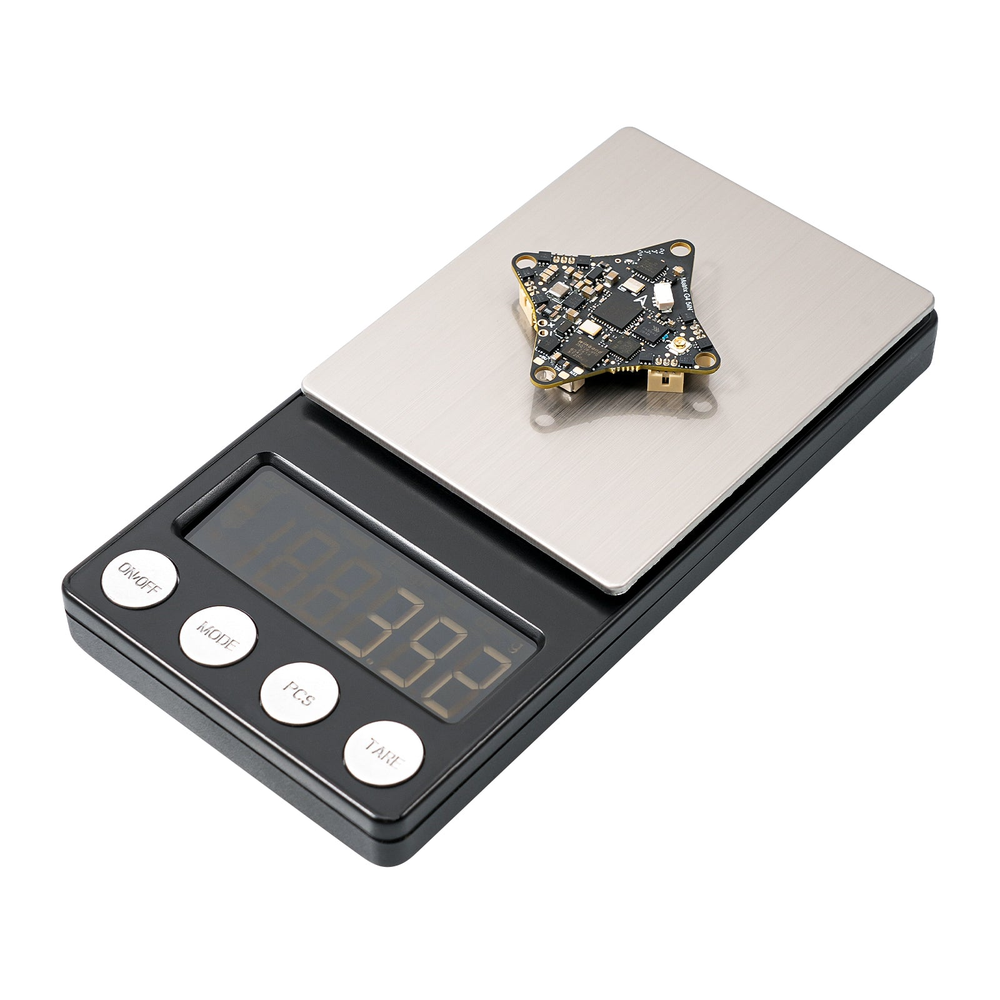
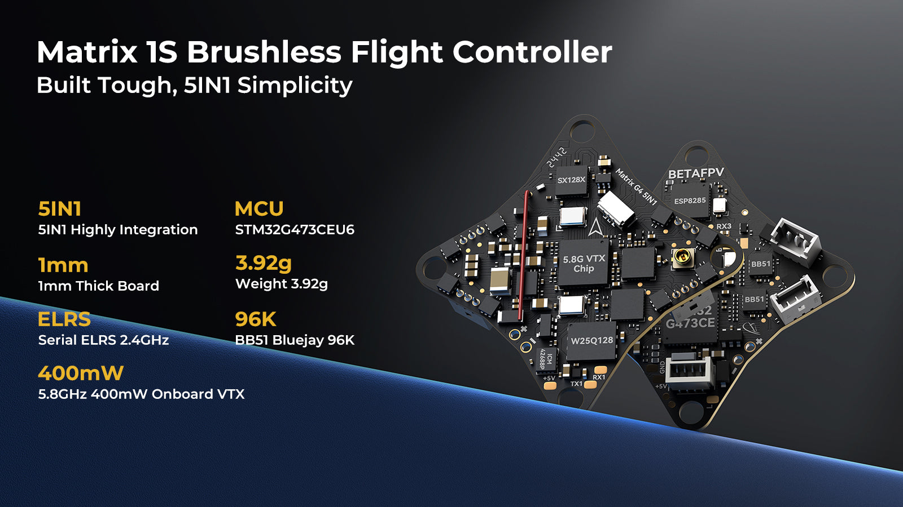
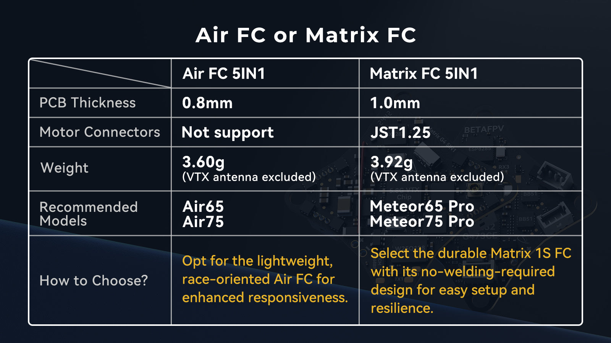
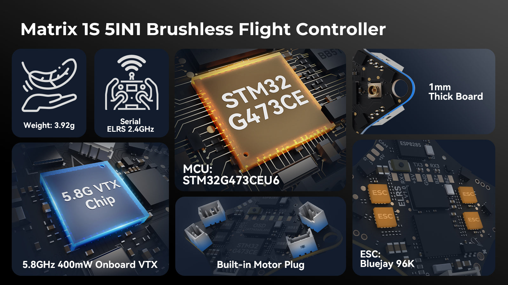
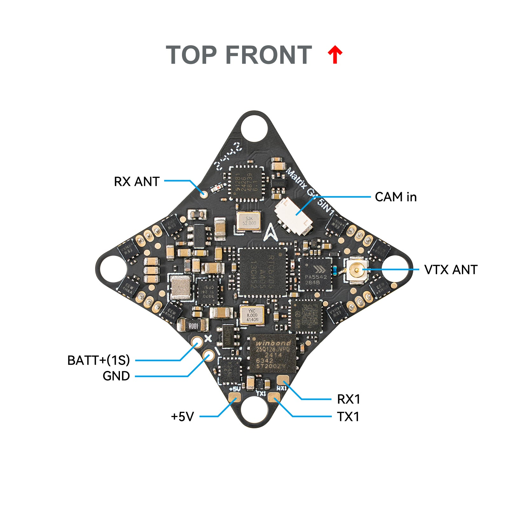
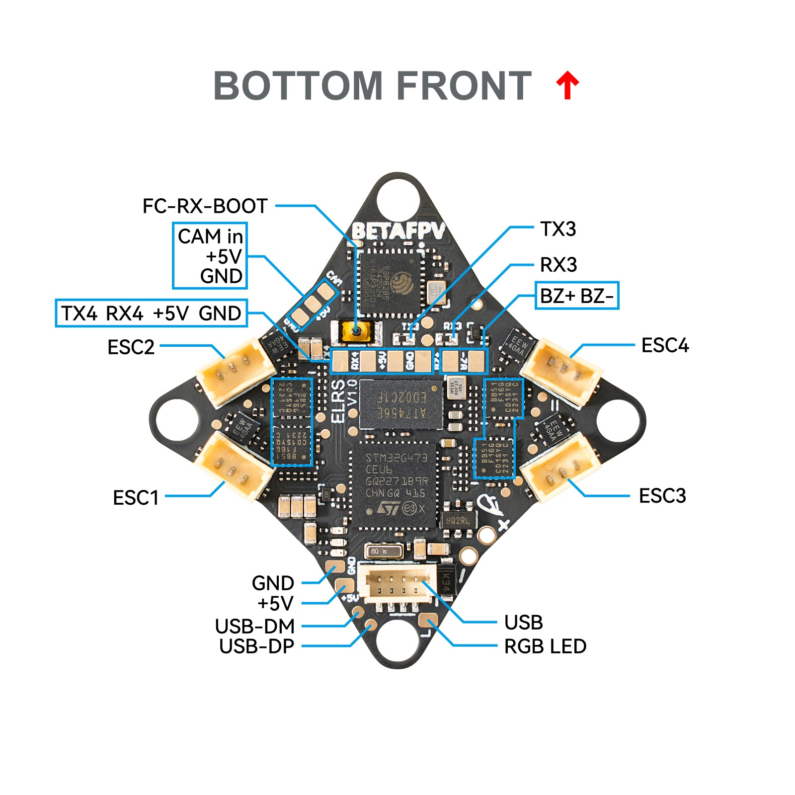
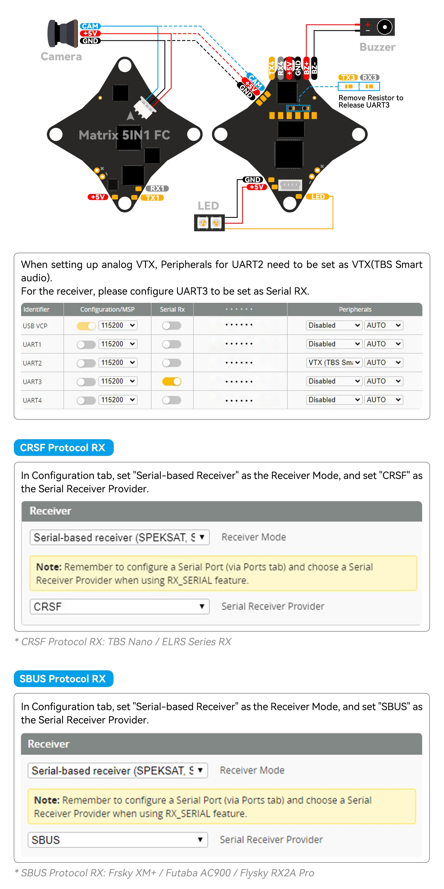
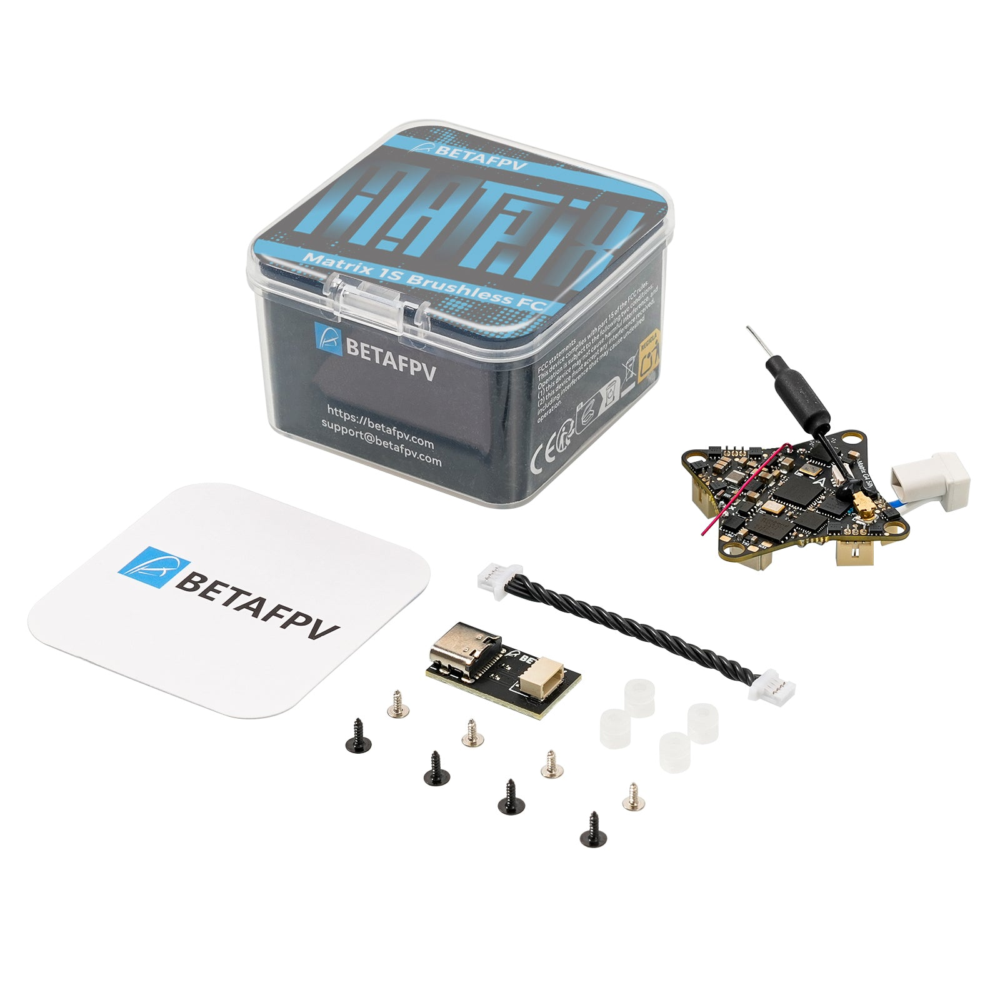

# Matrix 1S Brushless Flight Controller (5IN1)

| | |
|---|---|
| Source | <https://betafpv.com/products/matrix-1s-brushless-flight-controller> |
| Captured | 2026-08-14 |
| Shopify handle | `matrix-1s-brushless-flight-controller` |
| Vendor | BETAFPV |
| Product type | Brushless FC |
| Published | 2024-11-19 |
| Relevance to this repo | STM32G473CEU6 5IN1 — G473 family context. UNCONFIRMED |

> Archived marketing page. Vendor specifications, **not** a configuration
> artifact — nothing here is restorable to a flight controller. Where this
> page and a CLI dump or `config.h` disagree, the dump or target wins.

## Variants

| Variant | SKU | Available |
|---|---|---|
| 5IN1 (BMI270) | 01040018_5 | no |
| 5IN1 | 01040018_1 | no |

## Gallery

## Images not archived

These remain linked to their original CDN URL in the description below,
so they will break if BetaFPV takes the page down.

| Asset | Reason |
|---|---|
| [3d702acb2237d1ba1052b2bc9845bdf1.jpg](https://cdn.shopify.com/s/files/1/1778/6615/files/3d702acb2237d1ba1052b2bc9845bdf1.jpg) | unavailable from CDN (HTTP 404) |

## Description

The Matrix 1S Brushless Flight Controller is a highly integrated solution designed for beginners and FPV enthusiasts. Its robust 1mm-thick board ensures durability during intense training, while the built-in motor connectors simplify installation, eliminating welding. Upgraded with the G473 processor, it delivers a 55% performance boost over the F411 for more precise control in racing and freestyle. Plus, its premium 5.8GHz 400mWVTX ensures stable, high-quality video transmission.

### Attention

- The Matrix 1S Brushless Flight Controller is crafted for beginners and casual pilots, offering enhanced durability with its thicker board and no welding required—making it perfect for entry-level users. As a result, it is slightly heavier than the Air Brushless Flight Controller 5IN1 version. For advanced FPV pilots seeking a more responsive, race-oriented experience, the [Air Brushless FC 5IN1 version](https://betafpv.com/products/air-brushless-flight-controller?variant=41142912745606) is highly recommended. The Matrix 1S Brushless FC and Air Brushless FC 5IN1 Version have undergone rigorous testing and meet competition-grade standards.

- Flight controllers are covered for manufacturer defects. Issues arising from user errors, physical crash damage, damage during installation or dismantling, modifications, power surges, electrical fires, or water exposure are not covered.
- VTX Power: Higher VTX power consumes more energy and generates more heat, reducing flight time. For better flight time in indoor scenarios, use 25~100mW power.
- VTX Antenna: Connect and install the image transmission antenna before powering on the flight control. Alternatively, set transmission power to 0 to avoid burnout.

### Bullet Points

- Built Tough: The Matrix 1S Brushless FC features a robust 1mm-thick circuit board. While slightly heavier, this design enhances durability for everyday training. For advanced pilots, the [Air Brushless FC 5IN1 Verion](https://betafpv.com/products/air-brushless-flight-controller?variant=41142912745606) provides a lighter alternative.
- Simplified Installation: The Matrix 1S Brushless FC is a true all-in-one flight controller with integrated FC+VTX+OSD+ESC+RX, plus standard motor connectors, making setup and maintenance remarkably easy. Ideal for FPV beginners, this design requires no welding and ensures a smooth installation experience.
- Upgraded Performance: Upgraded with the G473 processor, the Matrix 1S Brushless FC achieves a remarkable 55% increase in computing speed over the F411, delivering swift response for precise racing and complex freestyle maneuvers.
- Premium Video Transmission: Equipped with a high-quality 5.8GHz VTX supporting up to 400mW, the Matrix 1S ensures stable, accurate transmission for both daily flying and competitive racing.

### Specifications

#### FC

- MCU: STM32G473CEU6
- Gyro: ICM42688P
- Blackbox memory: 16MB
- Sensor: Voltage & Current
- BEC: 5V, Max. 3A
- UART: UART 1, UART 2 (For VTX), UART 3 (For RX), UART 4
- BetaFlight OSD: AT7456E
- ESC: 5A continuous
- RX: Serial ELRS 2.4GHz (V3.4.3)
- VTX: 5.8GHz 48 channels, Max. 400mW
- FC firmware: Betaflight_4.5.0_BETAFPVG473
- USB port: SH1.0-4Pin
- Motor Connector: JST1.25
- Battery connector: BT2.0
- Mounting hole size: 26mm x 26mm
- Weight: 3.92±0.1g

#### ESC

- Power input: 1S Only
- Current: 5A continuous, 8A peak
- ESC firmware: A_X_5_96KHz_V0.19.hex for BB51 Bluejay firmware
- Digital signal protocol: DShot300, DShot600

#### VTX

- Output power: 25/100/200/400/PIT
- Frequency: 5.8GHz 48 channels, with Raceband: 5658~5917MHz
- Channel SEL: SmartAudio2.0
- Modulation type: FM
- Frequency control: PLL
- All harmonic: Max -50dBm
- Frequency stability: ±100KHz (Typ.)
- Frequency precision: ±200KHz (Typ.)
- Channel carrier error: ±1.5dB
- Antenna port: 50 Ω
- Operating temperature: -10℃~+80℃

### Diagram

### Comparison Between Matrix 1S, F4 1S 5A AIO & Air 5IN1

The Matrix 1S Brushless FC is designed with beginners in mind, offering enhanced durability and performance compared to the original F4 1S 5A AIO FC. With a 1mm-thick board, it’s more rugged than the 0.8mm-thick F4 1S 5A AIO board, and its built-in motor connectors simplify installation, eliminating the need for welding. With the advanced G473 processor and 5IN1 configuration, including a 5.8GHz 400mW VTX, the Matrix 1S is a better choice for beginners. For advanced pilots seeking a extremely lightweight, race-focused experience, the [Air Brushless FC 5IN1 version](https://betafpv.com/products/air-brushless-flight-controller?variant=41142912745606) is the best choice.

**Matrix 1S**

[Air 5IN1](https://betafpv.com/products/air-brushless-flight-controller?variant=41142912745606)

[F4 1S 5A AIO](https://betafpv.com//products/f4-1s-5a-aio-brushless-flight-controller-elrs-2-4g)

MCU

STM32G473CEU6

STM32F411CEU6

MCU Frequency

168MHz

108MHz

Gyro, Max. Sampling Rate

ICM42688P, 8KHz

BMI270, 3.2KHz

Blackbox Memory

16M

8M

OSD

BetaFlight OSD: AT7456E

ESC

1S, 5A

RX

Onboard serial ELRS 2.4GHz

VTX

Onboard 5.8GHz 48 channels, 400mW

-

Circuit Board Thickness

1.0mm

0.8mm

0.8mm

Motor Connector

JST1.25

Not support

JST1.25

Weight

3.92g (VTX antenna excluded)

3.60g (VTX antenna excluded)

4.74g (FC+M03 VTX, VTX antenna excluded)

### Meteor75 Pro Now Powered By the Upgraded Matrix 1S Brushless FC

Starting November 20, the [Meteor75 Pro](https://betafpv.com/products/meteor75-pro-brushless-whoop-quadcopter) will be upgraded with the Matrix 1S Brushless FC. This enhancement introduces a durable 1mm-thick board, a high-speed G473 processor with a 55% boost in computing power, and an integrated 5.8GHz 400mW VTX. Built-in motor connectors simplify installation, making it more beginner-friendly. These advancements deliver improved durability and performance while ensuring the Meteor75 Pro excels in both indoor and outdoor FPV racing and freestyle flying.

### Serial ELRS 2.4G RX

Serial ELRS 2.4G RX uses the Crossfire serial protocol (CRSF protocol) to communicate between the receiver and the flight controller board. So the Serial ELRS 2.4G RX is available to support upgrading to ELRS V3.0 with no need to flash Betaflight flight controller firmware. Enter binding status by power on/off three times.

- Plugin and unplug the flight controller three times;
- Make sure the RX LED is doing a quick double blink, which indicates the receiver is in bind mode;
- Make sure the RF TX module or radio transmitter enters binding status, which sends out a binding pulse;
- If the receiver has a solid light, it's bound.

The Serial ELRS 2.4G RX can be updated via Wi-Fi or Betaflight serial passthrough. Here is the way to update the Serial ELRS 2.4G RX firmware through passthrough.

- Plug in your FC to your computer, connect to ExpressLRS Configurator instead of Betaflight Configurator;
- Choose target "BETAFPV 2.4GHz AIO RX";
- Flash using the Betaflight Passthrough option in ExpressLRS Configurator.

*[How to flash firmware via Wi-Fi here.](https://support.betafpv.com/hc/en-us/articles/4404231679129-How-to-Flash-Firmware-of-ELRS-RX-TX)*

### Betaflight Firmware and CLI

Betaflight official developers recommend using version 42688 of the gyroscope, and many issues with ICM42688 have been fixed in version 4.5.0. Please learn more from version 4.5.0.

- FC firmware: Betaflight_4.5.0_BETAFPVG473, [Download the firmware and CLI dump file](https://support.betafpv.com/hc/en-us/articles/40131112129817-Firmware-for-Matrix-1S-Brushless-Flight-Controller)
- Reference link: [https://github.com/betaflight/betaflight/releases/tag/4.5.0](https://github.com/betaflight/betaflight/releases/tag/4.5.0)

*Note: Starting Jan 5, 2026, we will be shipping FC equipped with the BMI270 gyroscope. Before flashing firmware, please verify your gyroscope version to ensure compatibility.*

### Bluejay ESC Firmware

With BB51 ESC solution, Matrix 1S Brushless Flight Controller is based on A_X_5_96KHz_V0.19.hex for BB51 Bluejay hardware, it supports D-shot300, D-shot600, and even RPM filtering in Betaflight, offers 24KHz, 48KHz, and 96KHz fixed PWM frequency for options, and custom start-up melodies.

**DO NOT flash the firmware with a shorter interval,**otherwise, there will be a certain chance of stalling and burning the flight controller.

- ESC-Configurator: [https://preview.esc-configurator.com/](https://preview.esc-configurator.com/)
- [Download BLHeliSuite16714903](https://github.com/4712/BLHeliSuite/releases/tag/16714903)
- [Download the Bluejay ESC firmware. Please choose A_X_5_96KHz_V0.19.hex](https://github.com/bird-sanctuary/bluejay/releases)

### How to Use Serial Ports, Intergrated RX and VTX

Please note that by default, UART2 is connected to the VTX and UART3 is connected to the RX. To release UART3, please remove the resistor. Additionally, this FC reserves 2 complete full-featured serial ports that can be used for external CRSF/SBUS receivers, GPS, HD VTX, or other serial devices. You can refer to the below pictures.

### Recommended Parts

- Drones: [Meteor65 Pro](https://betafpv.com/products/air65-brushless-whoop-quadcopter), [Meteor75 Pro](https://betafpv.com/products/air75-brushless-whoop-quadcopter)
- Frames: [Meteor65 Pro](https://betafpv.com/collections/frame/products/meteor65-pro-frame-kit), [Meteor75 Pro](https://betafpv.com/collections/frame/products/meteor75-pro-brushless-whoop-frame)
- Motors: [0702/0702SE](https://betafpv.com/collections/motors/products/0702-brushless-motors), [0802/0802SE](https://betafpv.com/collections/motors/products/0802se-22000kv-brushless-motors), [1102](https://betafpv.com/collections/motors/products/1102-13500kv-brushless-motors)

### Package

- 1 * Matrix 1S Brushless Flight Controller
- 1 * Type-C to SH1.0 Adapter
- 1 * SH1.0-4Pin Adapter Cable
- 4 * M1.2*4 Self-tapping Screws
- 4 * M1.4*4 Self-tapping Screws
- 4 * Shock Absorbing Balls

