# Meteor75 Pro P1 Brushless Whoop Quadcopter

| | |
|---|---|
| Source | <https://betafpv.com/products/meteor75-pro-p1-brushless-whoop-quadcopter> |
| Captured | 2026-08-14 |
| Shopify handle | `meteor75-pro-p1-brushless-whoop-quadcopter` |
| Vendor | BETAFPV |
| Product type | Brushless Quad |
| Published | 2025-12-25 |
| Relevance to this repo | Meteor75 Pro P1 — the aircraft for OEM package BF4.5.3 G473 3in1_12A_M75 Pro P1_ELRS_BMI270 |

> Archived marketing page. Vendor specifications, **not** a configuration
> artifact — nothing here is restorable to a flight controller. Where this
> page and a CLI dump or `config.h` disagree, the dump or target wins.

## Variants

| Variant | SKU | Available |
|---|---|---|
| P1 VTX | 01010043_6 | no |
| RTF Kit | 01020013_3 | no |

## Gallery

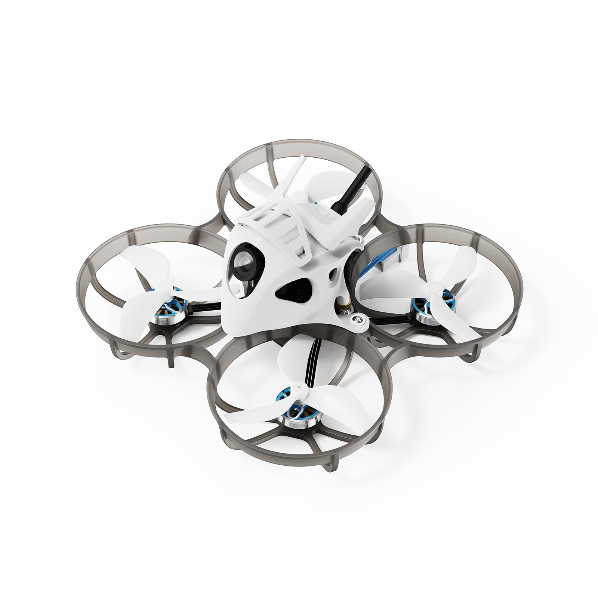
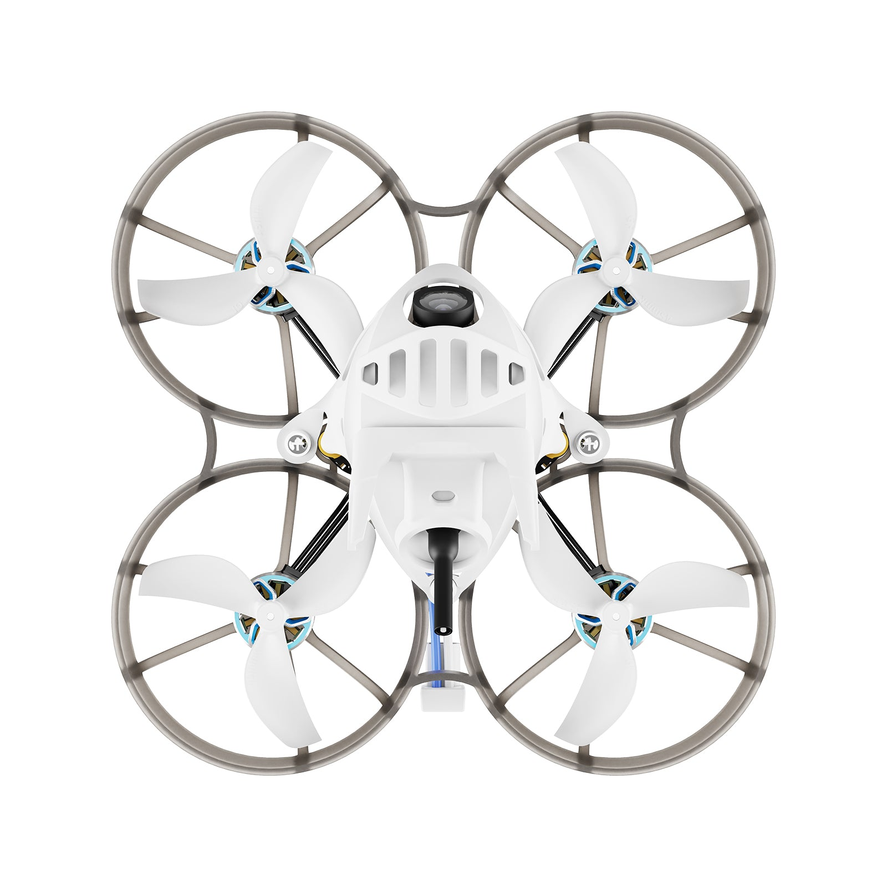
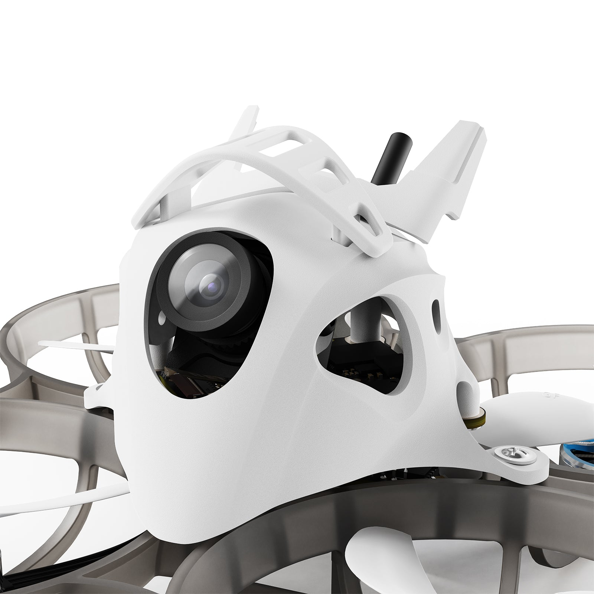
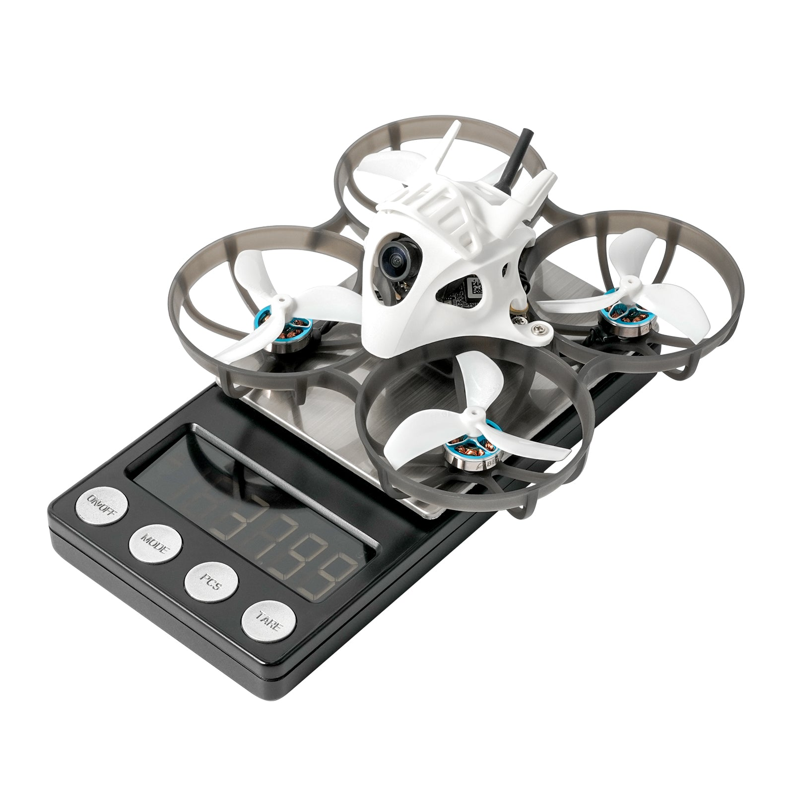
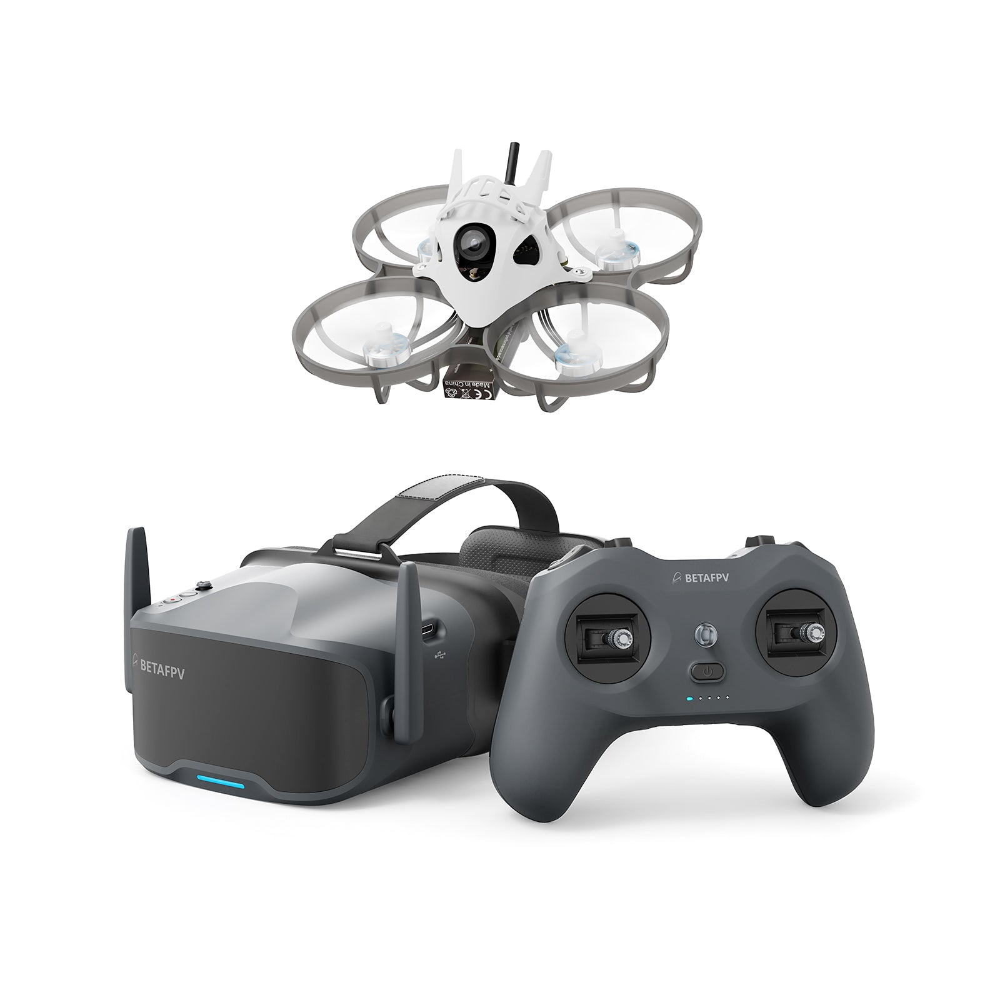
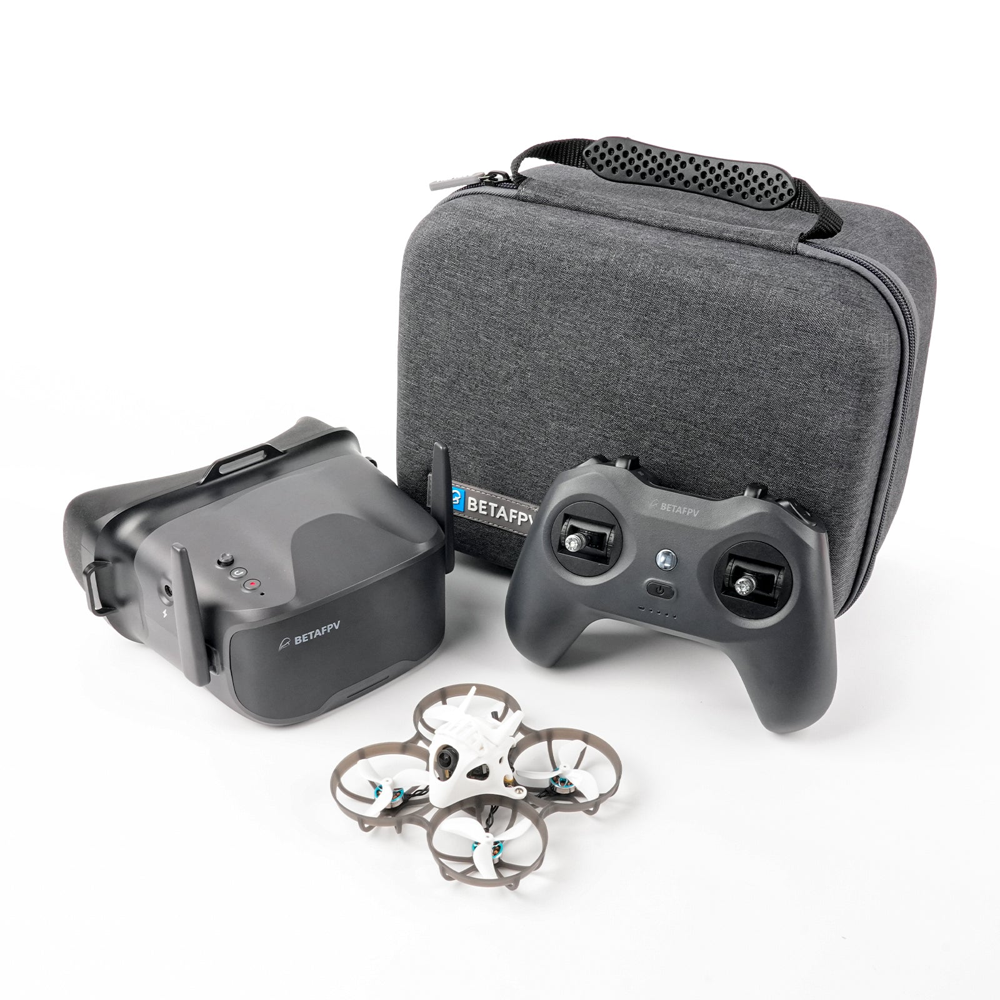

## Images not archived

These remain linked to their original CDN URL in the description below,
so they will break if BetaFPV takes the page down.

| Asset | Reason |
|---|---|
| [P1_Air_Unit_live_video.gif](https://cdn.shopify.com/s/files/1/1778/6615/files/P1_Air_Unit_live_video.gif) | 15.2 MB exceeds cap |

## Description

Learn more about the [Meteor75 Pro HD FPV Kit](https://betafpv.com/products/meteor75-pro-hd-fpv-kit).

Building on the proven ease of use and rugged durability of the Meteor75 Pro, the Meteor75 Pro P1 now integrates the P1 Air Unit HD VTX, delivering stunning 1080P@60fps live video for smooth, immersive high-definition flight. Equipped with the advanced [Matrix 1S 3IN1 HD FC](https://betafpv.com/products/matrix-1s-brushless-flight-controller-hd), powerful [1102 21000KV / 18000KV motors](https://betafpv.com/products/1102-brushless-motors-2026) and [Gemfan 45mm 3-Blade Propellers](https://betafpv.com/products/gemfan-45mm-2-blade-3-blade-propellers-1-5mm-shaft-4pcs), and paired with the new [LAVA II 1S 580mAh/680mAh battery](https://betafpv.com/products/lava-ii-1s-battery?variant=42566849298566), this whoop achieves a seamless balance of reliable control, agile power and 5:30 flight time. Whether you're capturing cinematic footage or enjoying recreational flying, the Meteor75 Pro P1 delivers exceptional HD performance in a ready‑to‑fly, cost‑effective package.

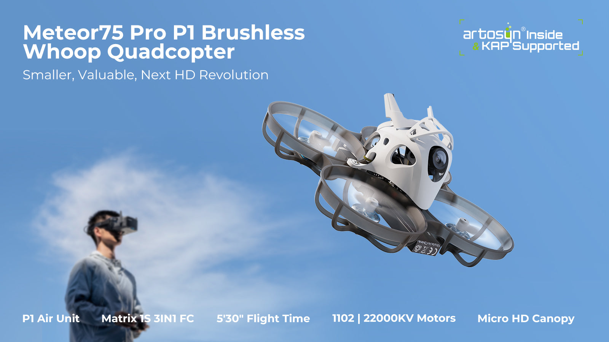

### Bullet Points

- P1 Air Unit HD VTX: Delivers 1080p@60fps buttery-smooth video with approximately 60ms latency and over 5km range.
- Advanced Flight Controller: Powered by the Matrix 1S 3IN1 HD FC, offering enhanced integration, performance and seamless operation.
- Enhanced Power Configuration: The 1102 21000KV / 18000KV Motors combined with GF 45mm 3-Blade Props ensure excellent thrust and responsive flight performance.
- Tailored HD Canopy: Weighing just 2.5g, the durable, heat‑resistant canopy shields your camera from impacts without compromising flight performance.
- Durable and User-Friendly: Built for reliability and ease of use, designed to stand apart from the competition-focused Air Series while delivering a refined and enjoyable flying experience.
- Bind & Fly Ready: Compatible with the VR04 HD goggles for an immersive HD FPV experience.

### Specifications

- Item: Meteor75 Pro P1 Brushless Whoop Quadcopter
- Wheelbase: 80.8mm
- Motors: [1102 21000KV / 18000KV Motor](https://betafpv.com/products/1102-brushless-motors-2026)
- Frame: [Meteor75 Pro Brushless Whoop Frame (Transparent Gray)](https://betafpv.com/products/meteor75-pro-brushless-whoop-frame)
- Propellers: [Gemfan 45mm 3-Blade Propellers](https://betafpv.com/collections/40mm-propellers/products/gemfan-45mm-2-blade-3-blade-propellers-1-5mm-shaft-4pcs)
- Canopy: [Micro Canopy for HD Camera](https://betafpv.com/products/micro-canopy-for-hd-camera)
- FC: [Matrix 1S 3IN1 HD FC](https://betafpv.com/collections/brushless-flight-controller/products/matrix-1s-brushless-flight-controller-hd)
- Camera: P1 Camera
- Receiver: Onboard Serial ELRS 2.4G
- VTX: [P1 Air Unit](https://betafpv.com/products/p1-air-unit-hd-vtx)
- Recommended Battery: [LAVA II 1S 580mAh/680mAh Battery](https://betafpv.com/products/lava-ii-1s-battery?variant=42566849298566)
- Flight time: 5:30
- Weight: 37.5g

### P1 Air Unit HD VTX

The Meteor75 Pro P1 features the P1 Air Unit, delivering reliable HD video with 200mW output and over 5km range. Experience smooth, low-latency flight at ~60ms, giving you stable, static‑free video for confident exploration.

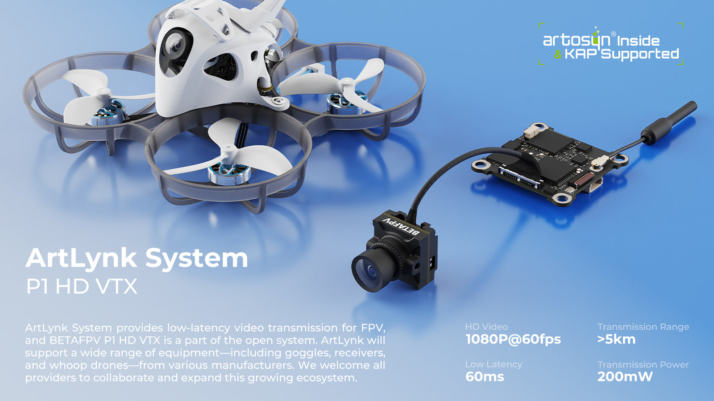

Its 1/2.9” CMOS sensor and 170° field of view capture crisp 1080p live footage, enhanced by optimized PID tuning for both cinematic flying and freestyle fun.

### Advanced Stability with Matrix 1S 3IN1 HD FC

The Meteor75 Pro P1 features the cutting-edge Matrix 1S 3IN1 HD FC, purpose-built for 1S HD whoops. Designed exclusively for digital FPV, this FC combines a flight controller, ESC, and ELRS 2.4G RX into a compact, lightweight unit, eliminating analog OSD for seamless performance. With a newly developed BEC and ESC, the Matrix 1S 3IN1 HD FC ensures stable digital image transmission, even in challenging conditions, giving pilots the confidence to push their flights further. Experience effortless setup, reliable power, and unmatched stability in every flight.

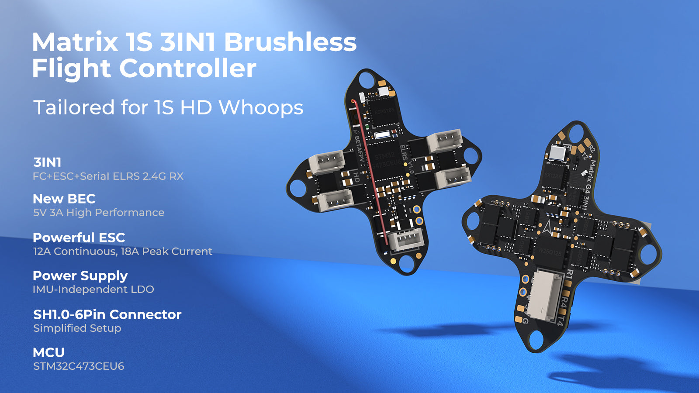

### Power System

The Meteor75 Pro P1 is powered by 1102 21000KV / 18000KV motors, GF 45mm 3-Blade props, enhanced continuous 12A ESC, and the high-performance LAVA II 1S 580mAh/680mAh battery, delivering a seamless balance of power and efficiency. This advanced setup effortlessly handles the size and weight of the P1 Air Unit while providing an impressive 5:30 minutes flight time. With this power system, you can confidently achieve smooth, high-definition aerial footage on every flight.

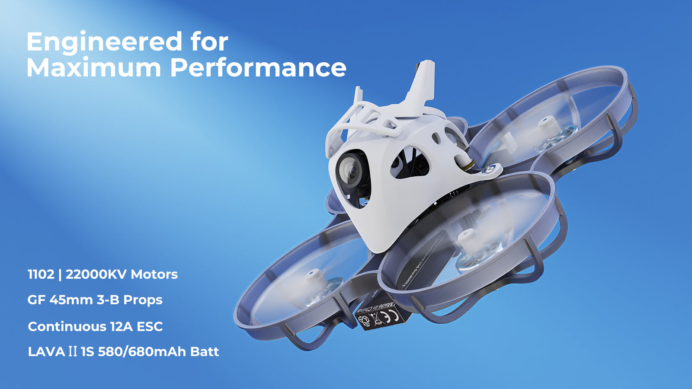

*Note: As of July 2026, the motors have been updated from [1102 22000KV](https://betafpv.com/products/1102-13500kv-brushless-motors?variant=40069450891398) to [1102 21000KV / 18000KV (2026)](https://betafpv.com/products/1102-brushless-motors-2026). Flight performance remains unchanged.*

### Tailored HD Canopy

Designed specifically for HD whoops, the micro canopy is injection‑molded for durability, impact resistance, and heat tolerance—keeping your Meteor75 Pro P1 protected. The adjustable camera angle (0°–45°) lets you frame the perfect shot, while optional decorative panels give your whoop a custom, spacecraft‑inspired look.

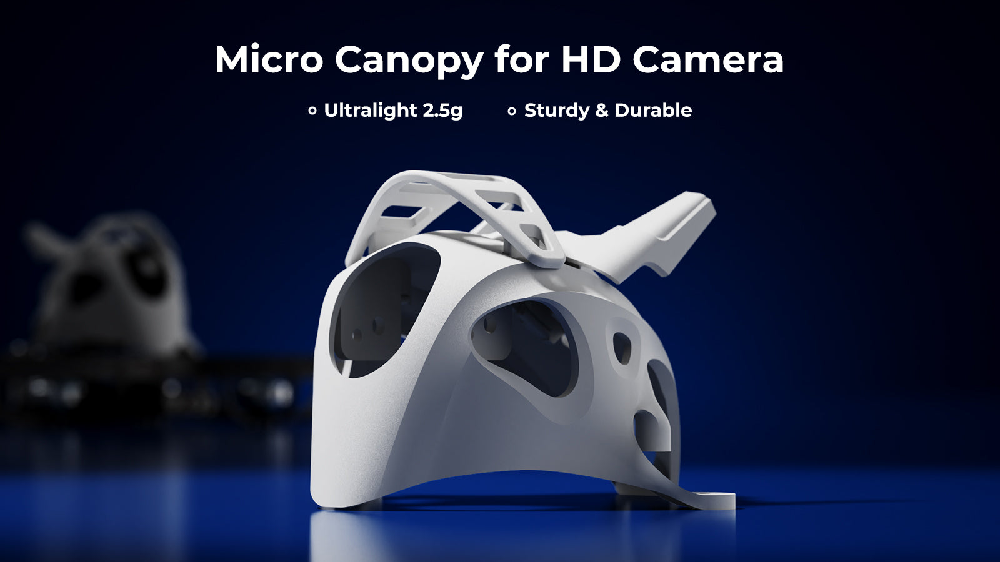

### Bind & Fly Ready

The Meteor75 Pro P1 is fully compatible with the VR04 HD goggles—just bind and fly. No setup, no fuss. Jump straight into an immersive HD FPV experience right out of the box.

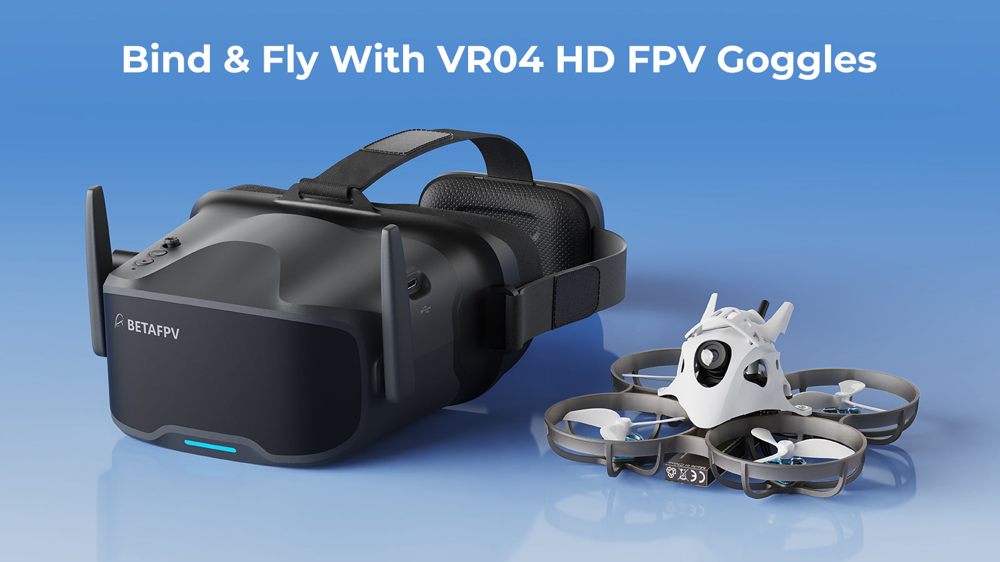

### Know More About ArtLynk Protocol

The ArtLynk protocol is a low-latency, long-range communication protocol for drones, offering superior stability and range over traditional analog VTX. ArtLynk protocol enables real-time HD video at about 60ms latency from glass to glass, which is crucial for smooth flight control and high-quality FPV (First Person View). Here are the key features you may want to know.

- **Artosyn Inside & KAP Supported:**ArtLynk protocol uses the Artosyn's latest AR803X chipset, with core technology support provided by KAP (KAP company provides core technology support or product solution to all FPV companies and ensures compatibility for various FPV products using Artosyn chipsets).
- **Collaborative and Open Community:**ArtLynk protocol is a collaborative FPV ecosystem not belonging to ONLY one company. Many FPV enterprises and teams would design and produce their own products based on the ArtLynk protocol, ensuring broad compatibility and fostering community.

The ArtLynk protocol supports the following devices, letting you customize your own build or simply bind and fly:

- BETAFPV [VR04 HD goggles](https://betafpv.com/products/vr04-hd-fpv-goggles), [Aquila20 P1](https://betafpv.com/products/aquila20-brushless-whoop-quadcopter), [Meteor75 Pro P1](https://betafpv.com/products/meteor75-pro-p1-brushless-whoop-quadcopter)
- [HGLRC Draco](https://www.hglrc.com/products/hglrc-draco-a1-a2-hd-vtx)
- More coming soon!

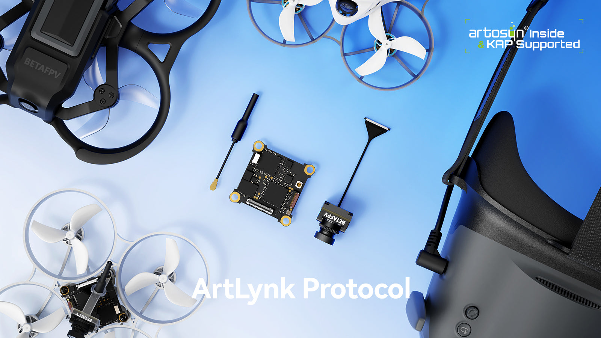

*Firmware Compatibility Notes:*

1. *To ensure seamless compatibility with third-party ArtLynk protocol equipments (such as HGLRC Draco), please verify that your BETAFPV devices are updated to firmware version V2.0.5 or later.*
2. *The air unit needs to be updated via the ground station. First make sure the ground station and air unit are on the same firmware version, then proceed to update the air unit. And firmware V2.0.5 is not compatible with any V1 versions (V1.0.36 / V1.0.44).*

**Ground Station**

**Air Unit**
**Actions Required**

V1
V1
Update both to V2

V1
V2
Update ground station to V2

V2
V1
Downgrade ground station to V1, then update both to V2

V2
V2
Ready to use

Click to see [how to update the firmware](https://youtu.be/JxtL8zO5-7o).

### Recommended Parts

- Battery: [LAVA II 1S 580mAh/680mAh Battery](https://betafpv.com/products/lava-ii-1s-battery?variant=42566849298566)
- FC: [Matrix 1S 3IN1 HD FC](https://betafpv.com/collections/brushless-flight-controller/products/matrix-1s-brushless-flight-controller-hd)
- Motor: [1102 21000KV motors (2026)](https://betafpv.com/products/1102-brushless-motors-2026), [1102 | 22000KV Brushless Motor](https://betafpv.com/collections/brushless-motors/products/1102-13500kv-brushless-motors)
- Props: [Gemfan 45mm 3-Blade Propellers (1.5mm Shaft 4PCS)](https://betafpv.com/collections/new-arrivals/products/gemfan-45mm-2-blade-3-blade-propellers-1-5mm-shaft-4pcs)
- VTX: [P1 Air Unit](https://betafpv.com/products/p1-air-unit-hd-vtx)
- Frame: [Meteor75 Pro Brushless Whoop Frame](https://betafpv.com/collections/new-arrivals/products/meteor75-pro-brushless-whoop-frame)
- Goggles: [VR04 HD FPV Goggles](https://betafpv.com/products/vr04-hd-fpv-goggles)
- Radio Transmitter: [LiteRadio 3 Pro](https://betafpv.com/collections/rx-tx/products/literadio-3-radio-transmitter), [LiteRadio 3](https://betafpv.com/collections/rx-tx/products/literadio-3-radio-transmitter), [LiteRadio 2 SE](https://betafpv.com/collections/rx-tx/products/literadio-2-se-radio-transmitter)
- Canopy: [Micro Canopy for HD Camera](https://betafpv.com/products/micro-canopy-for-hd-camera)

### File

- [FC firmware and CLI dump file](https://support.betafpv.com/hc/en-us/articles/53664040865817-CLI-for-Meteor75-Pro-P1-2025)

### Package

Meteor75 Pro P1 Brushless Whoop Quadcopter

- 1 * Meteor75 Pro P1 Brushless Whoop Quadcopter
- 4 * GF 45mm 3-Blade Propellers
- 1 * Type-C to SH1.0 Adapter
- 1 * SH1.0-4Pin Adapter Cable
- 4 * M1.4*4 Phillips Flat Head Screws
- 3 * Decorative Parts
- 1 * User Manual for P1 Air Unit

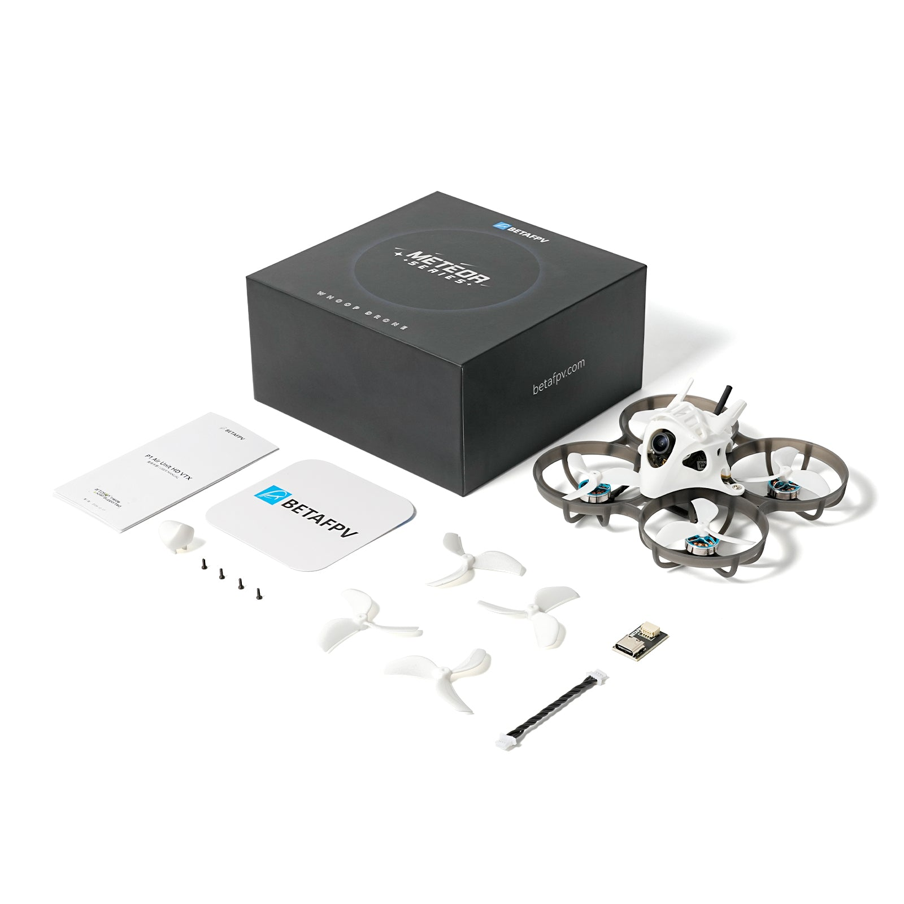
